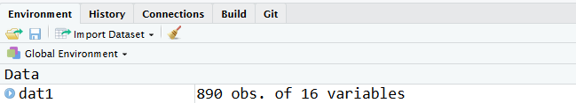
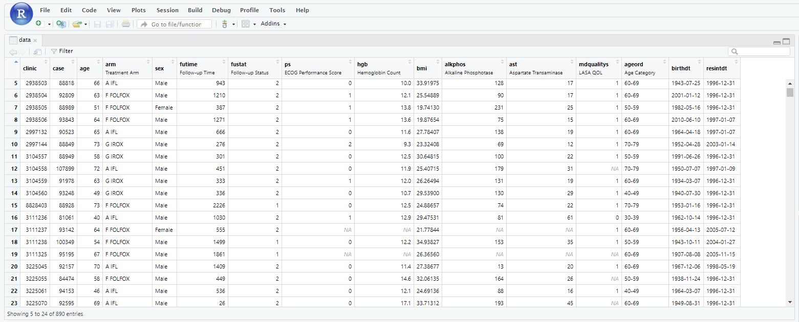

# Scenario 1: Getting Familiar with a New Project

```{r setup-2, results='hide', echo=FALSE, message=FALSE, warnings=FALSE}
source('setup.R')
```

You're handed a new project to work on and the abstract deadline is next week. You need to get something out the door soon!

## Your Mission 

**Import Data**

* Read in the example dataset dat1.sas7bdat.  What variables are in the data?  Are they character, numeric, Date, or factor? 

**Explore Data**

* Take a closer look at the data using basic summary statistics. Do you notice any strange values?  If so, fix them.  Are there any duplicate observations?  If so, see whether you can delete any of them.
* Summarize age, gender, bmi, etc. by the treatment variable using parametric statistics.  Do the summary statistics make sense for each variable?  If not, modify the variables so that the default summaries are appropriate.
* Change the label for the variable age. Now change the table summary statistics to be non-parametric.
* How many people have the combinations of ps, sex, and treatment arm?
* Create a formula from a list of variables that can used in tableby (hint: try `formulize`)

**Plot Data**

* Create a boxplot of bmi. Now create the boxplots stratified by the treatment arm. Modify the axis labels and add a title to your plot.
* Create a scatterplot of age versus another continuous variable. Now create the plot with separate colors for one of the group variables. Now make two scatterplots of age versus bmi with different colors indicating treatment.
* Create these same scatterplots, side-by-side, separately for males and females. How would you add a regression line to these plots?  How about smoothers? 

**Basic Modeling**

* Run a simple linear regression model predicting bmi with a covariate that is coded as 1/2.
Now re-do it with the covariate coded as a factor. Did the answer change?

**Data Import, revisited**

* Read the data in from Excel and compare it with the version that came from SAS. What is different?

## Implementation

### Import Data

* **Read in the example dataset dat1.sas7bdat.**
* **What variables are in the data?  Are they character, numeric, Date, or factor? **

When reading in SAS data you can use the `read_sas()` function that is found in the `haven` package.  To make a package available simply use the `library()` function with the non-quoted name of the package.  The `read_sas()` function works for the majority of SAS datasets.  Other options are found at the [end of this document](#alt-import) in the rare situations where you need to use a different tool.

```{r message=FALSE}
# Before doing any work, you are strongly encouraged to set this option in each of your programs
options(stringsAsFactors=FALSE)

# various functions from the tidyverse package are used.
# You can safely ignore the messages regarding conflicts for now
library(tidyverse)
# use the read_sas function found in the haven package 
library(haven)

# link to data on GitHub page if not already downloaded
if(!file.exists("data/dat1.sas7bdat")) {
  urlfile <- "https://raw.githubusercontent.com/bethatkinson/R_project_recipes/data/dat1.sas7bdat"
  if(!dir.exists("data")) dir.create("data")
  download.file(urlfile, destfile = "data/dat1.sas7bdat")
}

dat1 <- read_sas('data/dat1.sas7bdat')
```

Once we successfully import data into the current R session we should explore it a little bit.  The `names()` function is a good first step as it displays all the column names of the data, and you can quickly check to see if your import went as expected.

* `names()` returns a character vector

```{r}
names(dat1)
```

To understand how many observations are in your data, we can use `nrow()` function. Similarly, we can also print the number of columns with `ncol()`. The function `dim()` returns both the number of rows and columns at once. 

* `nrow()` and `ncol()` return integers 
* `dim()` returns a vector (rows, columns)

```{r}
# how many rows and columns are in the dataset?
nrow(dat1)
ncol(dat1)
dim(dat1)
```

Another really useful function to use to explore data is the `str()` or "structure" function.  When we run it, we can see all of the column names like the `names()` function, but now we also see the type of each column as well as any attributes that a column has.  The `read_sas()` function reads in the format and label metadata used in SAS datasets as R object attributes.  It is worth noting that the `str()` function works on most R objects, not just `data.frames`.

```{r}
str(dat1)
```

The function `str()` is what you get when you select the blue triangle next to the data name in the "Environment" panel on the right hand side of RStudio. The fact that Rstudio integrated `str()` into their IDE (Integrated development environment) really illustrates how useful they think it is. 




The Rstudio IDE has a ton of really useful features that makes programming in R easier.  Using the `View()` function within Rstudio will cause a new tab to open in the source panel with a view of your data.  Hovering over the name of a column will cause the type of column to display.  Any label attributes will be displayed in the view, and all columns in the view can be sorted.

```{r, eval=FALSE}
View(dat1)
```



Here is some simple code that prints out the variable names and their classes using the functions `sapply()` and `class()`.  [sapply](https://www.rdocumentation.org/packages/base/versions/3.6.2/topics/lapply) is a function that looks at each element within a list (here, each variable) and runs the specified function (here, `class()`).  Results are returned as a vector.  Then, the `knitr` package includes the `kable` function which makes pretty default tables, especially for reports. 
In the output below, the `class()` function is returning the class of each variable. Typical R classes for variables in a dataset include: character, numeric, integer, Date, logical, factor. More information on classes and data types can be found in Hadley Wickham's book [Advanced R](https://adv-r.hadley.nz/base-types.html).

```{r}
library(knitr)
kable(data.frame(Type = sapply(X=dat1, FUN=class)))
```

Other options to this exercise can be found at the [end of this document](#alt-import).


### Data Exploring

* **Take a closer look at the data using basic summary statistics. Do you notice any strange values?  If so, fix them.**

There are a number of different tools that are available to explore a new dataset.  The package `summarytools` includes the function `dfSummary()` which provides basic summaries of all of the variables in a dataset.  When the summary is written directly to a file, it also provides nice graphical summaries of each variable.

```{r dfsummary, results='asis'}
library(summarytools)

# Settings to work well in markdown document (try running default settings interactively)
dfSummary(dat1, plain.ascii=FALSE, style='grid',
          graph.col=FALSE, headings=TRUE)

# Save the results to an external file (includes plots!)
print(dfSummary(dat1), file='dat1.html')
```

See the [external file version](dat1.html).

Another option is to use the `tableby()` function that is available in the Mayo package `arsenal`. Tableby is a fantastic function for quick summaries for data exploration or reporting "table 1" describing the cohort. This function allows you to summarize the data stratified by some "by" variable or overall without any stratification. The code `~ sex + arm + age + bmi` is a formula.  If you wanted to stratify by a variable you would list the stratification variable on the left hand side of the `~`.   The `tableby` function does all the calculations, but it doesn't create the information in a nice format.  The `summary()` function pulls everything together into a nice table.  Note that when you type `summary` here you are actually using `summary.tableby()`.  This is important when looking for help with summarizing the `tableby` output.

If you want to look at the summary in your console window, you might want to use `summary(tab1, text=T)`. In order for the table to look nice within an R markdown (knitr) report, you just need to specify
`results="asis"` when creating the r chunk. This changes the layout slightly (compresses it) and bolds the variable names. 

```{r results='asis'}
library(arsenal)
tab1 <- tableby(~ sex + arm + age + bmi, data=dat1)
class(tab1)
summary(tab1, title = "Baseline and patient characteristics")
```

If you want to examine every variable in `dat` you can use the shortcut `.`.

```{r}
tab1 <- tableby(~ ., data=dat1)
```

Based on these summaries, it appears that `sex` was not coded correctly and needs to be fixed. Our investigator confirms that `2` is supposed to be female. To correct this, we will pull out all the values in the variable sex within the `dat1` dataset that are equal to 2 or F (`dat1$sex[dat1$sex %in% c('2','F')]`) and assign those values to be equal to "Female" (`<- 'Female'`).

```{r}
table(dat1$sex)

# For those observations that are 2 or F, change them to Female
dat1$sex[dat1$sex %in% c('2','F')] <- 'Female'

table(dat1$sex)
```

One of tricky functions in R for SAS programmers is `ifelse()` function which differs from `if() {} else {}`. Suppose that you believe that all observations over a certain cutoff are errors and you want to set them equal to missing.  The code below uses `ifelse`.  The first argument creates a logical True/False variable.  For those observations where the "test" is TRUE, use the value in the "yes" field and for those observations where the "test" is FALSE, use the value in the "no" field.

```{r}
ast <- dat1$ast
summary(ast)
ast2 <- ifelse(test=ast>45, yes=NA, no=ast)
summary(ast2)
```

If instead I was creating a loop and I had one logical value, then I would do something like the following using `if() else()`.

```{r}
group <- 'A IFL'

if(group == 'A IFL'){
  summary(ast)
} else {
  summary(ast2)
}
```

An alternative to `ifelse` is the `case_when()` function in the `dplyr` package.  It is particularly useful when you have multiple nested "ifelse" statements.  For instance, this is another alternative for fixing the code for sex.

```{r}
dat1$sex <- case_when(
  dat1$sex==2 ~ "Female",
  dat1$sex=="F" ~ "Female",
  TRUE ~ dat1$sex)
```

* **Oops, there is a duplicate observation in the data.  Confirm the data is the same for all the variables and remove one of the duplicates.**

Mistakes in data entry occur all the time. It is wise to check for duplicate records and/or more than one record per unique patient. There are a few different tools that can be used to check for duplicate observations including the functions `duplicated()` and `dplyr::distinct()`.

```{r duplicates}
# count how many times each id appears in dat1  
table(table(dat1$id))


# This next line of code first identifies which ids are duplicated: "duplicated(dat1$id)"
# Then, it selects those ids from "dat1$id" and returns only one instance of each duplicated ids using "unique()".

tmp <- unique(dat1$id[duplicated(dat1$id)])

# which rows have a duplicate?
dup.rows <- which(dat1$id %in% tmp)

# show a portion of the data with the duplicates - which version do you keep?
kable(dat1[dup.rows, c('id','age','arm','sex','bmi')])
```


This same code can be run using the following `dplyr` commands.  It also illustrates the use of "piping", which is what the `%>%` is called. Basically, it allows you to string a bunch of commands together without having to save out temporary datasets.  The `filter` command keeps only those observations where the condition is true.  The `select` function keeps only certain variables.

```{r}
# Using dplyr code this would be
dat1 %>% filter(id %in% tmp) %>%
         select(id, age, arm, sex, bmi) %>%
        kable()
```

Now check to see if the observations are a complete duplicate or not.


```{r}
# When you use `duplicated()` on a data.frame, it will test for completely identical rows.
table(duplicated(dat1))

# remove rows with duplicate values (2 different approaches)
# Both approaches will return the first instance of a row and will exclude any duplicated rows.
# This is similar to `FIRST.` in SAS.
dim(dat1)

dat2 <- dat1[!duplicated(dat1),]
dim(dat2)
```

* **Summarize age, gender, bmi, ... by the treatment variable using parametric statistics**

Again, this is an instance where `tableby` produces a nice table. Here the variable `arm` is listed on the left-hand side of the formula.  The option `pfootnote=TRUE` indicates that the summary table should show a footnote indicating what test was run. 

```{r tableby, results='asis'}
tab1 <- tableby(arm ~ age + sex + ps + bmi + alkphos + mdqualitys + ageord + birthdt,
                data=dat2)
summary(tab1, pfootnote=TRUE)
```

* **Do the summary statistics make sense for each variable?  If not, modify them so that the default summaries fit the data.**

These are the variables that are not creating the correct summaries

* LASA QOL (`mdqualitys`)
    + Range of values from 0-1
* ECOG Performance Score (`ps`)
    + Range of values from 0 - 2
    + 0 = Asymptomatic, 1 = Symptomatic but ambulatory, 2 = Symptomatic, <50% in bed during the day
* Age group (`ageord`)
    + Age groups, character strings (20-29, ... 80-89)

The variables `mdqualitys` and `ps` should not be treated as numeric values and summaries for `ageord` should recognize that `20-29` is less than `30-39` (hence the use of the "ordered" function instead of "factor").

```{r, results='asis'}
# Since the summaries performed by `tableby` are dependent on the class of the variable, if we change the class, we change the how `tableby` treats the variable.

# change mdqualitys to a factor
dat2$mdqualitys <- factor(dat2$mdqualitys, levels=c(0,1), labels=c('Deficient','Not Deficient'))

# change ps to an ordered factor where 0 < 1 < 2
dat2$ps <- ordered(dat2$ps, levels=0:2, labels=0:2)

# change ageord to an ordered factor
dat2$ageord <- ordered(dat2$ageord)
```

* **Change the label for the variables `age` and `bmi`**

When reading data in from SAS, variable labels are retained and stored in the attribute of the variable.  Usually in R, when a `data.frame` is subsetted these labels disappear.  Therefore it is useful to keep a separate object storing the variables and their labels.  If you have attached the package `arsenal` we have modified this behavior so labels do not disappear.

You can assign columns metadata, like a label, that describes them using attributes. If you want to modify/add a specific label, there are a couple of ways to do that.  The function `tableby` will look for label attributes and will automatically use them in the summaries. Another way to modify/add is using the `attr()` function. 


```{r change-label, results='asis'}
label(dat2$bmi)
label(dat2$bmi) <- 'Body Mass Index'

# Modify the actual attribute for the variable
attr(dat2$age,'label')
attr(dat2$age,'label') <- 'Age at baseline'
```

* **Now change the summary statistics to be non-parametric in the table.**

Using the function `tableby.control()` you can define which summary statistics and tests you want to appear for each type of variable (look at the help page of `tableby.control`, try `?tableby.control` for more details).

```{r non-parametric, results='asis'}
# change summary statistics to be non-parametric by using numeric.stats in tableby.control
# also, revise the number of decimal places, remove chi-squared correction
# create a tableby.control object to use later
mycontrol <- tableby.control(numeric.stats = c("Nmiss", "medianq1q3"), digits=1,
                             chisq.correct = FALSE)
 
tab2 <- tableby(arm ~ age + sex + ps + bmi + alkphos + mdqualitys + ageord + birthdt +
                Surv(futime,fustat), data=dat2, control=mycontrol)
summary(tab2, pfootnote=TRUE)
```

We can see that Age Group, ECOG Performance Score, and LASA QOL are now summarized appropriately and the default tests have changed for these variables.  Also, the labels for BMI and age have changed.

Another way to add labels is to use the `labelTranslations` option within `summary.tableby()`.  Here this example assumes that you have a list describing the variable labels (see the example at the [end of the document](#vlabels) for details on how to create the vlabels list).

```{r eval=FALSE}
# Use labelTranslations to add labels, ignore warning
summary(tab2, labelTranslations = vlabels, pfootnote)
```

* **Run the table separately for males only (subsetting on the fly instead of creating separate datasets).  In your report, add some text describing how many males and how many females you have.**

```{r subset, results='asis'}
tab2_males <- tableby(arm ~ age + ps + bmi + alkphos + mdqualitys + ageord + birthdt +
                      Surv(futime,fustat), data=dat2, control=mycontrol, subset=sex=='Male')
summary(tab2_males, pfootnote=TRUE, title='Males only')

# either calculate these ahead of time or on-the-fly
nfemale <- sum(dat2$sex=="Female")
nmales <- sum(dat2$sex=="Male")
```

The study sample consists of `r nrow(dat2)` observations, of which `r nmales` are men and `r sum(dat2$sex=='Female')` are women.   

* **How many people have the combinations of ps, sex, and treatment arm?**

The `freqlist()` function, also available in the `arsenal` package, provides summaries similar to what you might get with `proc freq; table a*b*c / list` in SAS. The `sparse` option shows all combinations.

```{r, results='asis'}
summary(freqlist(~ ps + sex + arm, data = dat2, sparse=TRUE))
```

Many times we are interested in the frequency of certain combinations of variables. The code below illustrates the power of the `group_by()` and `count()` available in the `dplyr` package.  This is a handy way to do several commands together.  In this example, the code reads as:

* use the dataset `dat2`
* stratify the data by a combination of sex, arm, and ps
* count how many rows there are in each strata
* print out the results using the `kable()` function

```{r results = 'asis'}
dat2 %>% 
  group_by(sex, arm, ps) %>%
  count() %>% 
  kable()
```

* **Fancier: create a formula from a list of variables that can used in tableby (hint: explore `formulize`)**

The `arsenal` package has the function `formulize()` which allows you to create a formula and use it repeatedly.  This can be especially helpful when you have a list of variables that you want to loop over or summarize in different ways.

```{r formulize, results = 'asis'}
labvars <- c('hgb','alkphos','ast')
myform <- formulize('sex', labvars)
myform

summary(tableby(myform, data=dat2))
```

Other options to this exercise can be found at the [end of this document](#alt-import).

### Plotting

There are three main plotting systems in R: basic, ggplot2, and lattice.
It is useful to know at least the basic and ggplot2 approaches to plotting because sometimes one tool is better than the other.
The examples below include both basic and ggplot2 code so that you can compare the results.
There are two basic and fundamental parts of a ggplot call:
the `aes()` function, which defines the plots aesthetics, and a call  to a `geom_*()` function.
Basically the `aes()` function defines the variables to be used on the x and y axes (and optionally a group variable).
The `geom_*()` functions will define what type of plot to use (boxplot, scatterplot, etc.).

#### Boxplots

* **Create a boxplot of bmi**

```{r boxplots}
# code using basic R
boxplot(dat2$bmi)

# code using ggplot
library(ggplot2)
ggplot(dat2, aes(x="total", y=bmi)) + geom_boxplot()
```

* **Now create the boxplots stratified by the treatment arm**

```{r}
# code using basic R
boxplot(bmi ~ arm, data=dat2)

# code using ggplot
ggplot(dat2, aes(x=arm, y=bmi)) + geom_boxplot()
```

* **Modify the axis labels and add a title to your plot.**

```{r}
# code using basic R
boxplot(bmi ~ arm, data=dat2, xlab=" ", ylab="BMI at baseline", 
        main="BMI distribution stratified by treatment group")

# code using ggplot
ggplot(dat2, aes(x=arm, y=bmi)) + geom_boxplot() + xlab(" ") + ylab("BMI at baseline") +
                                ggtitle("BMI distribution stratified by treatment group")
```

#### Scatterplots

* **Now make two scatterplots of age versus bmi with different colors indicating treatment**

The call to `as.numeric(as.factor(arm))` turns the levels of `arm` to a factor which is essentially a numeric variables with formats.  The call to `as.numeric` then changes the factor to a number, and the numbers correspond to different colors (1=black, 2=red, 3=green, 4=blue, 5=lightblue, 6=pink, 7=yellow, 8=gray).

```{r}
# code using basic R
plot(bmi ~ age, data=dat2, col=as.numeric(as.factor(arm)))

# code using ggplot
ggplot(dat2, aes(age, bmi, color=arm)) + geom_point()  
```

* **Create these same scatterplots, side-by-side, separately for males and females**

```{r}
# code using basic R
par(mfrow=c(1,2)) 
plot(bmi ~ age, data=dat2[dat2$sex=='Female',], col=as.numeric(as.factor(arm)), main='Females')
plot(bmi ~ age, data=dat2[dat2$sex=='Male',], col=as.numeric(as.factor(arm)), main='Males')
par(mfrow=c(1,1))

# code using ggplot
ggplot(dat2, aes(age, bmi, color=arm)) + geom_point() + facet_grid(~sex)
```

* **Fancier: How would you add a regression line to these plots?  How about smoothers?**

The code using base R graphics can be found further down at the [end of this document](#alt-plot).

```{r}
# code using ggplot
#  -- Regression lines
ggplot(dat2, aes(age, bmi, color=arm)) + geom_point()  + facet_grid(~sex) +
  geom_smooth(method='lm')

#  -- Smoothers
ggplot(dat2, aes(age, bmi, color=arm)) + geom_point()  + facet_grid(~sex) + 
  geom_smooth()

#  -- Smoothers removing the confidence bands
ggplot(dat2, aes(age, bmi, color=arm)) + geom_point()  + facet_grid(~sex) + 
  geom_smooth(se=FALSE)
```

There are many formating options for `ggplot` including `theme_bw` and the package [ggthemes[(https://rdrr.io/cran/ggthemes/)] which includes extra themes, geoms, and scales for ggplot2. Below, see how the plot has changed by just indicating the plotting theme.

```{r}
ggplot(dat2, aes(age, bmi, color=arm)) + geom_point()  + facet_grid(~sex) + 
  geom_smooth(se=FALSE) + theme_bw()
```

### Basic Modeling

* **Run a simple linear regression model predicting bmi with a covariate that is coded as 1/2. Now re-do it with the covariate coded as a factor. Did the answer change?**

First create a numeric version of sex with the values 1 and 2 (for illustration purposes only). This can be done by changing the variable `sex` from character to a factor, then changing the factor to numeric.  

```{r basic-model}
# Create a version of sex that is coded 1/2
dat2$sex.f <- factor(dat2$sex)
dat2$sex12 <- as.numeric(dat2$sex.f)

table(dat2$sex12, dat2$sex.f)
```

Next, fit a linear regression model using the function `lm()`.  The `lm()` function uses two main arguments - a formula and a dataset.   

```{r}
# Fit a linear regression model using the 
# the two different versions of sex
fit1 <- lm(bmi ~ sex12, data=dat2)
fit2 <- lm(bmi ~ sex.f, data=dat2)
```

There are a number of extractor functions for models, meaning that they can be used to extract information from a model.  One example is `coef()` which extracts the coefficients.

```{r}
# Compare the coefficients
coef(fit1)
coef(fit2)
```

The `summary()` function shown below is actually using `summary.lm()`.

```{r}
# Look at a standard model summary
summary(fit1)
```

Other options to this exercise can be found at the [end of this document](#alt-model).

### Data Import, revisited

* Now read the data in from Excel. What is different about the datasets?

Using the `readxl` package we are able to read in Excel data using the `read_xls()` function.

```{r excel}
# Clean copy of SAS data
library(haven)
sas_dat1 <- read_sas('data/dat1.sas7bdat')

# Use the readxl package to read in Excel data
library(readxl)

if(!file.exists("data/dat1.xls")) {
  urlfile <- "https://raw.githubusercontent.com/bethatkinson/R_project_recipes/data/dat1.xls"
  if(!dir.exists("data")) dir.create("data")
  download.file(urlfile, destfile = "data/dat1.xls")
}
excel_dat1 <- read_excel('data/dat1.xls')
```

The `arsenal` package has a function called `comparedf()` which is similar to `Proc Compare` in SAS.  It compares two data.frame objects and reports any differences.  

```{r results='asis'}
# Compare data.frames dat1 and excel_dat1 using comparedf
tmp <- comparedf(sas_dat1, excel_dat1)

# Brief overview of differences
print(tmp)

# More detailed summary of differences
summary(tmp)

# now compare after matching by id
tmp2 <- comparedf(x=sas_dat1, y=excel_dat1, by='id')
tmp2

summary(tmp2)
```

One of the big differences appears to be that the Excel data has periods in the variable names whereas the SAS data does not.  The following code replaces "." and substitutes in blanks "" to the column names.

```{r}
## We could do it ourselves
# names(excel_dat1) <- make.names(names(excel_dat1), allow_=FALSE)

## or we could let compare() do it.
summary(comparedf(x=sas_dat1, y=excel_dat1, by = "id", tol.vars = "."))
```


## Resources

### Technical details

Report created: `r format(Sys.Date(), format="%B %d %Y")` .

When asking for help it is often useful to specify which version of R and which version of the packages you are using.

```{r}
# Grab session info
sessionInfo()
```

### Example of a real program
* [scenario1-regular-program.Rmd](scenario1-regular-program.Rmd.txt)

### Packages used


* [tidyverse](http://www.tidyverse.org/)
     + [haven](http://haven.tidyverse.org/)
     + [dplyr](http://dplyr.tidyverse.org/)
     + [ggplot2](http://ggplot2.tidyverse.org/reference/)
     + [readxl](http://readxl.tidyverse.org/)
* [summary tools](https://cran.r-project.org/web/packages/summarytools/vignettes/Introduction.html)
     + [summarytools with rmarkdown](https://cran.r-project.org/web/packages/summarytools/vignettes/Recommendations-rmarkdown.html)
* [arsenal](https://cran.r-project.org/web/packages/arsenal/index.html)


## Optional ways to code 

### Data Import {#alt-import}

#### Read in data

Here is a slightly fancier way of reading in the data.  It pastes together the data directory and the dataset name.  Also, instead of first calling `library(haven)` the code uses the package name (`haven`) then two colons (`::`) to indicate the function to be used from within that package.

```{r}
# Alternative for reading in SAS data 
# - paste together your directory path and your dataset name
# - instead of using library to load the haven package, 
#   use the package name with two :: to indicate that you want
#   to use the read_sas function available in the haven package

datadir <- 'data/'
dat1 <- haven::read_sas(paste0(datadir,"dat1.sas7bdat"))
```

You can also import SAS data using the `sas.get` function found in the `Hmisc` package.  As is true with `read_sas()` it works for most, but not all, SAS datasets.  One of the downsides of `sas.get()` is that you must be working on a system where SAS is installed, whereas `read_sas()` is based on reverse engineering of the `.sas7bdat` file format and can be used anywhere.

```{r}
# Alternative tool for reading in SAS data
library(Hmisc)

# Note that for sas.get you specify the directory and data file separately
dat1 <- sas.get(libraryName=datadir, member='dat1')
```

Although not necessary in this particular example, sometimes you may want to change underscores to dots and upper-case letters to lower-case letters.  The function `sas.get()` automatically does this.

```{r}
# change the variable names so that underscores are not allowed
# also change mixed case names to all lowercase

names(sas_dat1) <- tolower(make.names(names(excel_dat1), allow_=FALSE))
```

#### Create dataset with variable labels {#vlabels}

Sometimes it is helpful to have a dataset containing variable names and labels.  

```{r}
# Grab labels from SAS dataset and create a dataframe of labels
# These can be used for tableby and plotting

vlabels <- unlist(sapply(dat1, FUN=function(x) attr(x,'label')))
tmp1 <- data.frame(vars=names(vlabels), labels=vlabels) # data for vars with labels
tmp2 <- data.frame(vars=names(dat1)) # data for vars with no existing labels
labeldata <- merge(tmp1, tmp2, all=T, by='vars') 

# add in some new labels

# 1) identify which variables you want to relabel and which column they are in 
#    Look at what is returned from the match function.
ok <- match(c('id','age','sex','bmi','birthdt','resintdt'), labeldata$vars)

# 2) for those locations, add in new labels
labeldata$labels[ok] <- c("ID",  "Age", "Sex", "BMI", "Birthdate", "ResInt Date")

# These next two lines create a list called vlabels and sets things up so that
# the variable labels can be accessed by their variable names.
# For example vlabels$birthdt or vlabels[['birthdt']] will return 'Birthdate'
vlabels <- as.list(labeldata$labels)
names(vlabels) <- labeldata$vars

# Remove some attributes from variables in data frame
# - when applied in a loop like this you need to use attr(dat1[[vname]]) instead of
#   attr(dat1[,vname])
for (vname in names(dat1)) {
    attr(dat1[[vname]], "format.sas") <- NULL
}
```

#### Tibble versus data.frame objects

To see what type of object the function `read_sas` creates, we can use the `class` function. 

```{r}
class(dat1)
```

Here we see that the function returns 3 values.

* `data.frame` indicates that `dat1` is a data frame. 
* `tbl_df` and `tbl` indicates that `dat1` is a [tibble](http://r4ds.had.co.nz/tibbles.html) which is essentially just a fancy `data.frame`.  Because these are listed first, functionality related to those classes will be used first.

Some people like the `tibble` default and others do not.  If you want to remove the `tibble` class, you can do the following using `as.data.frame()`.  Try some of the exercises using `dat1`  versus `dat1b` to see how they differ.

```{r}
# Create dataframe instead of tibble
dat1b <- as.data.frame(dat1)
class(dat1b)

# Alternatives for viewing the data
dat1
dat1b

# look at the beginning and end of the data
head(dat1)
head(dat1b)
tail(dat1b)

# What differs when you use dat1 and dat1b?  Which do you like better?
```


### Data Exploring {#alt-explore}

* Take a closer look at the data using basic summary statistics. Do you notice any strange values?  If so, fix them.

We can change the variable types using the dplyr package and mutate_at(). We will not include id in the tables since they are unique identifiers.  The code shown below makes all of these variables factors instead of numeric variables.

```{r results = 'asis'}
library(dplyr)
cols <- vars("id",  "fustat", "ps", "mdqualitys")
new_dat <- dat1 %>% mutate_at(cols, funs(factor(.)))
```

Here is another use of tableby to explore the data, removing the variable id  on-the-fly using the `select()` function.

```{r, results='asis'}
summary(tableby(~ ., 
                data=subset(dat1, select = -id)), 
        title = "Baseline and patient characteristics")
```


How many missing values are there?  Here are a couple of ways to explore this looking at missingness by subject and by variable.

The key to both approaches is to use the `is.na()` function which returns a logical (T/F) depending on whether there is a missing value in a given position.

First, use a `dplyr` approach.  The `summarize_all()` function is handy in that it says do "this" to each variable.  Here, the "this" says apply `is.na()`, then take the mean value, multiply that by 100, and round the result so that there are 2 decimal points.  Take all these new values and make them into a data frame.

```{r}
# Look at the missing rates for each variable using a dplyr approach
library(dplyr) 
dat1 %>% summarize_all(funs(round(100*mean(is.na(.)),2))) %>% as.data.frame
```

This is a base R approach using the function `colMeans()`.  In this approach, `is.na()` is applied to the whole dataset resulting in a dataframe of T/F.  For each column, take the mean using `colMeans`, then multiply by 100 and round the results.  This same logic is then used looking at the rows instead of the columns to look at the missing rates for each subject.

```{r}
# Create a dataset with T/F indicating if there is a missing value
# Take the mean of each column
round(100*colMeans(is.na(dat1)),2)

# Look at the missing rates for each subject
tmp <- round(100*rowMeans(is.na(dat1)), 2)
summary(tmp)

# percentage of subjects missing at least 25% of variables
100*mean(tmp>=25) 
```

We want to look at the data by gender. But wait, the variable "sex" needs to be cleaned up. 

There are a few ways to do this, gsub, ifelse, case_when, others?  Here is how to do it with `case_when()`, another function available in the `dplyr` package.

```{r}
library(dplyr)

dat1$sex <- case_when(
  dat1$sex==2 ~ "Female",
  dat1$sex=="F" ~ "Female",
  TRUE ~ dat1$sex)

table(dat1$sex)
```

Here is another solution for cleaning up variables using the `forcats` package.

```{r}
# Fix gender coding issues, not necessary to access entire forcats library
dat1$sex <- forcats::fct_collapse(dat1$sex,
                                "Male" = c("Male", "2"),
                                "Female" = c("Female", "F"))
```

And yet another solution using `fct_collapse()` and `mutate()`.

```{r}
library(forcats)

# Fix gender levels and convert arm, sex and ageord to factor
df_clean <- dat1 %>%
  mutate(arm = factor(arm),
         sex = fct_collapse(fct_inorder(sex), Male = "Male", 
                            Female = c("F", "Female")),
         ageord = factor(ageord)) %>% 
  filter(sex != "2") %>%
  #We don't know for certain if 2 is M or F - filter for now and check source / codebook
  droplevels()
```

```{r results = 'asis'}
# Fix some factor variables currently treated as numeric
# Mutate is from the 'dplyr' library
dat1 <- mutate(dat1,
             ps=factor(ps, levels=0:2, labels=c('PS=0', 'PS=1', 'PS=2')),
             mdqualitys=factor(mdqualitys, levels=0:1, labels=c("No", "Yes")),
             fustat=factor(fustat, levels=1:2, labels=c("Event", "Censor")))
```

* Oops, there is a duplicate observation in the data.  Confirm the data is the same for all the variables and remove one of the duplicates.

Here is a fancy table showing which line in the data is completely duplicated, however this won't work if some of the variables are duplicated and some are not. 

```{r results = 'asis'}
kable(dat1[duplicated(dat1),] %>% 
           select("id",  "age", "arm", "sex", "bmi"), 
      caption = "Duplicate Records")
```

Here is another option for creating a version of the dataset without duplicates using the `dplyr` package.

```{r}
# Remove exact duplicates
dat2 <- dplyr::distinct(dat1)
dim(dat2)
```

* Do the summary statistics make sense for each variable?  If not, modify them so that the default summaries fit the data.

Here is some code to assign labels to variables so that they are more presentable in tables using `labels()` and `upData()` from the `Hmisc` package. 

```{r}
library(Hmisc)
new_dat <- dat1 %>% upData(labels = unlist(labels(dat1)))
label(new_dat$bmi) <- "Body Mass Index"
```

* Fancier: create a formula from a list of variables that can used in tableby (hint: `formulize`)

```{r results='asis'}
# Default report
# I'm going to use the same formula many times, so let's define it once
# LHS=Arm, RHS=all other variables except id 
# exclude RHS identifies variables to leave out from right hand side (as indices)
excludeRHS <- which(names(dat1) %in% c("id", "arm"))
tableformula <- formulize(y="arm", x=names(dat1[,-excludeRHS]))
t1 <- tableby(tableformula, data=dat1, total=FALSE)
summary(t1)
```

Instead of using `formulize()` you can paste together your own formula.

```{r, results='asis'}
var <- c("futime", "fustat", "ps", "hgb", "bmi")
select_few <- paste(var, collapse="+")
summary(tableby(
  as.formula(paste('arm ~ ', select_few)), data=dat2), 
  title = "Baseline and patient characteristics by Treatment Arm")
```

### Plotting {#alt-plot}

Here are some alternatives for creating the boxplots using `ggplot`.

```{r}
dat2 %>% ggplot(aes(x=factor(0),y=bmi)) + 
  geom_boxplot() +
  scale_x_discrete(breaks = NULL) +
  xlab(NULL) 

## geom_boxplot for boxplots by categorical
dat2 %>% ggplot(aes(x=arm, y=bmi)) + 
  geom_boxplot()+
  labs(x="Treatment Arm", y="Age at Diagnosis", title="Age with Treatment Group",
       subtitle="This is a subtitle", caption="This is a caption")

# this shows a different coloring scheme (theme_bw)
ggplot(dat2, aes(y = bmi, x = arm)) + 
  geom_boxplot(fill="aliceblue") +
  theme_bw() +
  ggtitle("Boxplot of BMI by treatment arm") +
  scale_y_continuous(name = "BMI",
                              breaks = seq(0, 70, 10),
                              limits=c(0, 70)) +
        scale_x_discrete(name = "Treatment Arm") +
  theme(panel.grid.major = element_line(colour = "#e8e5e5"),
        panel.grid.minor = element_blank(),
        panel.border = element_blank(),
        panel.background = element_blank(),
        plot.title = element_text(size = 14, face = "bold"),
        axis.title = element_text(face="bold"),
        axis.text.x = element_text(colour="black", size = 11),
        axis.text.y = element_text(colour="black", size = 9),
        axis.line = element_line(size=0.3, colour = "black"))
```

* Now make two scatterplots side-by-side, split by sex

In addition to `facet_grid()` and `facet_wrap()` there is the `grid.arrange()` function which allows you to plot multiple figures on one page.

```{r}
library(gridExtra)

plot1 <- ggplot(filter(dat2, sex == 'Female'), aes(x=age, y=bmi, color = arm)) + 
  geom_point() + ggtitle("Female Scatter Plot")
plot2 <- ggplot(filter(dat2, sex == 'Male'), aes(x=age, y=bmi, color = arm)) + 
  geom_point() + ggtitle("Male Scatter Plot")

grid.arrange(plot1, plot2, ncol = 2)
```


```{r}
ggplot(dat2, aes(x = age, y = bmi)) +
        geom_point() +
        theme_bw() +
        theme() +
        ggtitle("Scatterplot - Age by BMI") +
        labs(x = vlabels$age, y = vlabels$bmi) + 
        facet_grid(. ~ sex)
```

* Fancier: How would you add a regression line to these plots?  How about smoothers? 

There are other packages that can do some of this work, but essentially this is how you would create these plots using base R graphics.

```{r}
# code using basic R
#  -- Regression lines
par(mfrow=c(1,2)) 
plot(bmi ~ age, data=dat2[dat2$sex=='Female',], col=as.numeric(as.factor(arm)), main='Females')
abline(lm(bmi~age, data=dat2[dat2$sex=='Female' & dat2$arm=='A IFL',]), col=1)
abline(lm(bmi~age, data=dat2[dat2$sex=='Female' & dat2$arm=='F FOLFOX',]), col=2)
abline(lm(bmi~age, data=dat2[dat2$sex=='Female' & dat2$arm=='G IROX',]), col=3)

plot(bmi ~ age, data=dat2[dat2$sex=='Male',], col=as.numeric(as.factor(arm)), main='Males')
abline(lm(bmi~age, data=dat2[dat2$sex=='Male' & dat2$arm=='A IFL',]), col=1)
abline(lm(bmi~age, data=dat2[dat2$sex=='Male' & dat2$arm=='F FOLFOX',]), col=2)
abline(lm(bmi~age, data=dat2[dat2$sex=='Male' & dat2$arm=='G IROX',]), col=3)
legend('topright', legend=c('A IFL','F FOLFOX','G IROX'), col=1:3, lty=1, bty='n')
par(mfrow=c(1,1))

#  -- Smoothers
par(mfrow=c(1,2))
# females
plot(bmi ~ age, data=dat2[dat2$sex=='Female',], col=as.numeric(as.factor(arm)), main='Females')
tmp <- na.omit(dat2[which(dat2$sex=='Female' & dat2$arm=='A IFL'),c('bmi','age')])
lines(with(tmp, smooth.spline(bmi~age, spar=.8)), col=1, lwd=2)

tmp <- na.omit(dat2[which(dat2$sex=='Female' & dat2$arm=='F FOLFOX'),c('bmi','age')])
lines(with(tmp, smooth.spline(bmi~age, spar=.8)), col=2, lwd=2)
tmp <- na.omit(dat2[which(dat2$sex=='Female' & dat2$arm=='G IROX'),c('bmi','age')])
lines(with(tmp, smooth.spline(bmi~age, spar=.8)), col=3, lwd=2)

# males
plot(bmi ~ age, data=dat2[dat2$sex=='Male',], col=as.numeric(as.factor(arm)), main='Males')
tmp <- na.omit(dat2[which(dat2$sex=='Male' & dat2$arm=='A IFL'),c('bmi','age')])
lines(with(tmp, smooth.spline(bmi~age, spar=.8)), col=1, lwd=2)

tmp <- na.omit(dat2[which(dat2$sex=='Male' & dat2$arm=='F FOLFOX'),c('bmi','age')])
lines(with(tmp, smooth.spline(bmi~age, spar=.8)), col=2, lwd=2)
tmp <- na.omit(dat2[which(dat2$sex=='Male' & dat2$arm=='G IROX'),c('bmi','age')])
lines(with(tmp, smooth.spline(bmi~age, spar=.8)), col=3, lwd=2)

# legend
legend('topright', legend=c('A IFL','F FOLFOX','G IROX'), col=1:3, lty=1, bty='n')
par(mfrow=c(1,1))
```

### Basic Modeling {#alt-model}

There is a lot of information stored in a model object and `broom` doesn't work for all types of models.  Sometimes you need to save the results from the summary of a fit which gives you different information than the fit itself.

```{r}
# What is stored in the lm object?
names(fit1)

# Now create a summary.lm object and see what is stored there
tmp <- summary(fit1)
names(tmp)

# Look at the model coefficients and p-values 
tmp$coefficients
class(tmp$coefficients)
```

### Data Import, revisited {#alt-revisited}

There are other packages that also read in Excel data including `openxlsx` and `gdata`.  The package `xlsx` causes problems within RStudio and so users are strongly encouraged to no longer use that particular package.   Note that `openxlsx` will only open newer `.xlsx` files.  All three functions have slightly different options so if you need to do something fancy with Excel, it is worth looking more closely at the help pages.

```{r}
# gdata
v1 <- gdata::read.xls(xls='data/dat1.xls', sheet=1)

# readxl
v2 <- readxl::read_excel(path='data/dat1.xls', sheet=1)

# openxlsx
# v3 <- openxlsx::read.xlsx(xlsxFile='data/dat1.xls', sheet=1)
```

One of the differences between reading in SAS and Excel is that Excel doesn't have the concept of variable labels.

```{r}
# Does the excel file have any variable labels?
head(labels(excel_dat1))

head(labels(sas_dat1))
```


