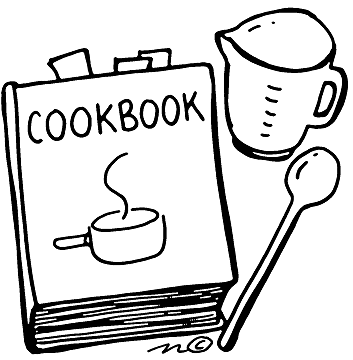

# R Recipes for Common Medical Projects

This book contains R recipes for typical analyses done for medical research projects.  The objectives of this book:

* Create Mock projects and analyze the data using R
* Give people code snippets that they can use for their own projects
* Show how the various packages and functions fit together
* Recommend key packages for summarizing data 
* Provide links for further study
* Model best practices for coding
* Encourage the use of RStudio and R markdown

The assumption is that users will have some basic knowledge of R.  Instead of re-creating introductory information or extended lists of options, we have chosen to provide one way of doing the analysis (with a perhaps a few more at the end of each scenario).  Links are provided to other resources for more education. 