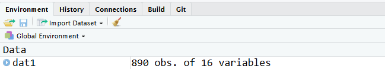

# Scenario 1: Getting Familiar with a New Project


You're handed a new project to work on and the abstract deadline is next week. You need to get something out the door soon!

## Your Mission 

**Import Data**

* Read in the example dataset dat1.sas7bdat.  What variables are in the data?  Are they character, numeric, Date, or factor? 

**Explore Data**

* Take a closer look at the data using basic summary statistics. Do you notice any strange values?  If so, fix them.  Are there any duplicate observations?  If so, see whether you can delete any of them.
* Summarize age, gender, bmi, etc. by the treatment variable using parametric statistics.  Do the summary statistics make sense for each variable?  If not, modify the variables so that the default summaries are appropriate.
* Change the label for the variable age. Now change the table summary statistics to be non-parametric.
* How many people have the combinations of ps, sex, and treatment arm?
* Create a formula from a list of variables that can used in tableby (hint: try `formulize`)

**Plot Data**

* Create a boxplot of bmi. Now create the boxplots stratified by the treatment arm. Modify the axis labels and add a title to your plot.
* Create a scatterplot of age versus another continuous variable. Now create the plot with separate colors for one of the group variables. Now make two scatterplots of age versus bmi with different colors indicating treatment.
* Create these same scatterplots, side-by-side, separately for males and females. How would you add a regression line to these plots?  How about smoothers? 

**Basic Modeling**

* Run a simple linear regression model predicting bmi with a covariate that is coded as 1/2.
Now re-do it with the covariate coded as a factor. Did the answer change?

**Data Import, revisited**

* Read the data in from Excel and compare it with the version that came from SAS. What is different?

## Implementation

### Import Data

* **Read in the example dataset dat1.sas7bdat.**
* **What variables are in the data?  Are they character, numeric, Date, or factor? **

When reading in SAS data you can use the `read_sas()` function that is found in the `haven` package.  To make a package available simply use the `library()` function with the non-quoted name of the package.  The `read_sas()` function works for the majority of SAS datasets.  Other options are found at the [end of this document](#alt-import) in the rare situations where you need to use a different tool.


```r
> # Before doing any work, you are strongly encouraged to set this option in each
> # of your programs (default for later versions of R)
> options(stringsAsFactors = FALSE)
> 
> # various functions from the tidyverse package are used.  You can safely ignore
> # the messages regarding conflicts for now
> library(tidyverse)
> # use the read_sas function found in the haven package
> library(haven)
> # the knitr package includes the kable function for simple nice tables
> library(knitr)
> 
> # link to data on GitHub page if not already downloaded
> if (!file.exists("data/dat1.sas7bdat")) {
+     urlfile <- "https://raw.githubusercontent.com/bethatkinson/R_project_recipes/data/dat1.sas7bdat"
+     if (!dir.exists("data")) 
+         dir.create("data")
+     download.file(urlfile, destfile = "data/dat1.sas7bdat")
+ }
> 
> dat1 <- read_sas("data/dat1.sas7bdat")
```

Once we successfully import data into the current R session we should explore it a little bit.  The `names()` function is a good first step as it displays all the column names of the data, and you can quickly check to see if your import went as expected.

* `names()` returns a character vector


```r
> names(dat1)
 [1] "id"         "age"        "arm"        "sex"        "futime"    
 [6] "fustat"     "ps"         "hgb"        "bmi"        "alkphos"   
[11] "ast"        "mdqualitys" "ageord"     "birthdt"    "resintdt"  
```

To understand how many observations are in your data, we can use `nrow()` function. Similarly, we can also print the number of columns with `ncol()`. The function `dim()` returns both the number of rows and columns at once. 

* `nrow()` and `ncol()` return integers 
* `dim()` returns a vector (rows, columns)


```r
> # how many rows and columns are in the dataset?
> nrow(dat1)
[1] 890
> ncol(dat1)
[1] 15
> dim(dat1)
[1] 890  15
```

Another really useful function to use to explore data is the `str()` or "structure" function.  When we run it, we can see all of the column names like the `names()` function, but now we also see the type of each column as well as any attributes that a column has.  The `read_sas()` function reads in the format and label metadata used in SAS datasets as R object attributes.  It is worth noting that the `str()` function works on most R objects, not just `data.frames`.


```r
> str(dat1)
tibble [890 x 15] (S3: tbl_df/tbl/data.frame)
 $ id        : num [1:890] 84681 89253 89499 90166 90291 ...
  ..- attr(*, "format.sas")= chr "BEST"
 $ age       : num [1:890] 57 64 75 54 71 71 66 56 50 43 ...
  ..- attr(*, "format.sas")= chr "BEST"
 $ arm       : chr [1:890] "F FOLFOX" "F FOLFOX" "F FOLFOX" "G IROX" ...
  ..- attr(*, "label")= chr "Treatment Arm"
  ..- attr(*, "format.sas")= chr "$"
 $ sex       : chr [1:890] "Male" "Female" "Female" "Female" ...
  ..- attr(*, "format.sas")= chr "$"
 $ futime    : num [1:890] 799 97 105 878 31 ...
  ..- attr(*, "label")= chr "Follow-up Time"
  ..- attr(*, "format.sas")= chr "BEST"
 $ fustat    : num [1:890] 2 2 2 2 2 1 2 2 2 2 ...
  ..- attr(*, "label")= chr "Follow-up Status"
  ..- attr(*, "format.sas")= chr "STATF"
 $ ps        : num [1:890] 0 1 1 0 2 NA 1 1 1 NA ...
  ..- attr(*, "label")= chr "ECOG Performance Score"
  ..- attr(*, "format.sas")= chr "BEST"
 $ hgb       : num [1:890] 11.2 12.6 12.5 10.9 9.1 NA 10.5 10.8 13.4 NA ...
  ..- attr(*, "label")= chr "Hemoglobin Count"
  ..- attr(*, "format.sas")= chr "BEST"
 $ bmi       : num [1:890] NA NA NA NA NA NA NA NA NA NA ...
  ..- attr(*, "format.sas")= chr "BEST"
 $ alkphos   : num [1:890] 102 272 169 247 304 NA 196 252 69 NA ...
  ..- attr(*, "label")= chr "Alkaline Phosphotase"
  ..- attr(*, "format.sas")= chr "BEST"
 $ ast       : num [1:890] 7 62 23 23 115 NA 39 77 13 NA ...
  ..- attr(*, "label")= chr "Aspartate Transaminase"
  ..- attr(*, "format.sas")= chr "BEST"
 $ mdqualitys: num [1:890] NA 1 1 1 1 1 0 1 NA 0 ...
  ..- attr(*, "label")= chr "LASA QOL"
  ..- attr(*, "format.sas")= chr "QOLF"
 $ ageord    : chr [1:890] "50-59" "60-69" "70-79" "50-59" ...
  ..- attr(*, "label")= chr "Age Category"
  ..- attr(*, "format.sas")= chr "$"
 $ birthdt   : Date[1:890], format: "2007-03-01" "1850-01-01" ...
 $ resintdt  : Date[1:890], format: "1997-01-01" "1997-01-01" ...
 - attr(*, "label")= chr "DAT1                            "
```

The function `str()` is what you get when you select the blue triangle next to the data name in the "Environment" panel on the right hand side of RStudio. The fact that Rstudio integrated `str()` into their IDE (Integrated development environment) really illustrates how useful they think it is. 




The Rstudio IDE has a ton of really useful features that makes programming in R easier.  Using the `View()` function within Rstudio will cause a new tab to open in the source panel with a view of your data.  Hovering over the name of a column will cause the type of column to display.  Any label attributes will be displayed in the view, and all columns in the view can be sorted.


```r
> View(dat1)
```


Here is some simple code that prints out the variable names and their classes using the functions `sapply()` and `class()`.  [sapply](https://www.rdocumentation.org/packages/base/versions/current/topics/lapply) is a function that looks at each element within a list (here, each variable) and runs the specified function (here, `class()`).  Results are returned as a vector.  Then, the `knitr` package includes the `kable` function which makes pretty default tables, especially for reports. 
In the output below, the `class()` function is returning the class of each variable. Typical R classes for variables in a dataset include: character, numeric, integer, Date, logical, factor. More information on classes and data types can be found in Hadley Wickham's book [Advanced R](https://adv-r.hadley.nz/base-types.html).


```r
> library(knitr)
> kable(data.frame(Type = sapply(X = dat1, FUN = class)))
```


\begin{tabular}{l|l}
\hline
  & Type\\
\hline
id & numeric\\
\hline
age & numeric\\
\hline
arm & character\\
\hline
sex & character\\
\hline
futime & numeric\\
\hline
fustat & numeric\\
\hline
ps & numeric\\
\hline
hgb & numeric\\
\hline
bmi & numeric\\
\hline
alkphos & numeric\\
\hline
ast & numeric\\
\hline
mdqualitys & numeric\\
\hline
ageord & character\\
\hline
birthdt & Date\\
\hline
resintdt & Date\\
\hline
\end{tabular}

Other options to this exercise can be found at the [end of this document](#alt-import).


### Data Exploring

* **Take a closer look at the data using basic summary statistics. Do you notice any strange values?  If so, fix them.**

There are a number of different tools that are available to explore a new dataset.  The package `summarytools` includes the function `dfSummary()` which provides basic summaries of all of the variables in a dataset.  When the summary is written directly to a file, it also provides nice graphical summaries of each variable.


```r
> library(summarytools)
Registered S3 method overwritten by 'pryr':
  method      from
  print.bytes Rcpp
Warning in fun(libname, pkgname): couldn't connect to display ":0"
system might not have X11 capabilities; in case of errors when using dfSummary(), set st_options(use.x11 = FALSE)

Attaching package: 'summarytools'
The following object is masked from 'package:tibble':

    view
> 
> # Settings to work well in markdown document (try running default settings
> # interactively)
> dfSummary(dat1, plain.ascii = FALSE, style = "grid", graph.col = FALSE, headings = TRUE)
```

### Data Frame Summary  
#### dat1  
**Dimensions:** 890 x 15  
**Duplicates:** 0  

+----+-------------+------------------------+-------------------------------+---------------------+----------+----------+
| No | Variable    | Label                  | Stats / Values                | Freqs (% of Valid)  | Valid    | Missing  |
+====+=============+========================+===============================+=====================+==========+==========+
| 1  | id\         |                        | Mean (sd) : 91495.3 (5017.7)\ | 889 distinct values | 890\     | 0\       |
|    | [numeric]   |                        | min < med < max:\             |                     | (100%)   | (0%)     |
|    |             |                        | 76170 < 91912.5 < 112263\     |                     |          |          |
|    |             |                        | IQR (CV) : 4245 (0.1)         |                     |          |          |
+----+-------------+------------------------+-------------------------------+---------------------+----------+----------+
| 2  | age\        |                        | Mean (sd) : 60.2 (11.3)\      | 59 distinct values  | 890\     | 0\       |
|    | [numeric]   |                        | min < med < max:\             |                     | (100%)   | (0%)     |
|    |             |                        | 27 < 61 < 88\                 |                     |          |          |
|    |             |                        | IQR (CV) : 16 (0.2)           |                     |          |          |
+----+-------------+------------------------+-------------------------------+---------------------+----------+----------+
| 3  | arm\        | Treatment Arm          | 1\. A IFL\                    | 303 (34.0%)\        | 890\     | 0\       |
|    | [character] |                        | 2\. F FOLFOX\                 | 299 (33.6%)\        | (100%)   | (0%)     |
|    |             |                        | 3\. G IROX                    | 288 (32.4%)         |          |          |
+----+-------------+------------------------+-------------------------------+---------------------+----------+----------+
| 4  | sex\        |                        | 1\. 2\                        | 2 ( 0.2%)\          | 890\     | 0\       |
|    | [character] |                        | 2\. F\                        | 2 ( 0.2%)\          | (100%)   | (0%)     |
|    |             |                        | 3\. Female\                   | 347 (39.0%)\        |          |          |
|    |             |                        | 4\. Male                      | 539 (60.6%)         |          |          |
+----+-------------+------------------------+-------------------------------+---------------------+----------+----------+
| 5  | futime\     | Follow-up Time         | Mean (sd) : 635.3 (487.8)\    | 666 distinct values | 890\     | 0\       |
|    | [numeric]   |                        | min < med < max:\             |                     | (100%)   | (0%)     |
|    |             |                        | 9 < 516.5 < 2472\             |                     |          |          |
|    |             |                        | IQR (CV) : 546.2 (0.8)        |                     |          |          |
+----+-------------+------------------------+-------------------------------+---------------------+----------+----------+
| 6  | fustat\     | Follow-up Status       | Min  : 1\                     | 1 :  68 ( 7.6%)\    | 890\     | 0\       |
|    | [numeric]   |                        | Mean : 1.9\                   | 2 : 822 (92.4%)     | (100%)   | (0%)     |
|    |             |                        | Max  : 2                      |                     |          |          |
+----+-------------+------------------------+-------------------------------+---------------------+----------+----------+
| 7  | ps\         | ECOG Performance Score | Mean (sd) : 0.5 (0.6)\        | 0 : 403 (52.3%)\    | 770\     | 120\     |
|    | [numeric]   |                        | min < med < max:\             | 1 : 324 (42.1%)\    | (86.52%) | (13.48%) |
|    |             |                        | 0 < 0 < 2\                    | 2 :  43 ( 5.6%)     |          |          |
|    |             |                        | IQR (CV) : 1 (1.1)            |                     |          |          |
+----+-------------+------------------------+-------------------------------+---------------------+----------+----------+
| 8  | hgb\        | Hemoglobin Count       | Mean (sd) : 12.4 (1.7)\       | 84 distinct values  | 770\     | 120\     |
|    | [numeric]   |                        | min < med < max:\             |                     | (86.52%) | (13.48%) |
|    |             |                        | 9 < 12.2 < 18.2\              |                     |          |          |
|    |             |                        | IQR (CV) : 2.5 (0.1)          |                     |          |          |
+----+-------------+------------------------+-------------------------------+---------------------+----------+----------+
| 9  | bmi\        |                        | Mean (sd) : 27.1 (5.6)\       | 828 distinct values | 871\     | 19\      |
|    | [numeric]   |                        | min < med < max:\             |                     | (97.87%) | (2.13%)  |
|    |             |                        | 3.1 < 26.3 < 60.2\            |                     |          |          |
|    |             |                        | IQR (CV) : 6.3 (0.2)          |                     |          |          |
+----+-------------+------------------------+-------------------------------+---------------------+----------+----------+
| 10 | alkphos\    | Alkaline Phosphotase   | Mean (sd) : 173.8 (135.7)\    | 307 distinct values | 770\     | 120\     |
|    | [numeric]   |                        | min < med < max:\             |                     | (86.52%) | (13.48%) |
|    |             |                        | 7 < 125 < 1014\               |                     |          |          |
|    |             |                        | IQR (CV) : 126.8 (0.8)        |                     |          |          |
+----+-------------+------------------------+-------------------------------+---------------------+----------+----------+
| 11 | ast\        | Aspartate Transaminase | Mean (sd) : 36.5 (27.1)\      | 114 distinct values | 770\     | 120\     |
|    | [numeric]   |                        | min < med < max:\             |                     | (86.52%) | (13.48%) |
|    |             |                        | 7 < 27 < 205\                 |                     |          |          |
|    |             |                        | IQR (CV) : 22.8 (0.7)         |                     |          |          |
+----+-------------+------------------------+-------------------------------+---------------------+----------+----------+
| 12 | mdqualitys\ | LASA QOL               | Min  : 0\                     | 0 :  85 (10.7%)\    | 792\     | 98\      |
|    | [numeric]   |                        | Mean : 0.9\                   | 1 : 707 (89.3%)     | (88.99%) | (11.01%) |
|    |             |                        | Max  : 1                      |                     |          |          |
+----+-------------+------------------------+-------------------------------+---------------------+----------+----------+
| 13 | ageord\     | Age Category           | 1\. 20-29\                    | 12 ( 1.4%)\         | 890\     | 0\       |
|    | [character] |                        | 2\. 30-39\                    | 40 ( 4.5%)\         | (100%)   | (0%)     |
|    |             |                        | 3\. 40-49\                    | 117 (13.2%)\        |          |          |
|    |             |                        | 4\. 50-59\                    | 256 (28.8%)\        |          |          |
|    |             |                        | 5\. 60-69\                    | 288 (32.4%)\        |          |          |
|    |             |                        | 6\. 70-79\                    | 162 (18.2%)\        |          |          |
|    |             |                        | 7\. 80-89                     | 15 ( 1.7%)          |          |          |
+----+-------------+------------------------+-------------------------------+---------------------+----------+----------+
| 14 | birthdt\    |                        | min : 1850-01-01\             | 638 distinct values | 890\     | 0\       |
|    | [Date]      |                        | med : 1966-09-22\             |                     | (100%)   | (0%)     |
|    |             |                        | max : 2015-04-06\             |                     |          |          |
|    |             |                        | range : 165y 3m 5d            |                     |          |          |
+----+-------------+------------------------+-------------------------------+---------------------+----------+----------+
| 15 | resintdt\   |                        | min : 1996-12-31\             | 50 distinct values  | 812\     | 78\      |
|    | [Date]      |                        | med : 1997-01-01\             |                     | (91.24%) | (8.76%)  |
|    |             |                        | max : 2014-02-19\             |                     |          |          |
|    |             |                        | range : 17y 1m 19d            |                     |          |          |
+----+-------------+------------------------+-------------------------------+---------------------+----------+----------+

```r
> 
> # Save the results to an external file (includes plots!)
> print(dfSummary(dat1), file = "dat1.html")
Warning in png(png_loc <- tempfile(fileext = ".png"), width = 150 *
graph.magnif, : unable to open connection to X11 display ''
Warning in png(png_loc <- tempfile(fileext = ".png"), width = 150 *
graph.magnif, : unable to open connection to X11 display ''
Warning in png(png_loc <- tempfile(fileext = ".png"), width = 150 *
graph.magnif, : unable to open connection to X11 display ''

Warning in png(png_loc <- tempfile(fileext = ".png"), width = 150 *
graph.magnif, : unable to open connection to X11 display ''
Warning in png(png_loc <- tempfile(fileext = ".png"), width = 150 *
graph.magnif, : unable to open connection to X11 display ''
Warning in png(png_loc <- tempfile(fileext = ".png"), width = 150 *
graph.magnif, : unable to open connection to X11 display ''

Warning in png(png_loc <- tempfile(fileext = ".png"), width = 150 *
graph.magnif, : unable to open connection to X11 display ''
Warning in png(png_loc <- tempfile(fileext = ".png"), width = 150 *
graph.magnif, : unable to open connection to X11 display ''

Warning in png(png_loc <- tempfile(fileext = ".png"), width = 150 *
graph.magnif, : unable to open connection to X11 display ''

Warning in png(png_loc <- tempfile(fileext = ".png"), width = 150 *
graph.magnif, : unable to open connection to X11 display ''

Warning in png(png_loc <- tempfile(fileext = ".png"), width = 150 *
graph.magnif, : unable to open connection to X11 display ''
Warning in png(png_loc <- tempfile(fileext = ".png"), width = 150 *
graph.magnif, : unable to open connection to X11 display ''

Warning in png(png_loc <- tempfile(fileext = ".png"), width = 150 *
graph.magnif, : unable to open connection to X11 display ''
Warning in png(png_loc <- tempfile(fileext = ".png"), width = 150 *
graph.magnif, : unable to open connection to X11 display ''

Warning in png(png_loc <- tempfile(fileext = ".png"), width = 150 *
graph.magnif, : unable to open connection to X11 display ''
Switching method to 'browser'
Output file written: /home/atkinson/education/R_project_recipes/dat1.html
```

See the [external file version](dat1.html).

Another option is to use the `tableby()` function that is available in the Mayo package `arsenal`. Tableby is a fantastic function for quick summaries for data exploration or reporting "table 1" describing the cohort. This function allows you to summarize the data stratified by some "by" variable or overall without any stratification. The code `~ sex + arm + age + bmi` is a formula.  If you wanted to stratify by a variable you would list the stratification variable on the left hand side of the `~`.   The `tableby` function does all the calculations, but it doesn't create the information in a nice format.  The `summary()` function pulls everything together into a nice table.  Note that when you type `summary` here you are actually using `summary.tableby()`.  This is important when looking for help with summarizing the `tableby` output.

If you want to look at the summary in your console window, you might want to use `summary(tab1, text=T)`. In order for the table to look nice within an R markdown (knitr) report, you just need to specify
`results="asis"` when creating the r chunk. This changes the layout slightly (compresses it) and bolds the variable names. 


```r
> library(arsenal)
> tab1 <- tableby(~sex + arm + age + bmi, data = dat1)
> class(tab1)
```

[1] "tableby"       "arsenal_table"

```r
> summary(tab1, title = "Baseline and patient characteristics")
```


Table: Baseline and patient characteristics

|                            | Overall (N=890) |
|:---------------------------|:---------------:|
|**sex**                     |                 |
|&nbsp;&nbsp;&nbsp;2         |    2 (0.2%)     |
|&nbsp;&nbsp;&nbsp;F         |    2 (0.2%)     |
|&nbsp;&nbsp;&nbsp;Female    |   347 (39.0%)   |
|&nbsp;&nbsp;&nbsp;Male      |   539 (60.6%)   |
|**Treatment Arm**           |                 |
|&nbsp;&nbsp;&nbsp;A IFL     |   303 (34.0%)   |
|&nbsp;&nbsp;&nbsp;F FOLFOX  |   299 (33.6%)   |
|&nbsp;&nbsp;&nbsp;G IROX    |   288 (32.4%)   |
|**age**                     |                 |
|&nbsp;&nbsp;&nbsp;Mean (SD) | 60.152 (11.342) |
|&nbsp;&nbsp;&nbsp;Range     | 27.000 - 88.000 |
|**bmi**                     |                 |
|&nbsp;&nbsp;&nbsp;N-Miss    |       19        |
|&nbsp;&nbsp;&nbsp;Mean (SD) | 27.106 (5.620)  |
|&nbsp;&nbsp;&nbsp;Range     | 3.060 - 60.243  |

If you want to examine every variable in `dat` you can use the shortcut `.`.


```r
> tab1 <- tableby(~., data = dat1)
```

Based on these summaries, it appears that `sex` was not coded correctly and needs to be fixed. Our investigator confirms that `2` is supposed to be female. To correct this, we will pull out all the values in the variable sex within the `dat1` dataset that are equal to 2 or F (`dat1$sex[dat1$sex %in% c('2','F')]`) and assign those values to be equal to "Female" (`<- 'Female'`).


```r
> table(dat1$sex)

     2      F Female   Male 
     2      2    347    539 
> 
> # For those observations that are 2 or F, change them to Female
> dat1$sex[dat1$sex %in% c("2", "F")] <- "Female"
> 
> table(dat1$sex)

Female   Male 
   351    539 
```

One of the tricky functions in R for SAS programmers is the `ifelse()` function which differs from `if() {} else {}`. Suppose that you believe that all observations over a certain cutoff are errors and you want to set them equal to missing.  The code below uses `ifelse`.  The first argument creates a logical True/False variable.  For those observations where the "test" is TRUE, use the value in the "yes" field and for those observations where the "test" is FALSE, use the value in the "no" field.


```r
> ast <- dat1$ast
> summary(ast)
   Min. 1st Qu.  Median    Mean 3rd Qu.    Max.    NA's 
   7.00   20.00   27.00   36.46   42.75  205.00     120 
> ast2 <- ifelse(test = ast > 45, yes = NA, no = ast)
> summary(ast2)
   Min. 1st Qu.  Median    Mean 3rd Qu.    Max.    NA's 
   7.00   19.00   24.00   25.21   31.00   45.00     286 
```

If instead I was creating a loop and I had one logical value, then I would do something like the following using `if() else()`.


```r
> group <- "A IFL"
> 
> if (group == "A IFL") {
+     summary(ast)
+ } else {
+     summary(ast2)
+ }
   Min. 1st Qu.  Median    Mean 3rd Qu.    Max.    NA's 
   7.00   20.00   27.00   36.46   42.75  205.00     120 
```

An alternative to `ifelse` is the `case_when()` function in the `dplyr` package.  It is particularly useful when you have multiple nested "ifelse" statements.  For instance, this is another alternative for fixing the code for sex.


```r
> dat1$sex <- case_when(dat1$sex == 2 ~ "Female", dat1$sex == "F" ~ "Female", TRUE ~ 
+     dat1$sex)
```

* **Oops, there is a duplicate observation in the data.  Confirm the data is the same for all the variables and remove one of the duplicates.**

Mistakes in data entry occur all the time. It is wise to check for duplicate records and/or more than one record per unique patient. There are a few different tools that can be used to check for duplicate observations including the functions `duplicated()` and `dplyr::distinct()`.


```r
> # count how many times each id appears in dat1
> table(table(dat1$id))

  1   2 
888   1 
> 
> 
> # This next line of code first identifies which ids are duplicated:
> # 'duplicated(dat1$id)' Then, it selects those ids from 'dat1$id' and returns
> # only one instance of each duplicated ids using 'unique()'.
> 
> tmp <- unique(dat1$id[duplicated(dat1$id)])
> 
> # which rows have a duplicate?
> dup.rows <- which(dat1$id %in% tmp)
> 
> # show a portion of the data with the duplicates - which version do you keep?
> # the kable function is available in the knitr package
> kable(dat1[dup.rows, c("id", "age", "arm", "sex", "bmi")])
```


\begin{tabular}{r|r|l|l|r}
\hline
id & age & arm & sex & bmi\\
\hline
101106 & 79 & F FOLFOX & Female & 3.059935\\
\hline
101106 & 79 & F FOLFOX & Female & 30.599346\\
\hline
\end{tabular}


This same code can be run using the following `dplyr` commands.  It also illustrates the use of "piping", which is what the 3 character string `%>%` is called. Basically, it allows you to combine a bunch of commands together without having to save out temporary datasets.  The `filter` command keeps only those observations where the condition is true.  The `select` function keeps only certain variables.


```r
> # Using dplyr code this would be
> dat1 %>% filter(id %in% tmp) %>% select(id, age, arm, sex, bmi) %>% kable()
```


\begin{tabular}{r|r|l|l|r}
\hline
id & age & arm & sex & bmi\\
\hline
101106 & 79 & F FOLFOX & Female & 3.059935\\
\hline
101106 & 79 & F FOLFOX & Female & 30.599346\\
\hline
\end{tabular}

Now check to see if the observations are a complete duplicate or not.


```r
> # When you use `duplicated()` on a data.frame, it will test for completely
> # identical rows.
> table(duplicated(dat1))

FALSE 
  890 
> 
> # remove rows with duplicate values (2 different approaches) Both approaches will
> # return the first instance of a row and will exclude any duplicated rows.  This
> # is similar to `FIRST.` in SAS.
> dim(dat1)
[1] 890  15
> 
> dat2 <- dat1[!duplicated(dat1), ]
> dim(dat2)
[1] 890  15
```

* **Summarize age, gender, bmi, ... by the treatment variable using parametric statistics**

Again, this is an instance where `tableby` produces a nice table. Here the variable `arm` is listed on the left-hand side of the formula.  The option `pfootnote=TRUE` indicates that the summary table should show a footnote indicating what test was run. 


```r
> tab1 <- tableby(arm ~ age + sex + ps + bmi + alkphos + mdqualitys + ageord + birthdt, 
+     data = dat2)
> summary(tab1, pfootnote = TRUE, total = FALSE)
```


|                            |      A IFL (N=303)      |    F FOLFOX (N=299)     |     G IROX (N=288)      |  p value|
|:---------------------------|:-----------------------:|:-----------------------:|:-----------------------:|--------:|
|**age**                     |                         |                         |                         | 0.585^1^|
|&nbsp;&nbsp;&nbsp;Mean (SD) |     59.696 (11.365)     |     60.652 (11.422)     |     60.111 (11.253)     |         |
|&nbsp;&nbsp;&nbsp;Range     |     27.000 - 88.000     |     27.000 - 88.000     |     28.000 - 84.000     |         |
|**sex**                     |                         |                         |                         | 0.175^2^|
|&nbsp;&nbsp;&nbsp;Female    |       107 (35.3%)       |       127 (42.5%)       |       117 (40.6%)       |         |
|&nbsp;&nbsp;&nbsp;Male      |       196 (64.7%)       |       172 (57.5%)       |       171 (59.4%)       |         |
|**ECOG Performance Score**  |                         |                         |                         | 0.781^1^|
|&nbsp;&nbsp;&nbsp;N-Miss    |           45            |           39            |           36            |         |
|&nbsp;&nbsp;&nbsp;Mean (SD) |      0.512 (0.600)      |      0.538 (0.598)      |      0.548 (0.607)      |         |
|&nbsp;&nbsp;&nbsp;Range     |      0.000 - 2.000      |      0.000 - 2.000      |      0.000 - 2.000      |         |
|**bmi**                     |                         |                         |                         | 0.745^1^|
|&nbsp;&nbsp;&nbsp;N-Miss    |            6            |            9            |            4            |         |
|&nbsp;&nbsp;&nbsp;Mean (SD) |     27.278 (5.493)      |     27.112 (5.499)      |     26.920 (5.883)      |         |
|&nbsp;&nbsp;&nbsp;Range     |     14.053 - 53.008     |     3.060 - 49.130      |     16.071 - 60.243     |         |
|**Alkaline Phosphotase**    |                         |                         |                         | 0.707^1^|
|&nbsp;&nbsp;&nbsp;N-Miss    |           45            |           39            |           36            |         |
|&nbsp;&nbsp;&nbsp;Mean (SD) |    170.612 (124.842)    |    171.377 (133.671)    |    179.663 (148.110)    |         |
|&nbsp;&nbsp;&nbsp;Range     |    13.000 - 858.000     |    18.000 - 1014.000    |     7.000 - 982.000     |         |
|**LASA QOL**                |                         |                         |                         | 0.937^1^|
|&nbsp;&nbsp;&nbsp;N-Miss    |           31            |           35            |           32            |         |
|&nbsp;&nbsp;&nbsp;Mean (SD) |      0.890 (0.314)      |      0.890 (0.313)      |      0.898 (0.303)      |         |
|&nbsp;&nbsp;&nbsp;Range     |      0.000 - 1.000      |      0.000 - 1.000      |      0.000 - 1.000      |         |
|**Age Category**            |                         |                         |                         | 0.994^2^|
|&nbsp;&nbsp;&nbsp;20-29     |        3 (1.0%)         |        4 (1.3%)         |        5 (1.7%)         |         |
|&nbsp;&nbsp;&nbsp;30-39     |        15 (5.0%)        |        12 (4.0%)        |        13 (4.5%)        |         |
|&nbsp;&nbsp;&nbsp;40-49     |       46 (15.2%)        |       36 (12.0%)        |       35 (12.2%)        |         |
|&nbsp;&nbsp;&nbsp;50-59     |       85 (28.1%)        |       89 (29.8%)        |       82 (28.5%)        |         |
|&nbsp;&nbsp;&nbsp;60-69     |       98 (32.3%)        |       96 (32.1%)        |       94 (32.6%)        |         |
|&nbsp;&nbsp;&nbsp;70-79     |       52 (17.2%)        |       56 (18.7%)        |       54 (18.8%)        |         |
|&nbsp;&nbsp;&nbsp;80-89     |        4 (1.3%)         |        6 (2.0%)         |        5 (1.7%)         |         |
|**birthdt**                 |                         |                         |                         | 0.653^3^|
|&nbsp;&nbsp;&nbsp;Median    |       1966-10-09        |       1969-01-01        |       1964-10-02        |         |
|&nbsp;&nbsp;&nbsp;Range     | 1850-01-01 - 2015-04-06 | 1850-01-01 - 2013-11-03 | 1850-01-01 - 2014-01-01 |         |
1. Linear Model ANOVA
2. Pearson's Chi-squared test
3. Kruskal-Wallis rank sum test

* **Do the summary statistics make sense for each variable?  If not, modify them so that the default summaries fit the data.**

These are the variables that are not creating the correct summaries

* LASA QOL (`mdqualitys`)
    + Range of values from 0-1
* ECOG Performance Score (`ps`)
    + Range of values from 0 - 2
    + 0 = Asymptomatic, 1 = Symptomatic but ambulatory, 2 = Symptomatic, <50% in bed during the day
* Age group (`ageord`)
    + Age groups, character strings (20-29, ... 80-89)

The variables `mdqualitys` and `ps` should not be treated as numeric values and summaries for `ageord` should recognize that `20-29` is less than `30-39` (hence the use of the "ordered" function instead of "factor").


```r
> # Since the summaries performed by `tableby` are dependent on the class of the
> # variable, if we change the class, we change the how `tableby` treats the
> # variable.
> 
> # change mdqualitys to a factor
> dat2$mdqualitys <- factor(dat2$mdqualitys, levels = c(0, 1), labels = c("Deficient", 
+     "Not Deficient"))
> 
> # change ps to an ordered factor where 0 < 1 < 2
> dat2$ps <- ordered(dat2$ps, levels = 0:2, labels = 0:2)
> 
> # change ageord to an ordered factor
> dat2$ageord <- ordered(dat2$ageord)
```

* **Change the label for the variables `age` and `bmi`**

When reading data in from SAS, variable labels are retained and stored in the attribute of the variable.  Usually in R, when a `data.frame` is subsetted these labels disappear.  Therefore it is useful to keep a separate object storing the variables and their labels.  If you have attached the package `arsenal` we have modified this behavior so labels do not disappear.

You can assign columns metadata, like a label, that describes them using attributes. If you want to modify/add a specific label, there are a couple of ways to do that.  The function `tableby` will look for label attributes and will automatically use them in the summaries. Another way to modify/add is using the `attr()` function. 


```r
> # The labels() function in arsenal shows all labels of a data frame
> labels(dat2)$bmi
```

NULL

```r
> labels(dat2)$bmi <- "Body Mass Index"
> 
> # Modify the actual attribute for the variable
> attr(dat2$age, "label")
```

NULL

```r
> attr(dat2$age, "label") <- "Age at baseline"
```

More information about labels can be found in the [arsenal vignette](https://cran.r-project.org/web/packages/arsenal/vignettes/labels.html) on that topic.

* **Now change the summary statistics to be non-parametric in the table.**

Using the function `tableby.control()` you can define which summary statistics and tests you want to appear for each type of variable (look at the help page of `tableby.control`, try `?tableby.control` for more details).


```r
> # change summary statistics to be non-parametric by using numeric.stats in
> # tableby.control also, revise the number of decimal places, remove chi-squared
> # correction create a tableby.control object to use later
> mycontrol <- tableby.control(numeric.stats = c("Nmiss", "medianq1q3"), digits = 1, 
+     chisq.correct = FALSE)
> 
> tab2 <- tableby(arm ~ age + sex + ps + bmi + alkphos + mdqualitys + ageord + birthdt, 
+     data = dat2, control = mycontrol)
> summary(tab2, pfootnote = TRUE)
```


|                                  |      A IFL (N=303)      |    F FOLFOX (N=299)     |     G IROX (N=288)      |      Total (N=890)      |  p value|
|:---------------------------------|:-----------------------:|:-----------------------:|:-----------------------:|:-----------------------:|--------:|
|**Age at baseline**               |                         |                         |                         |                         | 0.585^1^|
|&nbsp;&nbsp;&nbsp;Median (Q1, Q3) |    61.0 (53.0, 68.0)    |    61.0 (52.5, 69.0)    |    61.0 (53.0, 68.2)    |    61.0 (53.0, 69.0)    |         |
|**sex**                           |                         |                         |                         |                         | 0.175^2^|
|&nbsp;&nbsp;&nbsp;Female          |       107 (35.3%)       |       127 (42.5%)       |       117 (40.6%)       |       351 (39.4%)       |         |
|&nbsp;&nbsp;&nbsp;Male            |       196 (64.7%)       |       172 (57.5%)       |       171 (59.4%)       |       539 (60.6%)       |         |
|**ps**                            |                         |                         |                         |                         | 0.780^3^|
|&nbsp;&nbsp;&nbsp;N-Miss          |           45            |           39            |           36            |           120           |         |
|&nbsp;&nbsp;&nbsp;0               |       140 (54.3%)       |       134 (51.5%)       |       129 (51.2%)       |       403 (52.3%)       |         |
|&nbsp;&nbsp;&nbsp;1               |       104 (40.3%)       |       112 (43.1%)       |       108 (42.9%)       |       324 (42.1%)       |         |
|&nbsp;&nbsp;&nbsp;2               |        14 (5.4%)        |        14 (5.4%)        |        15 (6.0%)        |        43 (5.6%)        |         |
|**Body Mass Index**               |                         |                         |                         |                         | 0.745^1^|
|&nbsp;&nbsp;&nbsp;N-Miss          |            6            |            9            |            4            |           19            |         |
|&nbsp;&nbsp;&nbsp;Median (Q1, Q3) |    26.3 (23.6, 30.1)    |    26.5 (23.7, 29.7)    |    25.8 (23.0, 29.2)    |    26.3 (23.5, 29.8)    |         |
|**Alkaline Phosphotase**          |                         |                         |                         |                         | 0.707^1^|
|&nbsp;&nbsp;&nbsp;N-Miss          |           45            |           39            |           36            |           120           |         |
|&nbsp;&nbsp;&nbsp;Median (Q1, Q3) |   128.0 (83.2, 212.8)   |   122.0 (87.8, 207.5)   |   122.0 (87.8, 219.8)   |   125.0 (86.0, 212.8)   |         |
|**mdqualitys**                    |                         |                         |                         |                         | 0.936^2^|
|&nbsp;&nbsp;&nbsp;N-Miss          |           31            |           35            |           32            |           98            |         |
|&nbsp;&nbsp;&nbsp;Deficient       |       30 (11.0%)        |       29 (11.0%)        |       26 (10.2%)        |       85 (10.7%)        |         |
|&nbsp;&nbsp;&nbsp;Not Deficient   |       242 (89.0%)       |       235 (89.0%)       |       230 (89.8%)       |       707 (89.3%)       |         |
|**ageord**                        |                         |                         |                         |                         | 0.637^3^|
|&nbsp;&nbsp;&nbsp;20-29           |        3 (1.0%)         |        4 (1.3%)         |        5 (1.7%)         |        12 (1.3%)        |         |
|&nbsp;&nbsp;&nbsp;30-39           |        15 (5.0%)        |        12 (4.0%)        |        13 (4.5%)        |        40 (4.5%)        |         |
|&nbsp;&nbsp;&nbsp;40-49           |       46 (15.2%)        |       36 (12.0%)        |       35 (12.2%)        |       117 (13.1%)       |         |
|&nbsp;&nbsp;&nbsp;50-59           |       85 (28.1%)        |       89 (29.8%)        |       82 (28.5%)        |       256 (28.8%)       |         |
|&nbsp;&nbsp;&nbsp;60-69           |       98 (32.3%)        |       96 (32.1%)        |       94 (32.6%)        |       288 (32.4%)       |         |
|&nbsp;&nbsp;&nbsp;70-79           |       52 (17.2%)        |       56 (18.7%)        |       54 (18.8%)        |       162 (18.2%)       |         |
|&nbsp;&nbsp;&nbsp;80-89           |        4 (1.3%)         |        6 (2.0%)         |        5 (1.7%)         |        15 (1.7%)        |         |
|**birthdt**                       |                         |                         |                         |                         | 0.653^4^|
|&nbsp;&nbsp;&nbsp;Median          |       1966-10-09        |       1969-01-01        |       1964-10-02        |       1966-09-22        |         |
|&nbsp;&nbsp;&nbsp;Range           | 1850-01-01 - 2015-04-06 | 1850-01-01 - 2013-11-03 | 1850-01-01 - 2014-01-01 | 1850-01-01 - 2015-04-06 |         |
1. Linear Model ANOVA
2. Pearson's Chi-squared test
3. Trend test for ordinal variables
4. Kruskal-Wallis rank sum test

We can see that Age Group, ECOG Performance Score, and LASA QOL are now summarized appropriately and the default tests have changed for these variables.  Also, the labels for BMI and age have changed.

Another way to add labels is to use the `labelTranslations` option within `summary.tableby()`.  Here this example assumes that you have a list describing the variable labels (see the example at the [end of the document](#vlabels) for details on how to create the vlabels list).


```r
> # Use labelTranslations to add labels, ignore warning
> summary(tab2, labelTranslations = vlabels, pfootnote)
```

* **Run the table separately for males only (subsetting on the fly instead of creating separate datasets).  In your report, add some text describing how many males and how many females you have.**


```r
> tab2_males <- tableby(arm ~ age + ps + bmi + alkphos + mdqualitys + ageord + birthdt, 
+     data = dat2, control = mycontrol, subset = sex == "Male")
> summary(tab2_males, pfootnote = TRUE, title = "Males only")
```


Table: Males only

|                                  |      A IFL (N=196)      |    F FOLFOX (N=172)     |     G IROX (N=171)      |      Total (N=539)      |  p value|
|:---------------------------------|:-----------------------:|:-----------------------:|:-----------------------:|:-----------------------:|--------:|
|**Age at baseline**               |                         |                         |                         |                         | 0.717^1^|
|&nbsp;&nbsp;&nbsp;Median (Q1, Q3) |    61.0 (53.8, 68.0)    |    61.0 (53.0, 69.0)    |    62.0 (53.5, 69.5)    |    61.0 (53.0, 69.0)    |         |
|**ps**                            |                         |                         |                         |                         | 0.508^2^|
|&nbsp;&nbsp;&nbsp;N-Miss          |           32            |           16            |           24            |           72            |         |
|&nbsp;&nbsp;&nbsp;0               |       94 (57.3%)        |       80 (51.3%)        |       79 (53.7%)        |       253 (54.2%)       |         |
|&nbsp;&nbsp;&nbsp;1               |       64 (39.0%)        |       68 (43.6%)        |       61 (41.5%)        |       193 (41.3%)       |         |
|&nbsp;&nbsp;&nbsp;2               |        6 (3.7%)         |        8 (5.1%)         |        7 (4.8%)         |        21 (4.5%)        |         |
|**Body Mass Index**               |                         |                         |                         |                         | 0.872^1^|
|&nbsp;&nbsp;&nbsp;N-Miss          |            4            |            5            |            3            |           12            |         |
|&nbsp;&nbsp;&nbsp;Median (Q1, Q3) |    26.8 (24.3, 30.0)    |    26.7 (24.1, 30.0)    |    26.3 (24.0, 29.2)    |    26.5 (24.1, 29.9)    |         |
|**Alkaline Phosphotase**          |                         |                         |                         |                         | 0.763^1^|
|&nbsp;&nbsp;&nbsp;N-Miss          |           32            |           16            |           24            |           72            |         |
|&nbsp;&nbsp;&nbsp;Median (Q1, Q3) |   125.0 (82.0, 205.2)   |   123.5 (89.0, 195.2)   |   111.0 (87.0, 196.5)   |   122.0 (86.0, 199.5)   |         |
|**mdqualitys**                    |                         |                         |                         |                         | 0.861^3^|
|&nbsp;&nbsp;&nbsp;N-Miss          |           17            |           19            |           19            |           55            |         |
|&nbsp;&nbsp;&nbsp;Deficient       |       21 (11.7%)        |       17 (11.1%)        |        15 (9.9%)        |       53 (11.0%)        |         |
|&nbsp;&nbsp;&nbsp;Not Deficient   |       158 (88.3%)       |       136 (88.9%)       |       137 (90.1%)       |       431 (89.0%)       |         |
|**ageord**                        |                         |                         |                         |                         | 0.602^2^|
|&nbsp;&nbsp;&nbsp;20-29           |        2 (1.0%)         |        2 (1.2%)         |        1 (0.6%)         |        5 (0.9%)         |         |
|&nbsp;&nbsp;&nbsp;30-39           |        8 (4.1%)         |        7 (4.1%)         |        8 (4.7%)         |        23 (4.3%)        |         |
|&nbsp;&nbsp;&nbsp;40-49           |       29 (14.8%)        |       25 (14.5%)        |       20 (11.7%)        |       74 (13.7%)        |         |
|&nbsp;&nbsp;&nbsp;50-59           |       58 (29.6%)        |       48 (27.9%)        |       49 (28.7%)        |       155 (28.8%)       |         |
|&nbsp;&nbsp;&nbsp;60-69           |       63 (32.1%)        |       56 (32.6%)        |       54 (31.6%)        |       173 (32.1%)       |         |
|&nbsp;&nbsp;&nbsp;70-79           |       33 (16.8%)        |       29 (16.9%)        |       35 (20.5%)        |       97 (18.0%)        |         |
|&nbsp;&nbsp;&nbsp;80-89           |        3 (1.5%)         |        5 (2.9%)         |        4 (2.3%)         |        12 (2.2%)        |         |
|**birthdt**                       |                         |                         |                         |                         | 0.042^4^|
|&nbsp;&nbsp;&nbsp;Median          |       1969-01-01        |       1972-02-07        |       1965-01-01        |       1969-01-01        |         |
|&nbsp;&nbsp;&nbsp;Range           | 1850-01-01 - 2015-04-06 | 1850-01-01 - 2013-11-03 | 1850-01-01 - 2014-01-01 | 1850-01-01 - 2015-04-06 |         |
1. Linear Model ANOVA
2. Trend test for ordinal variables
3. Pearson's Chi-squared test
4. Kruskal-Wallis rank sum test

```r
> 
> # either calculate these ahead of time or on-the-fly
> nfemale <- sum(dat2$sex == "Female")
> nmales <- sum(dat2$sex == "Male")
```

The study sample consists of 890 observations, of which 539 are men and 351 are women.   

* **How many people have the combinations of ps, sex, and treatment arm?**

The `freqlist()` function, also available in the `arsenal` package, provides summaries similar to what you might get with `proc freq; table a*b*c / list` in SAS. The `sparse` option shows all combinations.


```r
> summary(freqlist(~ps + sex + arm, data = dat2, sparse = TRUE))
```


|ps |sex    |Treatment Arm | Freq| Cumulative Freq| Percent| Cumulative Percent|
|:--|:------|:-------------|----:|---------------:|-------:|------------------:|
|0  |Female |A IFL         |   46|              46|    5.17|               5.17|
|   |       |F FOLFOX      |   54|             100|    6.07|              11.24|
|   |       |G IROX        |   50|             150|    5.62|              16.85|
|   |Male   |A IFL         |   94|             244|   10.56|              27.42|
|   |       |F FOLFOX      |   80|             324|    8.99|              36.40|
|   |       |G IROX        |   79|             403|    8.88|              45.28|
|1  |Female |A IFL         |   40|             443|    4.49|              49.78|
|   |       |F FOLFOX      |   44|             487|    4.94|              54.72|
|   |       |G IROX        |   47|             534|    5.28|              60.00|
|   |Male   |A IFL         |   64|             598|    7.19|              67.19|
|   |       |F FOLFOX      |   68|             666|    7.64|              74.83|
|   |       |G IROX        |   61|             727|    6.85|              81.69|
|2  |Female |A IFL         |    8|             735|    0.90|              82.58|
|   |       |F FOLFOX      |    6|             741|    0.67|              83.26|
|   |       |G IROX        |    8|             749|    0.90|              84.16|
|   |Male   |A IFL         |    6|             755|    0.67|              84.83|
|   |       |F FOLFOX      |    8|             763|    0.90|              85.73|
|   |       |G IROX        |    7|             770|    0.79|              86.52|
|NA |Female |A IFL         |   13|             783|    1.46|              87.98|
|   |       |F FOLFOX      |   23|             806|    2.58|              90.56|
|   |       |G IROX        |   12|             818|    1.35|              91.91|
|   |Male   |A IFL         |   32|             850|    3.60|              95.51|
|   |       |F FOLFOX      |   16|             866|    1.80|              97.30|
|   |       |G IROX        |   24|             890|    2.70|             100.00|

Many times we are interested in the frequency of certain combinations of variables. The code below illustrates the power of the `group_by()` and `count()` available in the `dplyr` package.  This is a handy way to do several commands together.  In this example, the code reads as:

* use the dataset `dat2`
* stratify the data by a combination of sex, arm, and ps
* count how many rows there are in each strata
* print out the results using the `kable()` function


```r
> dat2 %>% group_by(sex, arm, ps) %>% count() %>% kable()
```


\begin{tabular}{l|l|l|r}
\hline
sex & arm & ps & n\\
\hline
Female & A IFL & 0 & 46\\
\hline
Female & A IFL & 1 & 40\\
\hline
Female & A IFL & 2 & 8\\
\hline
Female & A IFL & NA & 13\\
\hline
Female & F FOLFOX & 0 & 54\\
\hline
Female & F FOLFOX & 1 & 44\\
\hline
Female & F FOLFOX & 2 & 6\\
\hline
Female & F FOLFOX & NA & 23\\
\hline
Female & G IROX & 0 & 50\\
\hline
Female & G IROX & 1 & 47\\
\hline
Female & G IROX & 2 & 8\\
\hline
Female & G IROX & NA & 12\\
\hline
Male & A IFL & 0 & 94\\
\hline
Male & A IFL & 1 & 64\\
\hline
Male & A IFL & 2 & 6\\
\hline
Male & A IFL & NA & 32\\
\hline
Male & F FOLFOX & 0 & 80\\
\hline
Male & F FOLFOX & 1 & 68\\
\hline
Male & F FOLFOX & 2 & 8\\
\hline
Male & F FOLFOX & NA & 16\\
\hline
Male & G IROX & 0 & 79\\
\hline
Male & G IROX & 1 & 61\\
\hline
Male & G IROX & 2 & 7\\
\hline
Male & G IROX & NA & 24\\
\hline
\end{tabular}

* **Fancier: create a formula from a list of variables that can used in tableby (hint: explore `formulize`)**

The `arsenal` package has the function `formulize()` which allows you to create a formula and use it repeatedly.  This can be especially helpful when you have a list of variables that you want to loop over or summarize in different ways.


```r
> labvars <- c("hgb", "alkphos", "ast")
> myform <- formulize("sex", labvars)
> myform
```

sex ~ hgb + alkphos + ast

```r
> 
> summary(tableby(myform, data = dat2))
```


|                            |  Female (N=351)   |   Male (N=539)    |   Total (N=890)   | p value|
|:---------------------------|:-----------------:|:-----------------:|:-----------------:|-------:|
|**Hemoglobin Count**        |                   |                   |                   | < 0.001|
|&nbsp;&nbsp;&nbsp;N-Miss    |        48         |        72         |        120        |        |
|&nbsp;&nbsp;&nbsp;Mean (SD) |  11.956 (1.446)   |  12.620 (1.796)   |  12.359 (1.698)   |        |
|&nbsp;&nbsp;&nbsp;Range     |  9.000 - 17.900   |  9.000 - 18.200   |  9.000 - 18.200   |        |
|**Alkaline Phosphotase**    |                   |                   |                   |   0.342|
|&nbsp;&nbsp;&nbsp;N-Miss    |        48         |        72         |        120        |        |
|&nbsp;&nbsp;&nbsp;Mean (SD) | 179.607 (131.827) | 170.086 (138.099) | 173.832 (135.659) |        |
|&nbsp;&nbsp;&nbsp;Range     |  7.000 - 771.000  | 13.000 - 1014.000 | 7.000 - 1014.000  |        |
|**Aspartate Transaminase**  |                   |                   |                   |   0.406|
|&nbsp;&nbsp;&nbsp;N-Miss    |        48         |        72         |        120        |        |
|&nbsp;&nbsp;&nbsp;Mean (SD) |  37.475 (28.437)  |  35.809 (26.288)  |  36.465 (27.148)  |        |
|&nbsp;&nbsp;&nbsp;Range     | 10.000 - 178.000  |  7.000 - 205.000  |  7.000 - 205.000  |        |

Other options to this exercise can be found at the [end of this document](#alt-import).

### Plotting

There are three main plotting systems in R: basic, ggplot2, and lattice.
It is useful to know at least the basic and ggplot2 approaches to plotting because sometimes one tool is better than the other.
The examples below include both basic and ggplot2 code so that you can compare the results.
There are two basic and fundamental parts of a ggplot call:
the `aes()` function, which defines the plots aesthetics, and a call  to a `geom_*()` function.
Basically the `aes()` function defines the variables to be used on the x and y axes (and optionally a group variable).
The `geom_*()` functions will define what type of plot to use (boxplot, scatterplot, etc.).

#### Boxplots

* **Create a boxplot of bmi**


```r
> # code using basic R
> boxplot(dat2$bmi)
```


\begin{center}\includegraphics[width=0.8\linewidth]{01-scenario1_files/figure-latex/boxplots-1} \end{center}

```r
> 
> # code using ggplot
> library(ggplot2)
> ggplot(dat2, aes(x = "total", y = bmi)) + geom_boxplot()
Warning: Removed 19 rows containing non-finite values (stat_boxplot).
```


\begin{center}\includegraphics[width=0.8\linewidth]{01-scenario1_files/figure-latex/boxplots-2} \end{center}

* **Now create the boxplots stratified by the treatment arm**


```r
> # code using basic R
> boxplot(bmi ~ arm, data = dat2)
```


\begin{center}\includegraphics[width=0.8\linewidth]{01-scenario1_files/figure-latex/unnamed-chunk-19-1} \end{center}

```r
> 
> # code using ggplot
> ggplot(dat2, aes(x = arm, y = bmi)) + geom_boxplot()
Warning: Removed 19 rows containing non-finite values (stat_boxplot).
```


\begin{center}\includegraphics[width=0.8\linewidth]{01-scenario1_files/figure-latex/unnamed-chunk-19-2} \end{center}

* **Modify the axis labels and add a title to your plot.**


```r
> # code using basic R
> boxplot(bmi ~ arm, data = dat2, xlab = " ", ylab = "BMI at baseline", main = "BMI distribution stratified by treatment group")
```


\begin{center}\includegraphics[width=0.8\linewidth]{01-scenario1_files/figure-latex/unnamed-chunk-20-1} \end{center}

```r
> 
> # code using ggplot
> ggplot(dat2, aes(x = arm, y = bmi)) + geom_boxplot() + xlab(" ") + ylab("BMI at baseline") + 
+     ggtitle("BMI distribution stratified by treatment group")
Warning: Removed 19 rows containing non-finite values (stat_boxplot).
```


\begin{center}\includegraphics[width=0.8\linewidth]{01-scenario1_files/figure-latex/unnamed-chunk-20-2} \end{center}

#### Scatterplots

* **Now make two scatterplots of age versus bmi with different colors indicating treatment**

The call to `as.numeric(as.factor(arm))` turns the levels of `arm` to a factor which is essentially a numeric variables with formats.  The call to `as.numeric` then changes the factor to a number, and the numbers correspond to different colors (1=black, 2=red, 3=green, 4=blue, 5=lightblue, 6=pink, 7=yellow, 8=gray).


```r
> # code using basic R
> plot(bmi ~ age, data = dat2, col = as.numeric(as.factor(arm)))
```


\begin{center}\includegraphics[width=0.8\linewidth]{01-scenario1_files/figure-latex/unnamed-chunk-21-1} \end{center}

```r
> 
> # code using ggplot
> ggplot(dat2, aes(age, bmi, color = arm)) + geom_point()
Warning: Removed 19 rows containing missing values (geom_point).
```


\begin{center}\includegraphics[width=0.8\linewidth]{01-scenario1_files/figure-latex/unnamed-chunk-21-2} \end{center}

* **Create these same scatterplots, side-by-side, separately for males and females**


```r
> # code using basic R
> par(mfrow = c(1, 2))
> plot(bmi ~ age, data = dat2[dat2$sex == "Female", ], col = as.numeric(as.factor(arm)), 
+     main = "Females")
> plot(bmi ~ age, data = dat2[dat2$sex == "Male", ], col = as.numeric(as.factor(arm)), 
+     main = "Males")
```


\begin{center}\includegraphics[width=0.8\linewidth]{01-scenario1_files/figure-latex/unnamed-chunk-22-1} \end{center}

```r
> par(mfrow = c(1, 1))
> 
> # code using ggplot
> ggplot(dat2, aes(age, bmi, color = arm)) + geom_point() + facet_grid(~sex)
Warning: Removed 19 rows containing missing values (geom_point).
```


\begin{center}\includegraphics[width=0.8\linewidth]{01-scenario1_files/figure-latex/unnamed-chunk-22-2} \end{center}

* **Fancier: How would you add a regression line to these plots?  How about smoothers?**

The code using base R graphics can be found further down at the [end of this document](#alt-plot).


```r
> # code using ggplot -- Regression lines
> ggplot(dat2, aes(age, bmi, color = arm)) + geom_point() + facet_grid(~sex) + geom_smooth(method = "lm")
`geom_smooth()` using formula 'y ~ x'
Warning: Removed 19 rows containing non-finite values (stat_smooth).
Warning: Removed 19 rows containing missing values (geom_point).
```


\begin{center}\includegraphics[width=0.8\linewidth]{01-scenario1_files/figure-latex/unnamed-chunk-23-1} \end{center}

```r
> 
> # -- Smoothers
> ggplot(dat2, aes(age, bmi, color = arm)) + geom_point() + facet_grid(~sex) + geom_smooth()
`geom_smooth()` using method = 'loess' and formula 'y ~ x'
Warning: Removed 19 rows containing non-finite values (stat_smooth).

Warning: Removed 19 rows containing missing values (geom_point).
```


\begin{center}\includegraphics[width=0.8\linewidth]{01-scenario1_files/figure-latex/unnamed-chunk-23-2} \end{center}

```r
> 
> # -- Smoothers removing the confidence bands
> ggplot(dat2, aes(age, bmi, color = arm)) + geom_point() + facet_grid(~sex) + geom_smooth(se = FALSE)
`geom_smooth()` using method = 'loess' and formula 'y ~ x'
Warning: Removed 19 rows containing non-finite values (stat_smooth).

Warning: Removed 19 rows containing missing values (geom_point).
```


\begin{center}\includegraphics[width=0.8\linewidth]{01-scenario1_files/figure-latex/unnamed-chunk-23-3} \end{center}

There are many formating options for `ggplot` including `theme_bw` and the package [ggthemes[(https://rdrr.io/cran/ggthemes/)] which includes extra themes, geoms, and scales for ggplot2. Below, see how the plot has changed by just indicating the plotting theme.  Another addition is the `alpha` term which lightens the points (default=1). 


```r
> ggplot(dat2, aes(age, bmi, color = arm)) + geom_point(alpha = 0.2) + facet_grid(~sex) + 
+     geom_smooth(se = FALSE) + theme_bw()
`geom_smooth()` using method = 'loess' and formula 'y ~ x'
Warning: Removed 19 rows containing non-finite values (stat_smooth).
Warning: Removed 19 rows containing missing values (geom_point).
```


\begin{center}\includegraphics[width=0.8\linewidth]{01-scenario1_files/figure-latex/unnamed-chunk-24-1} \end{center}

### Basic Modeling

* **Run a simple linear regression model predicting bmi with a covariate that is coded as 1/2. Now re-do it with the covariate coded as a factor. Did the answer change?**

First create a numeric version of sex with the values 1 and 2 (for illustration purposes only). This can be done by changing the variable `sex` from character to a factor, then changing the factor to numeric.  


```r
> # Create a version of sex that is coded 1/2
> dat2$sex.f <- factor(dat2$sex)
> dat2$sex12 <- as.numeric(dat2$sex.f)
> 
> table(dat2$sex12, dat2$sex.f)
   
    Female Male
  1    351    0
  2      0  539
```

Next, fit a linear regression model using the function `lm()`.  The `lm()` function uses two main arguments - a formula and a dataset.   


```r
> # Fit a linear regression model using the the two different versions of sex
> fit1 <- lm(bmi ~ sex12, data = dat2)
> fit2 <- lm(bmi ~ sex.f, data = dat2)
```

There are a number of extractor functions for models, meaning that they can be used to extract information from a model.  One example is `coef()` which extracts the coefficients.


```r
> # Compare the coefficients
> coef(fit1)
(Intercept)       sex12 
 25.6960705   0.8783982 
> coef(fit2)
(Intercept)   sex.fMale 
 26.5744687   0.8783982 
```

The `summary()` function shown below is actually using `summary.lm()`.


```r
> # Look at a standard model summary
> summary(fit1)

Call:
lm(formula = bmi ~ sex12, data = dat2)

Residuals:
    Min      1Q  Median      3Q     Max 
-23.515  -3.610  -1.038   2.769  32.790 

Coefficients:
            Estimate Std. Error t value Pr(>|t|)    
(Intercept)  25.6961     0.6521   39.40   <2e-16 ***
sex12         0.8784     0.3887    2.26   0.0241 *  
---
Signif. codes:  0 '***' 0.001 '**' 0.01 '*' 0.05 '.' 0.1 ' ' 1

Residual standard error: 5.607 on 869 degrees of freedom
  (19 observations deleted due to missingness)
Multiple R-squared:  0.005844,	Adjusted R-squared:  0.0047 
F-statistic: 5.108 on 1 and 869 DF,  p-value: 0.02406
```

Other options to this exercise can be found at the [end of this document](#alt-model).

### Data Import, revisited

* Now read the data in from Excel. What is different about the datasets?

Using the `readxl` package we are able to read in Excel data using the `read_xls()` function.


```r
> # Clean copy of SAS data
> library(haven)
> sas_dat1 <- read_sas("data/dat1.sas7bdat")
> 
> # Use the readxl package to read in Excel data
> library(readxl)
> 
> if (!file.exists("data/dat1.xls")) {
+     urlfile <- "https://raw.githubusercontent.com/bethatkinson/R_project_recipes/data/dat1.xls"
+     if (!dir.exists("data")) 
+         dir.create("data")
+     download.file(urlfile, destfile = "data/dat1.xls")
+ }
> excel_dat1 <- read_excel("data/dat1.xls")
```

The `arsenal` package has a function called `comparedf()` which is similar to `Proc Compare` in SAS.  It compares two data.frame objects and reports any differences.  


```r
> # Compare data.frames dat1 and excel_dat1 using comparedf
> tmp <- comparedf(sas_dat1, excel_dat1)
> 
> # Brief overview of differences
> print(tmp)
```

Compare Object

Function Call: 
comparedf(x = sas_dat1, y = excel_dat1)

Shared: 8 non-by variables and 889 observations.
Not shared: 14 variables and 1 observations.

Differences found in 8/8 variables compared.
8 variables compared have non-identical attributes.

```r
> 
> # More detailed summary of differences
> summary(tmp)
```


Table: (\#tab:unnamed-chunk-28)Summary of data.frames

version   arg           ncol   nrow
--------  -----------  -----  -----
x         sas_dat1        15    890
y         excel_dat1      15    889


Table: (\#tab:unnamed-chunk-28)Summary of overall comparison

statistic                                                      value
------------------------------------------------------------  ------
Number of by-variables                                             0
Number of non-by variables in common                               8
Number of variables compared                                       8
Number of variables in x but not y                                 7
Number of variables in y but not x                                 7
Number of variables compared with some values unequal              8
Number of variables compared with all values equal                 0
Number of observations in common                                 889
Number of observations in x but not y                              1
Number of observations in y but not x                              0
Number of observations with some compared variables unequal      889
Number of observations with all compared variables equal           0
Number of values unequal                                        6236


Table: (\#tab:unnamed-chunk-28)Variables not shared

version   variable       position  class     
--------  ------------  ---------  ----------
x         futime                5  numeric   
x         fustat                6  numeric   
x         alkphos              10  numeric   
x         mdqualitys           12  numeric   
x         ageord               13  character 
x         birthdt              14  Date      
x         resintdt             15  Date      
y         fu.time               5  numeric   
y         fu.stat               6  numeric   
y         alk.phos             10  numeric   
y         mdquality.s          12  numeric   
y         age.ord              13  character 
y         birth.dt             14  character 
y         resint.dt            15  character 


Table: (\#tab:unnamed-chunk-28)Other variables not compared

|                                |
|:-------------------------------|
|No other variables not compared |


Table: (\#tab:unnamed-chunk-28)Observations not shared

version    ..row.names..   observation
--------  --------------  ------------
x                    890           890


Table: (\#tab:unnamed-chunk-28)Differences detected by variable

var.x   var.y      n   NAs
------  ------  ----  ----
id      id       888     0
age     age      866     0
arm     arm      889     0
sex     sex      441     0
ps      ps       543   210
hgb     hgb      862   210
bmi     bmi      885    32
ast     ast      862   210


Table: (\#tab:unnamed-chunk-28)Differences detected (6186 not shown)

var.x   var.y    ..row.names..  values.x   values.y     row.x   row.y
------  ------  --------------  ---------  ----------  ------  ------
id      id                   1  84681      90523            1       1
id      id                   2  89253      89582            2       2
id      id                   3  89499      91375            3       3
id      id                   4  90166      94287            4       4
id      id                   5  90291      95327            5       5
id      id                   6  91450      91923            6       6
id      id                   7  91486      93176            7       7
id      id                   8  91504      91724            8       8
id      id                   9  91724      92965            9       9
id      id                  10  92079      92389           10      10
age     age                  1  57         65               1       1
age     age                  3  75         62               3       3
age     age                  4  54         53               4       4
age     age                  5  71         52               5       5
age     age                  6  71         51               6       6
age     age                  7  66         31               7       7
age     age                  8  56         50               8       8
age     age                  9  50         68               9       9
age     age                 10  43         58              10      10
age     age                 11  51         43              11      11
arm     arm                  1  F FOLFOX   A: IFL           1       1
arm     arm                  2  F FOLFOX   F: FOLFOX        2       2
arm     arm                  3  F FOLFOX   A: IFL           3       3
arm     arm                  4  G IROX     F: FOLFOX        4       4
arm     arm                  5  A IFL      F: FOLFOX        5       5
arm     arm                  6  F FOLFOX   G: IROX          6       6
arm     arm                  7  A IFL      F: FOLFOX        7       7
arm     arm                  8  A IFL      G: IROX          8       8
arm     arm                  9  G IROX     F: FOLFOX        9       9
arm     arm                 10  A IFL      A: IFL          10      10
sex     sex                  4  Female     Male             4       4
sex     sex                  6  Female     Male             6       6
sex     sex                  7  Male       Female           7       7
sex     sex                 11  Female     Male            11      11
sex     sex                 15  Female     Male            15      15
sex     sex                 17  Male       Female          17      17
sex     sex                 19  Female     Male            19      19
sex     sex                 20  Female     Male            20      20
sex     sex                 22  Female     Male            22      22
sex     sex                 23  Female     Male            23      23
ps      ps                   2  1          0                2       2
ps      ps                   5  2          1                5       5
ps      ps                   6  NA         1                6       6
ps      ps                   9  1          0                9       9
ps      ps                  11  0          NA              11      11
ps      ps                  16  0          1               16      16
ps      ps                  17  1          0               17      17
ps      ps                  18  1          NA              18      18
ps      ps                  19  1          0               19      19
ps      ps                  20  0          1               20      20


Table: (\#tab:unnamed-chunk-28)Non-identical attributes

var.x   var.y   name       
------  ------  -----------
id      id      format.sas 
age     age     format.sas 
arm     arm     format.sas 
arm     arm     label      
sex     sex     format.sas 
ps      ps      format.sas 
ps      ps      label      
hgb     hgb     format.sas 
hgb     hgb     label      
bmi     bmi     format.sas 
ast     ast     format.sas 
ast     ast     label      

```r
> 
> # now compare after matching by id
> tmp2 <- comparedf(x = sas_dat1, y = excel_dat1, by = "id")
> tmp2
```

Compare Object

Function Call: 
comparedf(x = sas_dat1, y = excel_dat1, by = "id")

Shared: 7 non-by variables and 890 observations.
Not shared: 14 variables and 0 observations.

Differences found in 2/7 variables compared.
8 variables compared have non-identical attributes.

```r
> 
> summary(tmp2)
```


Table: (\#tab:unnamed-chunk-28)Summary of data.frames

version   arg           ncol   nrow
--------  -----------  -----  -----
x         sas_dat1        15    890
y         excel_dat1      15    889


Table: (\#tab:unnamed-chunk-28)Summary of overall comparison

statistic                                                      value
------------------------------------------------------------  ------
Number of by-variables                                             1
Number of non-by variables in common                               7
Number of variables compared                                       7
Number of variables in x but not y                                 7
Number of variables in y but not x                                 7
Number of variables compared with some values unequal              2
Number of variables compared with all values equal                 5
Number of observations in common                                 890
Number of observations in x but not y                              0
Number of observations in y but not x                              0
Number of observations with some compared variables unequal      890
Number of observations with all compared variables equal           0
Number of values unequal                                         891


Table: (\#tab:unnamed-chunk-28)Variables not shared

version   variable       position  class     
--------  ------------  ---------  ----------
x         futime                5  numeric   
x         fustat                6  numeric   
x         alkphos              10  numeric   
x         mdqualitys           12  numeric   
x         ageord               13  character 
x         birthdt              14  Date      
x         resintdt             15  Date      
y         fu.time               5  numeric   
y         fu.stat               6  numeric   
y         alk.phos             10  numeric   
y         mdquality.s          12  numeric   
y         age.ord              13  character 
y         birth.dt             14  character 
y         resint.dt            15  character 


Table: (\#tab:unnamed-chunk-28)Other variables not compared

|                                |
|:-------------------------------|
|No other variables not compared |


Table: (\#tab:unnamed-chunk-28)Observations not shared

|                           |
|:--------------------------|
|No observations not shared |


Table: (\#tab:unnamed-chunk-28)Differences detected by variable

var.x   var.y      n   NAs
------  ------  ----  ----
age     age        0     0
arm     arm      890     0
sex     sex        0     0
ps      ps         0     0
hgb     hgb        0     0
bmi     bmi        1     0
ast     ast        0     0


Table: (\#tab:unnamed-chunk-28)Differences detected (880 not shown)

var.x   var.y        id  values.x   values.y    row.x   row.y
------  ------  -------  ---------  ---------  ------  ------
arm     arm       76170  A IFL      A: IFL        241     691
arm     arm       76240  A IFL      A: IFL         72     269
arm     arm       76431  A IFL      A: IFL        350     175
arm     arm       76712  A IFL      A: IFL        397     355
arm     arm       76780  A IFL      A: IFL        645     525
arm     arm       77066  A IFL      A: IFL        487     216
arm     arm       77316  A IFL      A: IFL        809     113
arm     arm       77355  A IFL      A: IFL        678     830
arm     arm       77591  A IFL      A: IFL        786     217
arm     arm       77851  A IFL      A: IFL        576     799
bmi     bmi      101106  3.059935   30.59935       20     490


Table: (\#tab:unnamed-chunk-28)Non-identical attributes

var.x   var.y   name       
------  ------  -----------
id      id      format.sas 
age     age     format.sas 
arm     arm     format.sas 
arm     arm     label      
sex     sex     format.sas 
ps      ps      format.sas 
ps      ps      label      
hgb     hgb     format.sas 
hgb     hgb     label      
bmi     bmi     format.sas 
ast     ast     format.sas 
ast     ast     label      

One of the big differences appears to be that the Excel data has periods in the variable names whereas the SAS data does not.  The following code replaces "." and substitutes in blanks "" to the column names.


```r
> ## We could do it ourselves names(excel_dat1) <- make.names(names(excel_dat1),
> ## allow_=FALSE)
> 
> ## or we could let comparedf() do it.
> summary(comparedf(x = sas_dat1, y = excel_dat1, by = "id", tol.vars = "."))


Table: (\#tab:unnamed-chunk-29)Summary of data.frames

version   arg           ncol   nrow
--------  -----------  -----  -----
x         sas_dat1        15    890
y         excel_dat1      15    889


Table: (\#tab:unnamed-chunk-29)Summary of overall comparison

statistic                                                      value
------------------------------------------------------------  ------
Number of by-variables                                             1
Number of non-by variables in common                              14
Number of variables compared                                      12
Number of variables in x but not y                                 0
Number of variables in y but not x                                 0
Number of variables compared with some values unequal              2
Number of variables compared with all values equal                10
Number of observations in common                                 890
Number of observations in x but not y                              0
Number of observations in y but not x                              0
Number of observations with some compared variables unequal      890
Number of observations with all compared variables equal           0
Number of values unequal                                         891


Table: (\#tab:unnamed-chunk-29)Variables not shared

|                        |
|:-----------------------|
|No variables not shared |


Table: (\#tab:unnamed-chunk-29)Other variables not compared

var.x       pos.x  class.x   var.y        pos.y  class.y   
---------  ------  --------  ----------  ------  ----------
birthdt        14  Date      birth.dt        14  character 
resintdt       15  Date      resint.dt       15  character 


Table: (\#tab:unnamed-chunk-29)Observations not shared

|                           |
|:--------------------------|
|No observations not shared |


Table: (\#tab:unnamed-chunk-29)Differences detected by variable

var.x        var.y            n   NAs
-----------  ------------  ----  ----
age          age              0     0
arm          arm            890     0
sex          sex              0     0
futime       fu.time          0     0
fustat       fu.stat          0     0
ps           ps               0     0
hgb          hgb              0     0
bmi          bmi              1     0
alkphos      alk.phos         0     0
ast          ast              0     0
mdqualitys   mdquality.s      0     0
ageord       age.ord          0     0


Table: (\#tab:unnamed-chunk-29)Differences detected (880 not shown)

var.x   var.y        id  values.x   values.y    row.x   row.y
------  ------  -------  ---------  ---------  ------  ------
arm     arm       76170  A IFL      A: IFL        241     691
arm     arm       76240  A IFL      A: IFL         72     269
arm     arm       76431  A IFL      A: IFL        350     175
arm     arm       76712  A IFL      A: IFL        397     355
arm     arm       76780  A IFL      A: IFL        645     525
arm     arm       77066  A IFL      A: IFL        487     216
arm     arm       77316  A IFL      A: IFL        809     113
arm     arm       77355  A IFL      A: IFL        678     830
arm     arm       77591  A IFL      A: IFL        786     217
arm     arm       77851  A IFL      A: IFL        576     799
bmi     bmi      101106  3.059935   30.59935       20     490


Table: (\#tab:unnamed-chunk-29)Non-identical attributes

var.x        var.y         name       
-----------  ------------  -----------
id           id            format.sas 
age          age           format.sas 
arm          arm           format.sas 
arm          arm           label      
sex          sex           format.sas 
futime       fu.time       format.sas 
futime       fu.time       label      
fustat       fu.stat       format.sas 
fustat       fu.stat       label      
ps           ps            format.sas 
ps           ps            label      
hgb          hgb           format.sas 
hgb          hgb           label      
bmi          bmi           format.sas 
alkphos      alk.phos      format.sas 
alkphos      alk.phos      label      
ast          ast           format.sas 
ast          ast           label      
mdqualitys   mdquality.s   format.sas 
mdqualitys   mdquality.s   label      
ageord       age.ord       format.sas 
ageord       age.ord       label      
birthdt      birth.dt      class      
birthdt      birth.dt      format.sas 
resintdt     resint.dt     class      
resintdt     resint.dt     format.sas 
```


## Resources

### Technical details

Report created: September 21 2020 .

When asking for help it is often useful to specify which version of R and which version of the packages you are using.


```r
> # Grab session info
> sessionInfo()
R version 3.6.2 (2019-12-12)
Platform: x86_64-pc-linux-gnu (64-bit)
Running under: CentOS Linux 7 (Core)

Matrix products: default
BLAS:   /usr/lib64/libblas.so.3.4.2
LAPACK: /usr/lib64/liblapack.so.3.4.2

locale:
 [1] LC_CTYPE=en_US.UTF-8       LC_NUMERIC=C              
 [3] LC_TIME=en_US.UTF-8        LC_COLLATE=C              
 [5] LC_MONETARY=en_US.UTF-8    LC_MESSAGES=en_US.UTF-8   
 [7] LC_PAPER=en_US.UTF-8       LC_NAME=C                 
 [9] LC_ADDRESS=C               LC_TELEPHONE=C            
[11] LC_MEASUREMENT=en_US.UTF-8 LC_IDENTIFICATION=C       

attached base packages:
[1] stats     graphics  grDevices utils     datasets  methods   base     

other attached packages:
 [1] readxl_1.3.1       arsenal_3.4.0.9000 summarytools_0.9.6 knitr_1.29        
 [5] haven_2.2.0        forcats_0.5.0      stringr_1.4.0      dplyr_1.0.0       
 [9] purrr_0.3.4        readr_1.3.1        tidyr_1.1.0        tibble_3.0.1      
[13] ggplot2_3.3.2      tidyverse_1.3.0   

loaded via a namespace (and not attached):
 [1] httr_1.4.1         jsonlite_1.7.0     splines_3.6.2      modelr_0.1.6      
 [5] assertthat_0.2.1   highr_0.8          stats4_3.6.2       pander_0.6.4      
 [9] coin_1.3-1         cellranger_1.1.0   yaml_2.2.1         pillar_1.4.4      
[13] backports_1.1.6    lattice_0.20-40    glue_1.4.1         digest_0.6.25     
[17] pryr_0.1.4         checkmate_2.0.0    rvest_0.3.5        sandwich_2.5-1    
[21] colorspace_1.4-1   htmltools_0.5.0    Matrix_1.2-18      plyr_1.8.6        
[25] pkgconfig_2.0.3    broom_0.5.6        magick_2.4.0       bookdown_0.18     
[29] mvtnorm_1.1-0      scales_1.1.0       mgcv_1.8-31        farver_2.0.3      
[33] generics_0.0.2     ellipsis_0.3.1     TH.data_1.0-10     withr_2.1.2       
[37] cli_2.0.2          survival_3.2-5     magrittr_1.5       crayon_1.3.4      
[41] evaluate_0.14      fs_1.3.2           fansi_0.4.1        MASS_7.3-51.5     
[45] nlme_3.1-145       xml2_1.3.2         rapportools_1.0    tools_3.6.2       
[49] hms_0.5.3          multcomp_1.4-12    formatR_1.7        lifecycle_0.2.0   
[53] matrixStats_0.56.0 munsell_0.5.0      reprex_0.3.0       compiler_3.6.2    
[57] rlang_0.4.7        grid_3.6.2         rstudioapi_0.11    labeling_0.3      
[61] tcltk_3.6.2        base64enc_0.1-3    rmarkdown_2.1      gtable_0.3.0      
[65] codetools_0.2-16   DBI_1.1.0          R6_2.4.1           zoo_1.8-7         
[69] lubridate_1.7.4    libcoin_1.0-5      modeltools_0.2-23  stringi_1.4.6     
[73] parallel_3.6.2     Rcpp_1.0.4         vctrs_0.3.2        dbplyr_1.4.2      
[77] tidyselect_1.1.0   xfun_0.15         
```

### Example of a real program
* [scenario1-regular-program.Rmd](scenario1-regular-program.Rmd.txt)

### Packages used


* [tidyverse](http://www.tidyverse.org/)
     + [haven](http://haven.tidyverse.org/)
     + [dplyr](http://dplyr.tidyverse.org/)
     + [ggplot2](http://ggplot2.tidyverse.org/reference/)
     + [readxl](http://readxl.tidyverse.org/)
* [summary tools](https://cran.r-project.org/web/packages/summarytools/vignettes/Introduction.html)
     + [summarytools with rmarkdown](https://cran.r-project.org/web/packages/summarytools/vignettes/Recommendations-rmarkdown.html)
* [arsenal](https://cran.r-project.org/web/packages/arsenal/index.html)


## Optional ways to code 

### Data Import {#alt-import}

#### Read in data

Here is a slightly fancier way of reading in the data.  It pastes together the data directory and the dataset name.  Also, instead of first calling `library(haven)` the code uses the package name (`haven`) then two colons (`::`) to indicate the function to be used from within that package.


```r
> # Alternative for reading in SAS data - paste together your directory path and
> # your dataset name - instead of using library to load the haven package, use the
> # package name with two :: to indicate that you want to use the read_sas function
> # available in the haven package
> 
> datadir <- "data/"
> dat1 <- haven::read_sas(paste0(datadir, "dat1.sas7bdat"))
```

You can also import SAS data using the `sas.get` function found in the `Hmisc` package.  As is true with `read_sas()` it works for most, but not all, SAS datasets.  One of the downsides of `sas.get()` is that you must be working on a system where SAS is installed, whereas `read_sas()` is based on reverse engineering of the `.sas7bdat` file format and can be used anywhere.


```r
> # Alternative tool for reading in SAS data
> library(Hmisc)
> 
> # Note that for sas.get you specify the directory and data file separately
> dat1 <- sas.get(libraryName = datadir, member = "dat1")
```

Although not necessary in this particular example, sometimes you may want to change underscores to dots and upper-case letters to lower-case letters.  The function `sas.get()` automatically does this.


```r
> # change the variable names so that underscores are not allowed also change mixed
> # case names to all lowercase
> 
> names(sas_dat1) <- tolower(make.names(names(excel_dat1), allow_ = FALSE))
```

#### Create dataset with variable labels {#vlabels}

Sometimes it is helpful to have a dataset containing variable names and labels.  


```r
> # Grab labels from SAS dataset and create a dataframe of labels These can be used
> # for tableby and plotting
> 
> # vlabels <- unlist(sapply(dat1, FUN=function(x) attr(x,'label')))
> vlabels <- unlist(labels(dat1))
> tmp1 <- data.frame(vars = names(vlabels), labels = vlabels)  # data for vars with labels
> tmp2 <- data.frame(vars = names(dat1))  # data for vars with no existing labels
> labeldata <- merge(tmp1, tmp2, all = T, by = "vars")
> 
> # add in some new labels
> 
> # 1) identify which variables you want to relabel and which column they are in
> # Look at what is returned from the match function.
> ok <- match(c("id", "age", "sex", "bmi", "birthdt", "resintdt"), labeldata$vars)
> 
> # 2) for those locations, add in new labels
> labeldata$labels[ok] <- c("ID", "Age", "Sex", "BMI", "Birthdate", "ResInt Date")
> 
> # These next two lines create a list called vlabels and sets things up so that
> # the variable labels can be accessed by their variable names.  For example
> # vlabels$birthdt or vlabels[['birthdt']] will return 'Birthdate'
> vlabels <- as.list(labeldata$labels)
> names(vlabels) <- labeldata$vars
> 
> # Remove some attributes from variables in data frame - when applied in a loop
> # like this you need to use attr(dat1[[vname]]) instead of attr(dat1[,vname])
> for (vname in names(dat1)) {
+     attr(dat1[[vname]], "format.sas") <- NULL
+ }
```

#### Tibble versus data.frame objects

To see what type of object the function `read_sas` creates, we can use the `class` function. 


```r
> class(dat1)
[1] "tbl_df"     "tbl"        "data.frame"
```

Here we see that the function returns 3 values.

* `data.frame` indicates that `dat1` is a data frame. 
* `tbl_df` and `tbl` indicates that `dat1` is a [tibble](http://r4ds.had.co.nz/tibbles.html) which is essentially just a fancy `data.frame`.  Because these are listed first, functionality related to those classes will be used first.

Some people like the `tibble` default and others do not.  If you want to remove the `tibble` class, you can do the following using `as.data.frame()`.  Try some of the exercises using `dat1`  versus `dat1b` to see how they differ.


```r
> # Create dataframe instead of tibble
> dat1b <- as.data.frame(dat1)
> class(dat1b)
[1] "data.frame"
> 
> # Alternatives for viewing the data
> dat1
# A tibble: 890 x 15
      id   age arm   sex   futime fustat    ps   hgb   bmi alkphos   ast
   <dbl> <dbl> <chr> <chr>  <dbl>  <dbl> <dbl> <dbl> <dbl>   <dbl> <dbl>
 1 84681    57 F FO~ Male     799      2     0  11.2    NA     102     7
 2 89253    64 F FO~ Fema~     97      2     1  12.6    NA     272    62
 3 89499    75 F FO~ Fema~    105      2     1  12.5    NA     169    23
 4 90166    54 G IR~ Fema~    878      2     0  10.9    NA     247    23
 5 90291    71 A IFL Male      31      2     2   9.1    NA     304   115
 6 91450    71 F FO~ Fema~   1046      1    NA  NA      NA      NA    NA
 7 91486    66 A IFL Male      60      2     1  10.5    NA     196    39
 8 91504    56 A IFL Male     181      2     1  10.8    NA     252    77
 9 91724    50 G IR~ Male     481      2     1  13.4    NA      69    13
10 92079    43 A IFL Male     149      2    NA  NA      NA      NA    NA
# ... with 880 more rows, and 4 more variables: mdqualitys <dbl>, ageord <chr>,
#   birthdt <date>, resintdt <date>
> dat1b
       id age      arm    sex futime fustat ps  hgb       bmi alkphos ast
1   84681  57 F FOLFOX   Male    799      2  0 11.2        NA     102   7
2   89253  64 F FOLFOX Female     97      2  1 12.6        NA     272  62
3   89499  75 F FOLFOX Female    105      2  1 12.5        NA     169  23
4   90166  54   G IROX Female    878      2  0 10.9        NA     247  23
5   90291  71    A IFL   Male     31      2  2  9.1        NA     304 115
6   91450  71 F FOLFOX Female   1046      1 NA   NA        NA      NA  NA
7   91486  66    A IFL   Male     60      2  1 10.5        NA     196  39
8   91504  56    A IFL   Male    181      2  1 10.8        NA     252  77
9   91724  50   G IROX   Male    481      2  1 13.4        NA      69  13
10  92079  43    A IFL   Male    149      2 NA   NA        NA      NA  NA
11  92420  51 F FOLFOX Female    728      2  0 10.9        NA     126  25
12  92445  51   G IROX   Male    751      2  1 12.4        NA     302  51
13  92587  77 F FOLFOX   Male    260      2  1 14.2        NA     190  20
14  92769  48 F FOLFOX   Male    114      2  0 12.0        NA      93  45
15  92886  47    A IFL Female    355      2  0 11.0        NA     106  74
16  92965  68 F FOLFOX   Male     47      2  0 14.2        NA      80  16
17  93976  63   G IROX   Male     28      2  1 12.3        NA     180  33
18  99485  69 F FOLFOX   Male    742      2  1 13.2        NA     184  36
19 105271  50    A IFL Female    175      2  1 11.1        NA     700 100
20 101106  79 F FOLFOX Female    865      2  0 13.7  3.059935      74  42
21  79795  74    A IFL   Male    462      2  0 12.8 14.053002     103  28
22  92121  64   G IROX Female    824      2  2 11.6 16.071361      72  19
23  85064  59 F FOLFOX Female    549      2  0 15.6 16.649324      73  27
24  92581  56   G IROX Female    205      2  2 14.7 16.842653     118  34
25  92115  35    A IFL Female    636      2  1 15.2 17.345679     240  28
26  91647  38   G IROX   Male     97      2  2 10.3 17.376543     197  23
27  93491  53   G IROX Female    682      2  0 13.1 17.614513     437 104
28 101512  57   G IROX Female    659      2  0 11.6 17.741047     153  17
29  92030  38   G IROX   Male   1445      2  0 15.2 17.751479     105  24
30  92054  47 F FOLFOX Female   1946      1 NA   NA 18.069728      NA  NA
31  93374  61 F FOLFOX Female   1976      1 NA   NA 18.106073      NA  NA
32 101202  41   G IROX Female    282      2  0 12.4 18.181818     362  49
33  93165  70   G IROX Female    626      2  0 10.4 18.306361     405  31
   mdqualitys ageord    birthdt   resintdt
1          NA  50-59 2007-03-01 1997-01-01
2           1  60-69 1850-01-01 1997-01-01
3           1  70-79 1921-01-01 2012-06-19
4           1  50-59 1850-01-01 1997-01-01
5           1  70-79 1911-11-11 1997-01-01
6           1  70-79 1960-01-01       <NA>
7           0  60-69 1985-11-07 2012-12-20
8           1  50-59 1966-04-10 1997-01-01
9          NA  40-49 1929-07-04 1996-12-31
10          0  40-49 2004-07-01 1997-01-01
11          0  50-59 1939-05-17 1997-01-01
12         NA  50-59 2004-03-31 1997-01-01
13          1  70-79 1929-03-23       <NA>
14         NA  40-49 2005-08-01 1997-01-01
15          1  40-49 1971-05-08 1997-01-01
16         NA  60-69 2005-10-01 1997-01-01
17         NA  60-69 1940-09-20 2012-12-20
18          1  60-69 1969-12-31 1997-01-01
19          1  40-49 1850-01-01 1997-01-01
20         NA  70-79 1955-05-05 1996-12-31
21          1  70-79 1975-05-05 1997-01-01
22          0  60-69 1961-11-09 2002-08-20
23         NA  50-59 1974-04-04       <NA>
24          0  50-59 1950-01-01 1997-01-01
25          0  30-39 1963-01-01 1997-01-01
26          0  30-39 1899-09-13 1997-01-01
27          1  50-59 2000-12-12 1997-01-01
28          1  50-59 1920-01-01 1997-01-01
29          1  30-39 1919-09-20 1997-01-01
30          1  40-49 1968-12-31 1997-01-01
31          1  60-69 1922-08-06 2012-12-20
32         NA  40-49 1960-10-10 1997-01-01
33          1  60-69 1961-07-29 1997-01-01
 [ reached 'max' / getOption("max.print") -- omitted 857 rows ]
> 
> # look at the beginning and end of the data
> head(dat1)
# A tibble: 6 x 15
     id   age arm   sex   futime fustat    ps   hgb   bmi alkphos   ast
  <dbl> <dbl> <chr> <chr>  <dbl>  <dbl> <dbl> <dbl> <dbl>   <dbl> <dbl>
1 84681    57 F FO~ Male     799      2     0  11.2    NA     102     7
2 89253    64 F FO~ Fema~     97      2     1  12.6    NA     272    62
3 89499    75 F FO~ Fema~    105      2     1  12.5    NA     169    23
4 90166    54 G IR~ Fema~    878      2     0  10.9    NA     247    23
5 90291    71 A IFL Male      31      2     2   9.1    NA     304   115
6 91450    71 F FO~ Fema~   1046      1    NA  NA      NA      NA    NA
# ... with 4 more variables: mdqualitys <dbl>, ageord <chr>, birthdt <date>,
#   resintdt <date>
> head(dat1b)
     id age      arm    sex futime fustat ps  hgb bmi alkphos ast mdqualitys
1 84681  57 F FOLFOX   Male    799      2  0 11.2  NA     102   7         NA
2 89253  64 F FOLFOX Female     97      2  1 12.6  NA     272  62          1
3 89499  75 F FOLFOX Female    105      2  1 12.5  NA     169  23          1
4 90166  54   G IROX Female    878      2  0 10.9  NA     247  23          1
5 90291  71    A IFL   Male     31      2  2  9.1  NA     304 115          1
6 91450  71 F FOLFOX Female   1046      1 NA   NA  NA      NA  NA          1
  ageord    birthdt   resintdt
1  50-59 2007-03-01 1997-01-01
2  60-69 1850-01-01 1997-01-01
3  70-79 1921-01-01 2012-06-19
4  50-59 1850-01-01 1997-01-01
5  70-79 1911-11-11 1997-01-01
6  70-79 1960-01-01       <NA>
> tail(dat1b)
       id age      arm    sex futime fustat ps  hgb      bmi alkphos ast
885 89665  64 F FOLFOX   Male   1097      2 NA   NA 47.45809      NA  NA
886 92645  71    A IFL   Male   1948      1  0 13.4 48.38404      56  25
887 94378  69 F FOLFOX Female    992      2  1 10.9 49.12978     499  66
888 95155  50   G IROX   Male    752      2  1 14.4 51.32413      89  31
889 91494  38    A IFL Female    412      2  1 10.1 53.00776      94 178
890 91923  51   G IROX   Male     51      2  1 11.9 60.24257     163  58
    mdqualitys ageord    birthdt   resintdt
885          1  60-69 1972-02-02 1997-01-01
886          1  70-79 1968-05-05 2012-11-21
887         NA  60-69 1942-04-03 2012-12-20
888         NA  40-49 1970-07-16 1997-01-01
889          1  30-39 1972-06-02 1997-01-01
890          0  50-59 1949-12-31 1997-01-01
> 
> # What differs when you use dat1 and dat1b?  Which do you like better?
```


### Data Exploring {#alt-explore}

* Take a closer look at the data using basic summary statistics. Do you notice any strange values?  If so, fix them.

We can change the variable types using the dplyr package and mutate_at(). We will not include id in the tables since they are unique identifiers.  The code shown below makes all of these variables factors instead of numeric variables.


```r
> library(dplyr)
> cols <- vars("id", "fustat", "ps", "mdqualitys")
> new_dat <- dat1 %>% mutate_at(cols, ~factor(.))
```

Here is another use of tableby to explore the data, removing the variable id  on-the-fly using the `select()` function.


```r
> summary(tableby(~., data = subset(dat1, select = -id)), title = "Baseline and patient characteristics")
```


Table: Baseline and patient characteristics

|                            |     Overall (N=890)     |
|:---------------------------|:-----------------------:|
|**age**                     |                         |
|&nbsp;&nbsp;&nbsp;Mean (SD) |     60.152 (11.342)     |
|&nbsp;&nbsp;&nbsp;Range     |     27.000 - 88.000     |
|**Treatment Arm**           |                         |
|&nbsp;&nbsp;&nbsp;A IFL     |       303 (34.0%)       |
|&nbsp;&nbsp;&nbsp;F FOLFOX  |       299 (33.6%)       |
|&nbsp;&nbsp;&nbsp;G IROX    |       288 (32.4%)       |
|**sex**                     |                         |
|&nbsp;&nbsp;&nbsp;2         |        2 (0.2%)         |
|&nbsp;&nbsp;&nbsp;F         |        2 (0.2%)         |
|&nbsp;&nbsp;&nbsp;Female    |       347 (39.0%)       |
|&nbsp;&nbsp;&nbsp;Male      |       539 (60.6%)       |
|**Follow-up Time**          |                         |
|&nbsp;&nbsp;&nbsp;Mean (SD) |    635.284 (487.802)    |
|&nbsp;&nbsp;&nbsp;Range     |    9.000 - 2472.000     |
|**Follow-up Status**        |                         |
|&nbsp;&nbsp;&nbsp;Mean (SD) |      1.924 (0.266)      |
|&nbsp;&nbsp;&nbsp;Range     |      1.000 - 2.000      |
|**ECOG Performance Score**  |                         |
|&nbsp;&nbsp;&nbsp;N-Miss    |           120           |
|&nbsp;&nbsp;&nbsp;Mean (SD) |      0.532 (0.601)      |
|&nbsp;&nbsp;&nbsp;Range     |      0.000 - 2.000      |
|**Hemoglobin Count**        |                         |
|&nbsp;&nbsp;&nbsp;N-Miss    |           120           |
|&nbsp;&nbsp;&nbsp;Mean (SD) |     12.359 (1.698)      |
|&nbsp;&nbsp;&nbsp;Range     |     9.000 - 18.200      |
|**bmi**                     |                         |
|&nbsp;&nbsp;&nbsp;N-Miss    |           19            |
|&nbsp;&nbsp;&nbsp;Mean (SD) |     27.106 (5.620)      |
|&nbsp;&nbsp;&nbsp;Range     |     3.060 - 60.243      |
|**Alkaline Phosphotase**    |                         |
|&nbsp;&nbsp;&nbsp;N-Miss    |           120           |
|&nbsp;&nbsp;&nbsp;Mean (SD) |    173.832 (135.659)    |
|&nbsp;&nbsp;&nbsp;Range     |    7.000 - 1014.000     |
|**Aspartate Transaminase**  |                         |
|&nbsp;&nbsp;&nbsp;N-Miss    |           120           |
|&nbsp;&nbsp;&nbsp;Mean (SD) |     36.465 (27.148)     |
|&nbsp;&nbsp;&nbsp;Range     |     7.000 - 205.000     |
|**LASA QOL**                |                         |
|&nbsp;&nbsp;&nbsp;N-Miss    |           98            |
|&nbsp;&nbsp;&nbsp;Mean (SD) |      0.893 (0.310)      |
|&nbsp;&nbsp;&nbsp;Range     |      0.000 - 1.000      |
|**Age Category**            |                         |
|&nbsp;&nbsp;&nbsp;20-29     |        12 (1.3%)        |
|&nbsp;&nbsp;&nbsp;30-39     |        40 (4.5%)        |
|&nbsp;&nbsp;&nbsp;40-49     |       117 (13.1%)       |
|&nbsp;&nbsp;&nbsp;50-59     |       256 (28.8%)       |
|&nbsp;&nbsp;&nbsp;60-69     |       288 (32.4%)       |
|&nbsp;&nbsp;&nbsp;70-79     |       162 (18.2%)       |
|&nbsp;&nbsp;&nbsp;80-89     |        15 (1.7%)        |
|**birthdt**                 |                         |
|&nbsp;&nbsp;&nbsp;Median    |       1966-09-22        |
|&nbsp;&nbsp;&nbsp;Range     | 1850-01-01 - 2015-04-06 |
|**resintdt**                |                         |
|&nbsp;&nbsp;&nbsp;N-Miss    |           78            |
|&nbsp;&nbsp;&nbsp;Median    |       1997-01-01        |
|&nbsp;&nbsp;&nbsp;Range     | 1996-12-31 - 2014-02-19 |


How many missing values are there?  Here are a couple of ways to explore this looking at missingness by subject and by variable.

The key to both approaches is to use the `is.na()` function which returns a logical (T/F) depending on whether there is a missing value in a given position.

First, use a `dplyr` approach.  The `summarize_all()` function is handy in that it says do "this" to each variable.  Here, the "this" says apply `is.na()`, then take the mean value, multiply that by 100, and round the result so that there are 2 decimal points.  Take all these new values and make them into a data frame.


```r
> # Look at the missing rates for each variable using a dplyr approach
> library(dplyr)
> dat1 %>% summarize_all(funs(round(100 * mean(is.na(.)), 2))) %>% as.data.frame
Warning: `funs()` is deprecated as of dplyr 0.8.0.
Please use a list of either functions or lambdas: 

  # Simple named list: 
  list(mean = mean, median = median)

  # Auto named with `tibble::lst()`: 
  tibble::lst(mean, median)

  # Using lambdas
  list(~ mean(., trim = .2), ~ median(., na.rm = TRUE))
This warning is displayed once every 8 hours.
Call `lifecycle::last_warnings()` to see where this warning was generated.
  id age arm sex futime fustat    ps   hgb  bmi alkphos   ast mdqualitys ageord
1  0   0   0   0      0      0 13.48 13.48 2.13   13.48 13.48      11.01      0
  birthdt resintdt
1       0     8.76
```

This is a base R approach using the function `colMeans()`.  In this approach, `is.na()` is applied to the whole dataset resulting in a dataframe of T/F.  For each column, take the mean using `colMeans`, then multiply by 100 and round the results.  This same logic is then used looking at the rows instead of the columns to look at the missing rates for each subject.


```r
> # Create a dataset with T/F indicating if there is a missing value Take the mean
> # of each column
> round(100 * colMeans(is.na(dat1)), 2)
        id        age        arm        sex     futime     fustat         ps 
      0.00       0.00       0.00       0.00       0.00       0.00      13.48 
       hgb        bmi    alkphos        ast mdqualitys     ageord    birthdt 
     13.48       2.13      13.48      13.48      11.01       0.00       0.00 
  resintdt 
      8.76 
> 
> # Look at the missing rates for each subject
> tmp <- round(100 * rowMeans(is.na(dat1)), 2)
> summary(tmp)
   Min. 1st Qu.  Median    Mean 3rd Qu.    Max. 
  0.000   0.000   0.000   5.057   6.670  40.000 
> 
> # percentage of subjects missing at least 25% of variables
> 100 * mean(tmp >= 25)
[1] 13.48315
```

We want to look at the data by gender. But wait, the variable "sex" needs to be cleaned up. 

There are a few ways to do this, gsub, ifelse, case_when, others?  Here is how to do it with `case_when()`, another function available in the `dplyr` package.


```r
> library(dplyr)
> 
> dat1$sex <- case_when(dat1$sex == 2 ~ "Female", dat1$sex == "F" ~ "Female", TRUE ~ 
+     dat1$sex)
> 
> table(dat1$sex)

Female   Male 
   351    539 
```

Here is another solution for cleaning up variables using the `forcats` package.


```r
> # Fix gender coding issues, not necessary to access entire forcats library
> dat1$sex <- forcats::fct_collapse(dat1$sex, Male = c("Male", "2"), Female = c("Female", 
+     "F"))
Warning: Unknown levels in `f`: 2, F
```

And yet another solution using `fct_collapse()` and `mutate()`.


```r
> library(forcats)
> 
> # Fix gender levels and convert arm, sex and ageord to factor
> df_clean <- dat1 %>% mutate(arm = factor(arm), sex = fct_collapse(fct_inorder(sex), 
+     Male = "Male", Female = c("F", "Female")), ageord = factor(ageord)) %>% filter(sex != 
+     "2") %>% # We don't know for certain if 2 is M or F - filter for now and check source /
+ # codebook
+ droplevels()
Warning: Unknown levels in `f`: F
```


```r
> # Fix some factor variables currently treated as numeric Mutate is from the
> # 'dplyr' library
> dat1 <- mutate(dat1, ps = factor(ps, levels = 0:2, labels = c("PS=0", "PS=1", "PS=2")), 
+     mdqualitys = factor(mdqualitys, levels = 0:1, labels = c("No", "Yes")), fustat = factor(fustat, 
+         levels = 1:2, labels = c("Event", "Censor")))
```

* Oops, there is a duplicate observation in the data.  Confirm the data is the same for all the variables and remove one of the duplicates.

Here is a fancy table showing which line in the data is completely duplicated, however this won't work if some of the variables are duplicated and some are not. 


```r
> kable(dat1[duplicated(dat1), ] %>% select("id", "age", "arm", "sex", "bmi"), caption = "Duplicate Records")
```

\begin{table}

\caption{(\#tab:unnamed-chunk-45)Duplicate Records}
\centering
\begin{tabular}[t]{r|r|l|l|r}
\hline
id & age & arm & sex & bmi\\


\hline
\end{tabular}
\end{table}

Here is another option for creating a version of the dataset without duplicates using the `dplyr` package.


```r
> # Remove exact duplicates
> dat2 <- dplyr::distinct(dat1)
> dim(dat2)
[1] 890  15
```

* Do the summary statistics make sense for each variable?  If not, modify them so that the default summaries fit the data.

Here is some code to assign labels to variables so that they are more presentable in tables using `labels()` and `upData()` from the `Hmisc` package. 


```r
> library(Hmisc)
Loading required package: lattice
Loading required package: survival
Loading required package: Formula

Attaching package: 'Hmisc'
The following object is masked from 'package:arsenal':

    %nin%
The following objects are masked from 'package:summarytools':

    label, label<-
The following objects are masked from 'package:dplyr':

    src, summarize
The following objects are masked from 'package:base':

    format.pval, units
> new_dat <- dat1 %>% upData(labels = unlist(labels(dat1)))
Input object size:	 99976 bytes;	 15 variables	 890 observations
New object size:	83968 bytes;	15 variables	890 observations
> label(new_dat$bmi) <- "Body Mass Index"
```

* Fancier: create a formula from a list of variables that can used in tableby (hint: `formulize`)


```r
> # Default report I'm going to use the same formula many times, so let's define it
> # once LHS=Arm, RHS=all other variables except id exclude RHS identifies
> # variables to leave out from right hand side (as indices)
> excludeRHS <- which(names(dat1) %in% c("id", "arm"))
> tableformula <- formulize(y = "arm", x = names(dat1[, -excludeRHS]))
> t1 <- tableby(tableformula, data = dat1, total = FALSE)
> summary(t1)
```


|                            |      A IFL (N=303)      |    F FOLFOX (N=299)     |     G IROX (N=288)      | p value|
|:---------------------------|:-----------------------:|:-----------------------:|:-----------------------:|-------:|
|**age**                     |                         |                         |                         |   0.585|
|&nbsp;&nbsp;&nbsp;Mean (SD) |     59.696 (11.365)     |     60.652 (11.422)     |     60.111 (11.253)     |        |
|&nbsp;&nbsp;&nbsp;Range     |     27.000 - 88.000     |     27.000 - 88.000     |     28.000 - 84.000     |        |
|**sex**                     |                         |                         |                         |   0.175|
|&nbsp;&nbsp;&nbsp;Female    |       107 (35.3%)       |       127 (42.5%)       |       117 (40.6%)       |        |
|&nbsp;&nbsp;&nbsp;Male      |       196 (64.7%)       |       172 (57.5%)       |       171 (59.4%)       |        |
|**Follow-up Time**          |                         |                         |                         | < 0.001|
|&nbsp;&nbsp;&nbsp;Mean (SD) |    528.201 (411.359)    |    760.264 (555.458)    |    618.191 (458.231)    |        |
|&nbsp;&nbsp;&nbsp;Range     |    9.000 - 2170.000     |    19.000 - 2472.000    |    17.000 - 2118.000    |        |
|**fustat**                  |                         |                         |                         | < 0.001|
|&nbsp;&nbsp;&nbsp;Event     |        10 (3.3%)        |       36 (12.0%)        |        22 (7.6%)        |        |
|&nbsp;&nbsp;&nbsp;Censor    |       293 (96.7%)       |       263 (88.0%)       |       266 (92.4%)       |        |
|**ps**                      |                         |                         |                         |   0.956|
|&nbsp;&nbsp;&nbsp;N-Miss    |           45            |           39            |           36            |        |
|&nbsp;&nbsp;&nbsp;PS=0      |       140 (54.3%)       |       134 (51.5%)       |       129 (51.2%)       |        |
|&nbsp;&nbsp;&nbsp;PS=1      |       104 (40.3%)       |       112 (43.1%)       |       108 (42.9%)       |        |
|&nbsp;&nbsp;&nbsp;PS=2      |        14 (5.4%)        |        14 (5.4%)        |        15 (6.0%)        |        |
|**Hemoglobin Count**        |                         |                         |                         |   0.213|
|&nbsp;&nbsp;&nbsp;N-Miss    |           45            |           39            |           36            |        |
|&nbsp;&nbsp;&nbsp;Mean (SD) |     12.232 (1.653)      |     12.494 (1.760)      |     12.350 (1.674)      |        |
|&nbsp;&nbsp;&nbsp;Range     |     9.060 - 17.300      |     9.070 - 18.200      |     9.000 - 17.000      |        |
|**bmi**                     |                         |                         |                         |   0.745|
|&nbsp;&nbsp;&nbsp;N-Miss    |            6            |            9            |            4            |        |
|&nbsp;&nbsp;&nbsp;Mean (SD) |     27.278 (5.493)      |     27.112 (5.499)      |     26.920 (5.883)      |        |
|&nbsp;&nbsp;&nbsp;Range     |     14.053 - 53.008     |     3.060 - 49.130      |     16.071 - 60.243     |        |
|**Alkaline Phosphotase**    |                         |                         |                         |   0.707|
|&nbsp;&nbsp;&nbsp;N-Miss    |           45            |           39            |           36            |        |
|&nbsp;&nbsp;&nbsp;Mean (SD) |    170.612 (124.842)    |    171.377 (133.671)    |    179.663 (148.110)    |        |
|&nbsp;&nbsp;&nbsp;Range     |    13.000 - 858.000     |    18.000 - 1014.000    |     7.000 - 982.000     |        |
|**Aspartate Transaminase**  |                         |                         |                         |   0.903|
|&nbsp;&nbsp;&nbsp;N-Miss    |           45            |           39            |           36            |        |
|&nbsp;&nbsp;&nbsp;Mean (SD) |     36.310 (26.455)     |     37.062 (28.716)     |     36.008 (26.266)     |        |
|&nbsp;&nbsp;&nbsp;Range     |    11.000 - 205.000     |     7.000 - 174.000     |    10.000 - 176.000     |        |
|**mdqualitys**              |                         |                         |                         |   0.936|
|&nbsp;&nbsp;&nbsp;N-Miss    |           31            |           35            |           32            |        |
|&nbsp;&nbsp;&nbsp;No        |       30 (11.0%)        |       29 (11.0%)        |       26 (10.2%)        |        |
|&nbsp;&nbsp;&nbsp;Yes       |       242 (89.0%)       |       235 (89.0%)       |       230 (89.8%)       |        |
|**Age Category**            |                         |                         |                         |   0.994|
|&nbsp;&nbsp;&nbsp;20-29     |        3 (1.0%)         |        4 (1.3%)         |        5 (1.7%)         |        |
|&nbsp;&nbsp;&nbsp;30-39     |        15 (5.0%)        |        12 (4.0%)        |        13 (4.5%)        |        |
|&nbsp;&nbsp;&nbsp;40-49     |       46 (15.2%)        |       36 (12.0%)        |       35 (12.2%)        |        |
|&nbsp;&nbsp;&nbsp;50-59     |       85 (28.1%)        |       89 (29.8%)        |       82 (28.5%)        |        |
|&nbsp;&nbsp;&nbsp;60-69     |       98 (32.3%)        |       96 (32.1%)        |       94 (32.6%)        |        |
|&nbsp;&nbsp;&nbsp;70-79     |       52 (17.2%)        |       56 (18.7%)        |       54 (18.8%)        |        |
|&nbsp;&nbsp;&nbsp;80-89     |        4 (1.3%)         |        6 (2.0%)         |        5 (1.7%)         |        |
|**birthdt**                 |                         |                         |                         |   0.653|
|&nbsp;&nbsp;&nbsp;Median    |       1966-10-09        |       1969-01-01        |       1964-10-02        |        |
|&nbsp;&nbsp;&nbsp;Range     | 1850-01-01 - 2015-04-06 | 1850-01-01 - 2013-11-03 | 1850-01-01 - 2014-01-01 |        |
|**resintdt**                |                         |                         |                         |   0.807|
|&nbsp;&nbsp;&nbsp;N-Miss    |           18            |           37            |           23            |        |
|&nbsp;&nbsp;&nbsp;Median    |       1997-01-01        |       1997-01-01        |       1997-01-01        |        |
|&nbsp;&nbsp;&nbsp;Range     | 1996-12-31 - 2014-02-19 | 1996-12-31 - 2013-11-01 | 1996-12-31 - 2013-12-17 |        |

Instead of using `formulize()` you can paste together your own formula.


```r
> var <- c("futime", "fustat", "ps", "hgb", "bmi")
> select_few <- paste(var, collapse = "+")
> summary(tableby(as.formula(paste("arm ~ ", select_few)), data = dat2), title = "Baseline and patient characteristics by Treatment Arm")
```


Table: Baseline and patient characteristics by Treatment Arm

|                            |   A IFL (N=303)   | F FOLFOX (N=299)  |  G IROX (N=288)   |   Total (N=890)   | p value|
|:---------------------------|:-----------------:|:-----------------:|:-----------------:|:-----------------:|-------:|
|**Follow-up Time**          |                   |                   |                   |                   | < 0.001|
|&nbsp;&nbsp;&nbsp;Mean (SD) | 528.201 (411.359) | 760.264 (555.458) | 618.191 (458.231) | 635.284 (487.802) |        |
|&nbsp;&nbsp;&nbsp;Range     | 9.000 - 2170.000  | 19.000 - 2472.000 | 17.000 - 2118.000 | 9.000 - 2472.000  |        |
|**fustat**                  |                   |                   |                   |                   | < 0.001|
|&nbsp;&nbsp;&nbsp;Event     |     10 (3.3%)     |    36 (12.0%)     |     22 (7.6%)     |     68 (7.6%)     |        |
|&nbsp;&nbsp;&nbsp;Censor    |    293 (96.7%)    |    263 (88.0%)    |    266 (92.4%)    |    822 (92.4%)    |        |
|**ps**                      |                   |                   |                   |                   |   0.956|
|&nbsp;&nbsp;&nbsp;N-Miss    |        45         |        39         |        36         |        120        |        |
|&nbsp;&nbsp;&nbsp;PS=0      |    140 (54.3%)    |    134 (51.5%)    |    129 (51.2%)    |    403 (52.3%)    |        |
|&nbsp;&nbsp;&nbsp;PS=1      |    104 (40.3%)    |    112 (43.1%)    |    108 (42.9%)    |    324 (42.1%)    |        |
|&nbsp;&nbsp;&nbsp;PS=2      |     14 (5.4%)     |     14 (5.4%)     |     15 (6.0%)     |     43 (5.6%)     |        |
|**Hemoglobin Count**        |                   |                   |                   |                   |   0.213|
|&nbsp;&nbsp;&nbsp;N-Miss    |        45         |        39         |        36         |        120        |        |
|&nbsp;&nbsp;&nbsp;Mean (SD) |  12.232 (1.653)   |  12.494 (1.760)   |  12.350 (1.674)   |  12.359 (1.698)   |        |
|&nbsp;&nbsp;&nbsp;Range     |  9.060 - 17.300   |  9.070 - 18.200   |  9.000 - 17.000   |  9.000 - 18.200   |        |
|**bmi**                     |                   |                   |                   |                   |   0.745|
|&nbsp;&nbsp;&nbsp;N-Miss    |         6         |         9         |         4         |        19         |        |
|&nbsp;&nbsp;&nbsp;Mean (SD) |  27.278 (5.493)   |  27.112 (5.499)   |  26.920 (5.883)   |  27.106 (5.620)   |        |
|&nbsp;&nbsp;&nbsp;Range     |  14.053 - 53.008  |  3.060 - 49.130   |  16.071 - 60.243  |  3.060 - 60.243   |        |

### Plotting {#alt-plot}

Here are some alternatives for creating the boxplots using `ggplot`.


```r
> dat2 %>% ggplot(aes(x = factor(0), y = bmi)) + geom_boxplot() + scale_x_discrete(breaks = NULL) + 
+     xlab(NULL)
Warning: Removed 19 rows containing non-finite values (stat_boxplot).
```


\begin{center}\includegraphics[width=0.8\linewidth]{01-scenario1_files/figure-latex/unnamed-chunk-50-1} \end{center}

```r
> 
> ## geom_boxplot for boxplots by categorical
> dat2 %>% ggplot(aes(x = arm, y = bmi)) + geom_boxplot() + labs(x = "Treatment Arm", 
+     y = "Age at Diagnosis", title = "Age with Treatment Group", subtitle = "This is a subtitle", 
+     caption = "This is a caption")
Warning: Removed 19 rows containing non-finite values (stat_boxplot).
```


\begin{center}\includegraphics[width=0.8\linewidth]{01-scenario1_files/figure-latex/unnamed-chunk-50-2} \end{center}

```r
> 
> # this shows a different coloring scheme (theme_bw)
> ggplot(dat2, aes(y = bmi, x = arm)) + geom_boxplot(fill = "aliceblue") + theme_bw() + 
+     ggtitle("Boxplot of BMI by treatment arm") + scale_y_continuous(name = "BMI", 
+     breaks = seq(0, 70, 10), limits = c(0, 70)) + scale_x_discrete(name = "Treatment Arm") + 
+     theme(panel.grid.major = element_line(colour = "#e8e5e5"), panel.grid.minor = element_blank(), 
+         panel.border = element_blank(), panel.background = element_blank(), plot.title = element_text(size = 14, 
+             face = "bold"), axis.title = element_text(face = "bold"), axis.text.x = element_text(colour = "black", 
+             size = 11), axis.text.y = element_text(colour = "black", size = 9), axis.line = element_line(size = 0.3, 
+             colour = "black"))
Warning: Removed 19 rows containing non-finite values (stat_boxplot).
```


\begin{center}\includegraphics[width=0.8\linewidth]{01-scenario1_files/figure-latex/unnamed-chunk-50-3} \end{center}

* Now make two scatterplots side-by-side, split by sex

In addition to `facet_grid()` and `facet_wrap()` there is the `grid.arrange()` function which allows you to plot multiple figures on one page.


```r
> library(gridExtra)

Attaching package: 'gridExtra'
The following object is masked from 'package:dplyr':

    combine
> 
> plot1 <- ggplot(filter(dat2, sex == "Female"), aes(x = age, y = bmi, color = arm)) + 
+     geom_point() + ggtitle("Female Scatter Plot")
> plot2 <- ggplot(filter(dat2, sex == "Male"), aes(x = age, y = bmi, color = arm)) + 
+     geom_point() + ggtitle("Male Scatter Plot")
> 
> grid.arrange(plot1, plot2, ncol = 2)
Warning: Removed 7 rows containing missing values (geom_point).
Warning: Removed 12 rows containing missing values (geom_point).
```


\begin{center}\includegraphics[width=0.8\linewidth]{01-scenario1_files/figure-latex/unnamed-chunk-51-1} \end{center}


```r
> ggplot(dat2, aes(x = age, y = bmi)) + geom_point() + theme_bw() + theme() + ggtitle("Scatterplot - Age by BMI") + 
+     labs(x = vlabels$age, y = vlabels$bmi) + facet_grid(. ~ sex)
Warning: Removed 19 rows containing missing values (geom_point).
```


\begin{center}\includegraphics[width=0.8\linewidth]{01-scenario1_files/figure-latex/unnamed-chunk-52-1} \end{center}

* Fancier: How would you add a regression line to these plots?  How about smoothers? 

There are other packages that can do some of this work, but essentially this is how you would create these plots using base R graphics.


```r
> # code using basic R -- Regression lines
> par(mfrow = c(1, 2))
> plot(bmi ~ age, data = dat2[dat2$sex == "Female", ], col = as.numeric(as.factor(arm)), 
+     main = "Females")
> abline(lm(bmi ~ age, data = dat2[dat2$sex == "Female" & dat2$arm == "A IFL", ]), 
+     col = 1)
> abline(lm(bmi ~ age, data = dat2[dat2$sex == "Female" & dat2$arm == "F FOLFOX", ]), 
+     col = 2)
> abline(lm(bmi ~ age, data = dat2[dat2$sex == "Female" & dat2$arm == "G IROX", ]), 
+     col = 3)
> 
> plot(bmi ~ age, data = dat2[dat2$sex == "Male", ], col = as.numeric(as.factor(arm)), 
+     main = "Males")
> abline(lm(bmi ~ age, data = dat2[dat2$sex == "Male" & dat2$arm == "A IFL", ]), col = 1)
> abline(lm(bmi ~ age, data = dat2[dat2$sex == "Male" & dat2$arm == "F FOLFOX", ]), 
+     col = 2)
> abline(lm(bmi ~ age, data = dat2[dat2$sex == "Male" & dat2$arm == "G IROX", ]), col = 3)
> legend("topright", legend = c("A IFL", "F FOLFOX", "G IROX"), col = 1:3, lty = 1, 
+     bty = "n")
```


\begin{center}\includegraphics[width=0.8\linewidth]{01-scenario1_files/figure-latex/unnamed-chunk-53-1} \end{center}

```r
> par(mfrow = c(1, 1))
> 
> # -- Smoothers
> par(mfrow = c(1, 2))
> # females
> plot(bmi ~ age, data = dat2[dat2$sex == "Female", ], col = as.numeric(as.factor(arm)), 
+     main = "Females")
> tmp <- na.omit(dat2[which(dat2$sex == "Female" & dat2$arm == "A IFL"), c("bmi", "age")])
> lines(with(tmp, smooth.spline(bmi ~ age, spar = 0.8)), col = 1, lwd = 2)
> 
> tmp <- na.omit(dat2[which(dat2$sex == "Female" & dat2$arm == "F FOLFOX"), c("bmi", 
+     "age")])
> lines(with(tmp, smooth.spline(bmi ~ age, spar = 0.8)), col = 2, lwd = 2)
> tmp <- na.omit(dat2[which(dat2$sex == "Female" & dat2$arm == "G IROX"), c("bmi", 
+     "age")])
> lines(with(tmp, smooth.spline(bmi ~ age, spar = 0.8)), col = 3, lwd = 2)
> 
> # males
> plot(bmi ~ age, data = dat2[dat2$sex == "Male", ], col = as.numeric(as.factor(arm)), 
+     main = "Males")
> tmp <- na.omit(dat2[which(dat2$sex == "Male" & dat2$arm == "A IFL"), c("bmi", "age")])
> lines(with(tmp, smooth.spline(bmi ~ age, spar = 0.8)), col = 1, lwd = 2)
> 
> tmp <- na.omit(dat2[which(dat2$sex == "Male" & dat2$arm == "F FOLFOX"), c("bmi", 
+     "age")])
> lines(with(tmp, smooth.spline(bmi ~ age, spar = 0.8)), col = 2, lwd = 2)
> tmp <- na.omit(dat2[which(dat2$sex == "Male" & dat2$arm == "G IROX"), c("bmi", "age")])
> lines(with(tmp, smooth.spline(bmi ~ age, spar = 0.8)), col = 3, lwd = 2)
> 
> # legend
> legend("topright", legend = c("A IFL", "F FOLFOX", "G IROX"), col = 1:3, lty = 1, 
+     bty = "n")
```


\begin{center}\includegraphics[width=0.8\linewidth]{01-scenario1_files/figure-latex/unnamed-chunk-53-2} \end{center}

```r
> par(mfrow = c(1, 1))
```

### Basic Modeling {#alt-model}

There is a lot of information stored in a model object and `broom` doesn't work for all types of models.  Sometimes you need to save the results from the summary of a fit which gives you different information than the fit itself.


```r
> # What is stored in the lm object?
> names(fit1)
 [1] "coefficients"  "residuals"     "effects"       "rank"         
 [5] "fitted.values" "assign"        "qr"            "df.residual"  
 [9] "na.action"     "xlevels"       "call"          "terms"        
[13] "model"        
> 
> # Now create a summary.lm object and see what is stored there
> tmp <- summary(fit1)
> names(tmp)
 [1] "call"          "terms"         "residuals"     "coefficients" 
 [5] "aliased"       "sigma"         "df"            "r.squared"    
 [9] "adj.r.squared" "fstatistic"    "cov.unscaled"  "na.action"    
> 
> # Look at the model coefficients and p-values
> tmp$coefficients
              Estimate Std. Error   t value      Pr(>|t|)
(Intercept) 25.6960705  0.6521116 39.404408 1.354488e-195
sex12        0.8783982  0.3886608  2.260064  2.406410e-02
> class(tmp$coefficients)
[1] "matrix"
```

### Data Import, revisited {#alt-revisited}

There are other packages that also read in Excel data including `openxlsx` and `gdata`.  The package `xlsx` causes problems within RStudio and so users are strongly encouraged to no longer use that particular package.   Note that `openxlsx` will only open newer `.xlsx` files.  All three functions have slightly different options so if you need to do something fancy with Excel, it is worth looking more closely at the help pages.


```r
> # gdata
> v1 <- gdata::read.xls(xls = "data/dat1.xls", sheet = 1)
> 
> # readxl
> v2 <- readxl::read_excel(path = "data/dat1.xls", sheet = 1)
> 
> # openxlsx, cannot real .xls - only .xlsx v3 <-
> # openxlsx::read.xlsx(xlsxFile='data/dat1.xls', sheet=1)
```

One of the differences between reading in SAS and Excel is that Excel doesn't have the concept of variable labels.


```r
> # Does the excel file have any variable labels?
> head(labels(excel_dat1))
$id
NULL

$age
NULL

$arm
NULL

$sex
NULL

$fu.time
NULL

$fu.stat
NULL
> 
> head(labels(sas_dat1))
$id
NULL

$age
NULL

$arm
[1] "Treatment Arm"

$sex
NULL

$fu.time
[1] "Follow-up Time"

$fu.stat
[1] "Follow-up Status"
```


