# Scenario 2: In Depth Modeling and Plotting with Cleaned Data


You are working on a project and have cleaned the data using SAS but you would like to create a summary report using R markdown.  The study has eleven covariates and three endpoints:  discharge status (alive/deceased), time-to-tvr (tricuspid valve replacement), and time-to-death.  The investigator is interested in understanding the relationship of the covariates with the different endpoints.  Note that some of the covariates have missing values. Also, the investigator would like to see a figure showing the cumulative incidence of TVR curve.  

## Your Mission

* Read in dataset "data2.sas7bdat".  This data was cleaned and labelled in SAS, but you may need to modify some of the variables slightly so that they produce the right summaries.  For instance, a number of the variables have the SAS format where 1='No' and 2='Yes'.  The variable `recentmi` has four levels: `<24 hrs, 1-7 days, >7 days, never`.  Explore the data and modify the variables as you see fit.  Create a list of the variable labels for use in summaries.  

* Investigate the missing data patterns.  This could be graphically or with tables.

* Create a Kaplan-Meier curve of death for subjects by gender
    - Create a time to death variable (difference between dates). Look at a summary of this new variable. 
    
* Create a cumulative incidence curve of TVR where death is treated as a competing risk.  Steps include:
    - Create a time-to-tvr variable  
    - Stratify the curves by gender 

* Run a linear regression model for bmi with the covariates age and sex.  Check the modeling assumptions. 
* Run logistic models for `dischargestatus` and create summary tables for each covariate.
    - Investigate the `modelsum()` function in the `arsenal` package and `tidy()` in the `broom` package.
    
* Run Cox models for `tm2lfu` and create summary tables for each covariate.
    - write results to a separate file
    - check model assumptions

* Perform multiple imputation and rerun the logistic regression models


## Implementation

### Read and summarize data


```r
> # Strongly encouraged to set this option!
> options(stringsAsFactors = F)
> 
> # Include tidyverse and arsenal to have some basic packages
> library(tidyverse)
> library(arsenal)
> 
> # Read in data
> library(haven)
> 
> # link to data on GitHub page if not already downloaded
> if (!file.exists("data/dat1.sas7bdat")) {
+     urlfile <- "https://raw.githubusercontent.com/bethatkinson/R_project_recipes/data/dat1.sas7bdat"
+     if (!dir.exists("data")) 
+         dir.create("data")
+     download.file(urlfile, destfile = "data/dat1.sas7bdat")
+ }
> 
> d1 <- read_sas("data/data2.sas7bdat")
> names(d1)
 [1] "AGE"             "RECENTMI"        "cardioshock"     "DIABETES"       
 [5] "hypertension"    "BMI"             "currsmoker"      "msrenaldis"     
 [9] "numdisvessels"   "intrapostmi"     "dischargestatus" "S_DEATH"        
[13] "S_TVR"           "ID"              "DT_INDEX"        "DT_DEATH"       
[17] "DT_TVR"          "DT_LFU"          "gender"         
```

Sometimes variable names have mixed cases, have underscores, or even spaces (especially if reading in data from Excel).  The 
`make.names` function removes special characters and spaces from variables names.  The option `allow_` turns underscores to periods.  The `tolower` function changes text so that they are all lowercase.  


```r
> # Change variable names to all lowercase and change underscores to '.'
> names(d1) <- tolower(make.names(names(d1), allow_ = F))
> names(d1)
 [1] "age"             "recentmi"        "cardioshock"     "diabetes"       
 [5] "hypertension"    "bmi"             "currsmoker"      "msrenaldis"     
 [9] "numdisvessels"   "intrapostmi"     "dischargestatus" "s.death"        
[13] "s.tvr"           "id"              "dt.index"        "dt.death"       
[17] "dt.tvr"          "dt.lfu"          "gender"         
> 
> # quick exploration of data
> library(summarytools)
Registered S3 method overwritten by 'pryr':
  method      from
  print.bytes Rcpp
Warning in fun(libname, pkgname): couldn't connect to display ":0"
system might not have X11 capabilities; in case of errors when using dfSummary(), set st_options(use.x11 = FALSE)

Attaching package: 'summarytools'
The following object is masked from 'package:tibble':

    view
> dfSummary(d1, graph.col = FALSE)
Data Frame Summary  
d1  
Dimensions: 2000 x 19  
Duplicates: 0  

--------------------------------------------------------------------------------------------------------------------------------
No   Variable          Label                           Stats / Values               Freqs (% of Valid)     Valid      Missing   
---- ----------------- ------------------------------- ---------------------------- ---------------------- ---------- ----------
1    age               Age, yrs                        Mean (sd) : 66.6 (12.1)      65 distinct values     2000       0         
     [numeric]                                         min < med < max:                                    (100%)     (0%)      
                                                       25 < 67 < 98                                                             
                                                       IQR (CV) : 18 (0.2)                                                      

2    recentmi          Recent MI                       Mean (sd) : 2.8 (1.2)        1 : 417 (21.1%)        1972       28        
     [numeric]                                         min < med < max:             2 : 319 (16.2%)        (98.6%)    (1.4%)    
                                                       1 < 3 < 4                    3 : 404 (20.5%)                             
                                                       IQR (CV) : 2 (0.4)           4 : 832 (42.2%)                             

3    cardioshock       Cardiogenic shock               Min  : 1                     1 : 1920 (96.2%)       1996       4         
     [numeric]                                         Mean : 1                     2 :   76 ( 3.8%)       (99.8%)    (0.2%)    
                                                       Max  : 2                                                                 

4    diabetes          Diabetes mellitus               Min  : 1                     1 : 1408 (71.0%)       1984       16        
     [numeric]                                         Mean : 1.3                   2 :  576 (29.0%)       (99.2%)    (0.8%)    
                                                       Max  : 2                                                                 

5    hypertension      Hypertension                    Min  : 1                     1 :  359 (18.6%)       1928       72        
     [numeric]                                         Mean : 1.8                   2 : 1569 (81.4%)       (96.4%)    (3.6%)    
                                                       Max  : 2                                                                 

6    bmi               Body Mass Index (kg/sq.m)       Mean (sd) : 30.3 (6.1)       1215 distinct values   1987       13        
     [numeric]                                         min < med < max:                                    (99.35%)   (0.65%)   
                                                       14.3 < 29.4 < 65.4                                                       
                                                       IQR (CV) : 7.5 (0.2)                                                     

7    currsmoker        Current Smoker                  Min  : 1                     1 : 1586 (82.1%)       1932       68        
     [numeric]                                         Mean : 1.2                   2 :  346 (17.9%)       (96.6%)    (3.4%)    
                                                       Max  : 2                                                                 

8    msrenaldis        Moderate/Severe renal disease   Min  : 1                     1 : 1889 (95.4%)       1980       20        
     [numeric]                                         Mean : 1                     2 :   91 ( 4.6%)       (99%)      (1%)      
                                                       Max  : 2                                                                 

9    numdisvessels     Number of diseased vessels      Mean (sd) : 1.7 (0.9)        0 :  57 ( 2.9%)        1982       18        
     [numeric]                                         min < med < max:             1 : 898 (45.3%)        (99.1%)    (0.9%)    
                                                       0 < 2 < 3                    2 : 528 (26.6%)                             
                                                       IQR (CV) : 2 (0.5)           3 : 499 (25.2%)                             

10   intrapostmi       MI complication (PTCA Reg)      Min  : 1                     1 : 1925 (96.2%)       2000       0         
     [numeric]                                         Mean : 1                     2 :   75 ( 3.8%)       (100%)     (0%)      
                                                       Max  : 2                                                                 

11   dischargestatus   In-hospital death               Min  : 1                     1 : 1976 (98.8%)       2000       0         
     [numeric]                                         Mean : 1                     2 :   24 ( 1.2%)       (100%)     (0%)      
                                                       Max  : 2                                                                 

12   s.death           Death Status                    Min  : 0                     0 : 1392 (69.6%)       2000       0         
     [numeric]                                         Mean : 0.3                   1 :  608 (30.4%)       (100%)     (0%)      
                                                       Max  : 1                                                                 

13   s.tvr             TVR Status                      Min  : 0                     0 : 1579 (79.0%)       2000       0         
     [numeric]                                         Mean : 0.2                   1 :  421 (21.1%)       (100%)     (0%)      
                                                       Max  : 1                                                                 

14   id                Sample ID no.                   Mean (sd) : 1000.5 (577.5)   2000 distinct values   2000       0         
     [numeric]                                         min < med < max:                                    (100%)     (0%)      
                                                       1 < 1000.5 < 2000                                                        
                                                       IQR (CV) : 999.5 (0.6)                                                   

15   dt.index          Baseline date                   min : 1990-01-02             1689 distinct values   2000       0         
     [Date]                                            med : 1997-11-06                                    (100%)     (0%)      
                                                       max : 2005-12-28                                                         
                                                       range : 15y 11m 26d                                                      

16   dt.death          Death date                      min : 1990-05-01             588 distinct values    608        1392      
     [Date]                                            med : 2001-04-22                                    (30.4%)    (69.6%)   
                                                       max : 2014-11-12                                                         
                                                       range : 24y 6m 11d                                                       

17   dt.tvr            TVR date                        min : 1990-02-02             403 distinct values    421        1579      
     [Date]                                            med : 2001-05-15                                    (21.05%)   (78.95%)  
                                                       max : 2015-09-19                                                         
                                                       range : 25y 7m 17d                                                       

18   dt.lfu            LFU date                        min : 1990-03-31             1767 distinct values   2000       0         
     [Date]                                            med : 2003-01-12                                    (100%)     (0%)      
                                                       max : 2017-10-10                                                         
                                                       range : 27y 6m 10d                                                       

19   gender            Gender                          1. Female                     588 (29.4%)           2000       0         
     [character]                                       2. Male                      1412 (70.6%)           (100%)     (0%)      
--------------------------------------------------------------------------------------------------------------------------------
```

There are several variables that are coded as numbers that we want treated as factors with descriptive values (e.g. No/Yes).  The code below loops over all of these No/Yes variables and changes the variables to factors.  Tip: this code only works if you specify the variables using `d1[[i]]`.  It will not work if you use `d1[,i]`.


```r
> # Change variables with the values 1/2 to formats with the values No/Yes.  Note
> # the use of d1[[i]] to indicate each variable
> ynvars <- c("cardioshock", "diabetes", "hypertension", "currsmoker", "msrenaldis", 
+     "intrapostmi")
> for (i in ynvars) d1[[i]] <- factor(d1[[i]], levels = 1:2, labels = c("No", "Yes"))
```

Now create some other factors.


```r
> # Change discharge status variable to Alive/Deceased
> d1$dischargestatus <- factor(d1$dischargestatus, levels = 1:2, labels = c("Alive", 
+     "Deceased"))
```

In the code below, the level 'Never' was moved to the first position so that it can serve as the reference group in models. In models, R by default uses the first level as the reference. 


```r
> # Chance order of recentmi levels
> d1$recentmi <- factor(d1$recentmi, levels = 4:1, labels = c("Never", ">7 days", "1-7 days", 
+     "<24 hrs"), ordered = TRUE)
```

This next section of code is a bit tricky, but it demonstrates how to create a mapping between variable labels and variable names, which is useful for `tableby` and plotting. There are several different functions introduced here including  [sapply](https://www.rdocumentation.org/packages/base/versions/current/topics/lapply), [unlist](https://www.rdocumentation.org/packages/base/versions/current/topics/unlist), and [function(x)](https://www.statmethods.net/management/userfunctions.html).  

Step 1 essentially takes a dataframe (which is a special type of list), then it uses the `sapply` function to look at each element in the list (here, each variable) and extracts the label.  Finally it takes the results and changes them to be a vector.

Step 5 uses the [filter()](https://www.rdocumentation.org/packages/dplyr/versions/current/topics/filter) function which is a part of the `dplyr` package.  It keeps all observations where the `labels` variable is missing, as determined by `is.na()`.  


```r
> # 1. Pull all available labels arsenal has the function labels that extracts all
> # labels in the df
> d1_labels <- labels(d1)
> 
> # 2. Identify which variables don't have a label Which variables are missing
> names(d1)[names(d1) %nin% names(unlist(d1_labels))]
[1] "recentmi"        "cardioshock"     "diabetes"        "hypertension"   
[5] "currsmoker"      "msrenaldis"      "intrapostmi"     "dischargestatus"
> 
> # 3. Add labels to those variables
> d1_labels$cardioshock <- "Cardiogenic shock"
> d1_labels$currsmoker <- "Current smoker"
> d1_labels$diabetes <- "Diabetes mellitus"
> d1_labels$dischargestatus <- "In-hospital death"
> d1_labels$hypertension <- "Hypertension"
> d1_labels$intrapostmi <- "MI complication"
> d1_labels$msrenaldis <- "Moderate/Severe renal disease"
> d1_labels$recentmi <- "Recent MI"
> 
> # create a vector of covariates
> covar <- c("age", "gender", "recentmi", "cardioshock", "diabetes", "hypertension", 
+     "bmi", "currsmoker", "msrenaldis", "numdisvessels", "intrapostmi")
```

### Investigate missing data

From the `dfsummary` it is apparent that there is some missing data. Before doing any modeling, it would be helpful to better understand the missingness patterns.  The [apply()](https://www.rdocumentation.org/packages/base/versions/current/topics/apply) function is helpful in that it takes a matrix or dataframe, and does something to each row (`MARGIN=1`) or column (`MARGIN=2`).  In this case, it uses the function `sum()` to summarize the number of missings found in the dataframe `is.na(d1)`.


```r
> # How many missing values are there for each variable?
> tmp <- is.na(d1)
> head(tmp)
       age recentmi cardioshock diabetes hypertension   bmi currsmoker
[1,] FALSE    FALSE       FALSE    FALSE        FALSE FALSE      FALSE
[2,] FALSE    FALSE       FALSE    FALSE        FALSE FALSE      FALSE
[3,] FALSE    FALSE       FALSE    FALSE        FALSE FALSE      FALSE
[4,] FALSE    FALSE       FALSE    FALSE        FALSE FALSE      FALSE
[5,] FALSE    FALSE       FALSE    FALSE        FALSE FALSE      FALSE
[6,] FALSE    FALSE       FALSE    FALSE        FALSE FALSE      FALSE
     msrenaldis numdisvessels intrapostmi dischargestatus s.death s.tvr    id
[1,]      FALSE         FALSE       FALSE           FALSE   FALSE FALSE FALSE
[2,]      FALSE         FALSE       FALSE           FALSE   FALSE FALSE FALSE
[3,]      FALSE         FALSE       FALSE           FALSE   FALSE FALSE FALSE
[4,]      FALSE         FALSE       FALSE           FALSE   FALSE FALSE FALSE
[5,]      FALSE         FALSE       FALSE           FALSE   FALSE FALSE FALSE
[6,]      FALSE         FALSE       FALSE           FALSE   FALSE FALSE FALSE
     dt.index dt.death dt.tvr dt.lfu gender
[1,]    FALSE     TRUE   TRUE  FALSE  FALSE
[2,]    FALSE     TRUE   TRUE  FALSE  FALSE
[3,]    FALSE     TRUE   TRUE  FALSE  FALSE
[4,]    FALSE     TRUE   TRUE  FALSE  FALSE
[5,]    FALSE     TRUE   TRUE  FALSE  FALSE
[6,]    FALSE     TRUE   TRUE  FALSE  FALSE
> sum(tmp[, 2])  # look at 1 variable
[1] 28
> apply(tmp, MARGIN = 2, FUN = sum)  # use apply to examine all variables
            age        recentmi     cardioshock        diabetes    hypertension 
              0              28               4              16              72 
            bmi      currsmoker      msrenaldis   numdisvessels     intrapostmi 
             13              68              20              18               0 
dischargestatus         s.death           s.tvr              id        dt.index 
              0               0               0               0               0 
       dt.death          dt.tvr          dt.lfu          gender 
           1392            1579               0               0 
> 
> # What is the distribution of missing values by subject?
> sum(tmp[2, ])  # look at 1 subject
[1] 2
> subj.na <- apply(tmp, MARGIN = 1, FUN = sum)  # use apply to examine all subjects
> table(subj.na)
subj.na
   0    1    2    3    4    5 
  99  733 1042  115    7    4 
> 
> # Repeat, but only include covariates
> subj.na <- apply(is.na(d1[, covar]), MARGIN = 1, FUN = sum)
> table(subj.na)
subj.na
   0    1    2    3    4 
1785  198   13    1    3 
```

There are a number of different packages available to visually explore missing data.  The code below illustrates one package called [`naniar`](https://cran.r-project.org/web/packages/naniar/vignettes/getting-started-w-naniar.html) written by Nick Tierney.


```r
> library(naniar)
> 
> vis_miss(d1[, covar], cluster = TRUE)  # cluster observations by missingness
```


```r
> 
> gg_miss_var(d1[, covar], show_pct = TRUE)
```

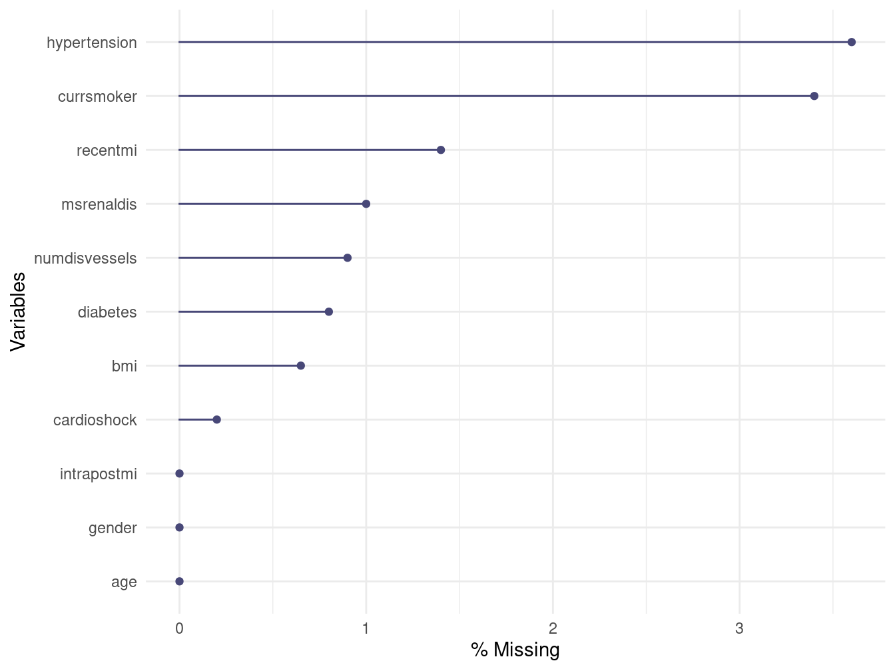

```r
> gg_miss_var(d1[, c("dischargestatus", covar)], show_pct = TRUE, facet = dischargestatus)
```


Classification trees using the package `rpart` can also sometimes be helpful when looking for missingness patterns, especially if you want to understand why a particular variable is missing and whether it is related to any other variable.


```r
> library(rpart)
> library(rpart.plot)
> 
> # determine what is associated with missing information about hypertension
> fit <- rpart(is.na(hypertension) ~ ., data = d1, method = "class", minsplit = 10)
> printcp(fit)

Classification tree:
rpart(formula = is.na(hypertension) ~ ., data = d1, method = "class", 
    minsplit = 10)

Variables actually used in tree construction:
[1] age             cardioshock     dischargestatus dt.index       
[5] dt.lfu          id              recentmi       

Root node error: 72/2000 = 0.036

n= 2000 

        CP nsplit rel error xerror    xstd
1 0.013889      0   1.00000 1.0000 0.11571
2 0.010417      4   0.93056 1.0694 0.11951
3 0.010000      8   0.88889 1.0694 0.11951
> rpart.plot(fit, type = 2, extra = 101)
```


Running `rpart()` with the default settings didn't create any splits because it requires 20 subjects in a node before any splits can be made (`minsplit` option).  Based on the `printcp()` summary, it appears that 4 splits are necessary to gain much of an improvement in the classification error.  The plot suggests that there might be more missingness for those who were alive at discharge and were age 58+.

For now, we are going to proceed, recognizing that missingness is an issue.

### Kaplan-Meier

In order to create a KM curve we need time variables and right now we just have dates.


```r
> # First attempt - days from Index Date to LFU Date
> d1$tm2death <- d1$dt.lfu - d1$dt.index
> summary(d1$tm2death)
  Length    Class     Mode 
    2000 difftime  numeric 
> # This is not so helpful, because subtracting dates creates an object of class
> # 'difftime' Instead, let's make a numeric object
> d1$tm2death <- as.numeric(d1$dt.lfu - d1$dt.index)
> summary(d1$tm2death)
   Min. 1st Qu.  Median    Mean 3rd Qu.    Max. 
    1.0   981.2  1862.0  1915.8  2653.2  4598.0 
> 
> # Create a default KM curve
> library(survival)
> fit <- survfit(Surv(tm2death, s.death) ~ gender, data = d1)
> plot(fit, col = 1:2, lty = 1:2, xscale = 365.25, xlab = "Follow-up, years", ylab = "Probability of Survival")
> legend("topright", legend = c("Female", "Male"), col = 1:2, lty = 1:2, bty = "n")
> 
> # If you want the survival estimates at specific time points, use the summary
> # function
> summary(fit, times = 365.25 * 0:10)
Call: survfit(formula = Surv(tm2death, s.death) ~ gender, data = d1)

                gender=Female 
 time n.risk n.event survival std.err lower 95% CI upper 95% CI
    0    588       0    1.000  0.0000        1.000        1.000
  365    514      50    0.913  0.0117        0.891        0.937
  730    480      20    0.877  0.0137        0.851        0.905
 1096    438      22    0.836  0.0157        0.806        0.867
 1461    364      26    0.783  0.0178        0.749        0.819
 1826    306      31    0.713  0.0202        0.674        0.753
 2192    249      23    0.654  0.0220        0.612        0.698
 2557    202      13    0.617  0.0230        0.573        0.663
 2922    141      10    0.578  0.0246        0.532        0.629
 3287    118       7    0.549  0.0257        0.501        0.602
 3652     46       4    0.514  0.0299        0.458        0.576

                gender=Male 
 time n.risk n.event survival std.err lower 95% CI upper 95% CI
    0   1412       0    1.000 0.00000        1.000        1.000
  365   1225     111    0.919 0.00735        0.905        0.934
  730   1132      52    0.880 0.00886        0.862        0.897
 1096   1014      54    0.836 0.01021        0.816        0.856
 1461    895      40    0.802 0.01115        0.780        0.824
 1826    748      41    0.762 0.01218        0.739        0.786
 2192    610      38    0.719 0.01334        0.694        0.746
 2557    502      24    0.689 0.01416        0.662        0.717
 2922    295      23    0.643 0.01615        0.612        0.675
 3287    247      10    0.620 0.01714        0.587        0.654
 3652    110       6    0.592 0.01983        0.554        0.632
> 
> # Fancier plot including table indicating number at risk
> library(survminer)
Loading required package: ggpubr
Loading required package: magrittr
Warning: package 'magrittr' was built under R version 4.0.2

Attaching package: 'magrittr'
The following object is masked from 'package:purrr':

    set_names
The following object is masked from 'package:tidyr':

    extract
> 
> ggsurvplot(fit, risk.table = TRUE, pval = TRUE, censor = FALSE, xscale = 365.25, 
+     break.time.by = 5 * 365.25)
Warning: Vectorized input to `element_text()` is not officially supported.
Results may be unexpected or may change in future versions of ggplot2.
```


### Cumulative Incidence

Now look at the time to TVR where death is treated as a competing risk.


```r
> # Create time to TVR (if event) or LFU The pmin function estimates the smallest
> # value, by row, not including missings
> d1$tm2tvr <- as.numeric(pmin(d1$dt.tvr, d1$dt.lfu, na.rm = T) - d1$dt.index)
> 
> # Create event variable with 3 levels: censor, TVR, death
> with(d1, table(death = s.death, tvr = s.tvr))
     tvr
death    0    1
    0 1078  314
    1  501  107
> d1$event <- with(d1, ifelse(s.tvr == 0, 2 * s.death, 1))
> table(d1$event)

   0    1    2 
1078  421  501 
> # In order to do competing risks, the status variable must be a factor
> d1$event <- factor(d1$event, levels = 0:2, labels = c("censor", "tvr", "death"))
> 
> # confirm coding makes sense
> library(arsenal)
> summary(freqlist(table(new_event = d1$event, tvr = d1$s.tvr, death = d1$s.death)))


|new_event |tvr |death | Freq| Cumulative Freq| Percent| Cumulative Percent|
|:---------|:---|:-----|----:|---------------:|-------:|------------------:|
|censor    |0   |0     | 1078|            1078|   53.90|              53.90|
|tvr       |1   |0     |  314|            1392|   15.70|              69.60|
|          |    |1     |  107|            1499|    5.35|              74.95|
|death     |0   |1     |  501|            2000|   25.05|             100.00|
> 
> # Fit the cumulative incidence curves
> fit <- survfit(Surv(tm2tvr, event) ~ gender, data = d1)
> fit
Call: survfit(formula = Surv(tm2tvr, event) ~ gender, data = d1)

                        n nevent    rmean*
gender=Female, (s0)   588      0 2658.4914
gender=Male, (s0)    1412      0 2755.6290
gender=Female, tvr    588    102  803.9427
gender=Male, tvr     1412    319  945.0840
gender=Female, death  588    177 1135.5658
gender=Male, death   1412    324  897.2870
   *mean time in state, restricted (max time = 4598 )
> plot(fit, col = c(1, 1, 2, 2), lty = c(2, 1, 2, 1), xscale = 365.25, xlab = "Follow-up, years", 
+     ylab = "Probability")
> legend("topleft", c("female: tvr", "male: tvr", "female: death", "male: death"), 
+     lty = c(2, 1, 2, 1), col = c(1, 1, 2, 2), bty = "n")
```

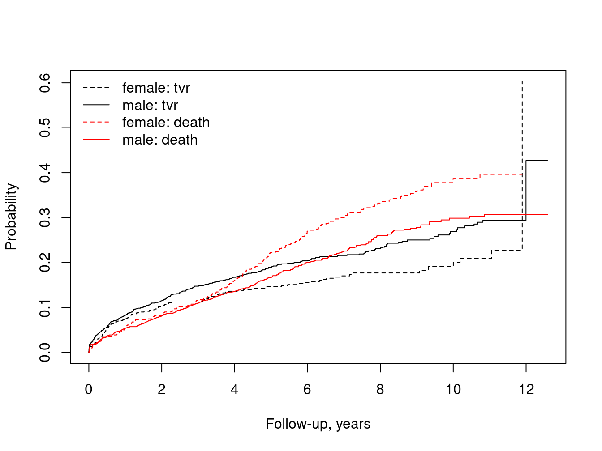

```r
> 
> ## look at only certain portions of the survfit object rows=strata, columns=states
> dim(fit)
strata states 
     2      3 
> fit$strata
gender=Female   gender=Male 
          499          1020 
> fit$states
[1] "(s0)"  "tvr"   "death"
> 
> # re-plot, just including tvr
> fit2 <- fit[, 2]
> fit2  # confirm that this just picks up the tvr events
Call: survfit(formula = Surv(tm2tvr, event) ~ gender, data = d1)

                      n nevent   rmean*
gender=Female, tvr  588    102 803.9427
gender=Male, tvr   1412    319 945.0840
   *mean time in state, restricted (max time = 4598 )
> 
> plot(fit2, col = 1:2, lty = 1:2, xscale = 365.25, xlab = "Follow-up, years", ylab = "Cumulative Incidence of TVR", 
+     xmax = 11 * 365.25)
> legend("topleft", legend = c("Female", "Male"), col = 1:2, lty = 1:2, bty = "n")
```


```r
> 
> ## Fit model
> cfit <- coxph(Surv(tm2tvr, event) ~ gender, data = d1, id = id)
> 
> ## If you are just interested in tvr, then you get the same results using
> cfit2 <- coxph(Surv(tm2tvr, event == "tvr") ~ gender, data = d1, id = id)
```

### Linear regression model

Assess how BMI differs by age and gender, then check the model assumptions.  Don't assume that the functional form for age is linear.  The `splines` package includes the natural splines function `ns`. 


```r
> library(splines)  # needed to load the ns() function
> fit <- lm(bmi ~ ns(age, df = 3) + gender, data = d1)
> summary(fit)

Call:
lm(formula = bmi ~ ns(age, df = 3) + gender, data = d1)

Residuals:
    Min      1Q  Median      3Q     Max 
-17.284  -4.034  -0.870   3.178  33.668 

Coefficients:
                 Estimate Std. Error t value Pr(>|t|)    
(Intercept)       30.7571     1.5463  19.891  < 2e-16 ***
ns(age, df = 3)1  -1.3705     0.8080  -1.696   0.0900 .  
ns(age, df = 3)2  -1.9786     3.4576  -0.572   0.5672    
ns(age, df = 3)3  -7.3226     1.2885  -5.683 1.52e-08 ***
genderMale        -0.6195     0.2977  -2.081   0.0376 *  
---
Signif. codes:  0 '***' 0.001 '**' 0.01 '*' 0.05 '.' 0.1 ' ' 1

Residual standard error: 5.945 on 1982 degrees of freedom
  (13 observations deleted due to missingness)
Multiple R-squared:  0.05133,	Adjusted R-squared:  0.04942 
F-statistic: 26.81 on 4 and 1982 DF,  p-value: < 2.2e-16
> 
> # plot the curvature
> termplot(fit, term = 1, se = T, rug = T)
```

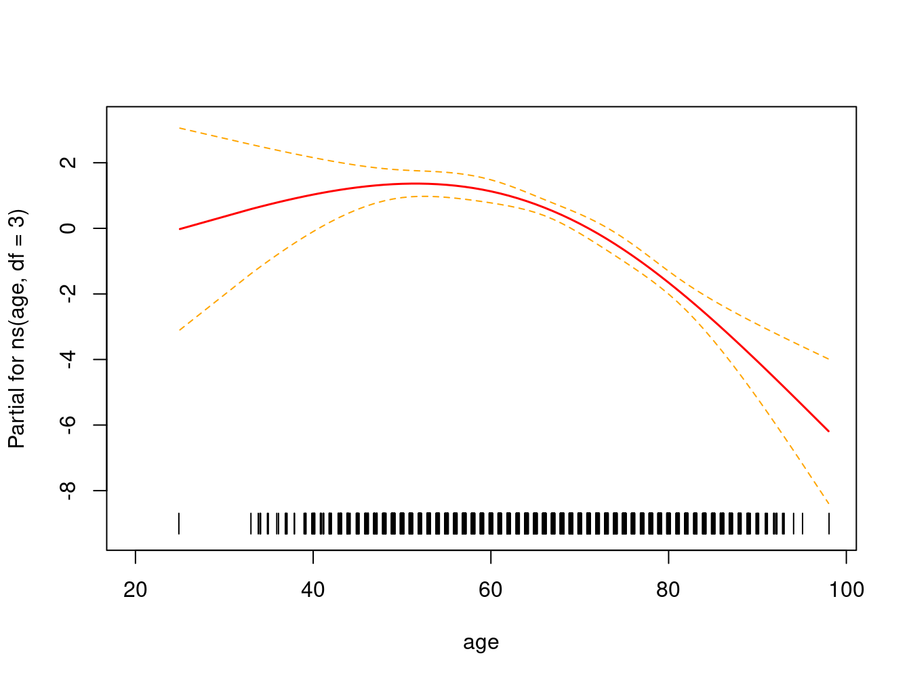

```r
> 
> # visually check model assumptions
> plot(fit)
```

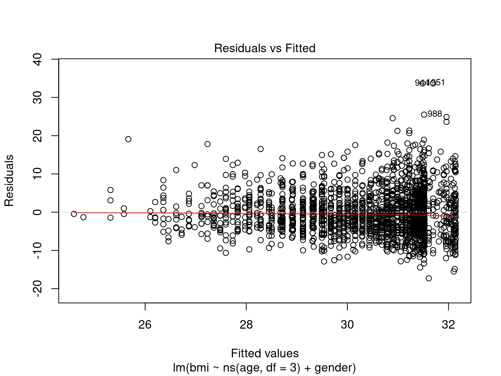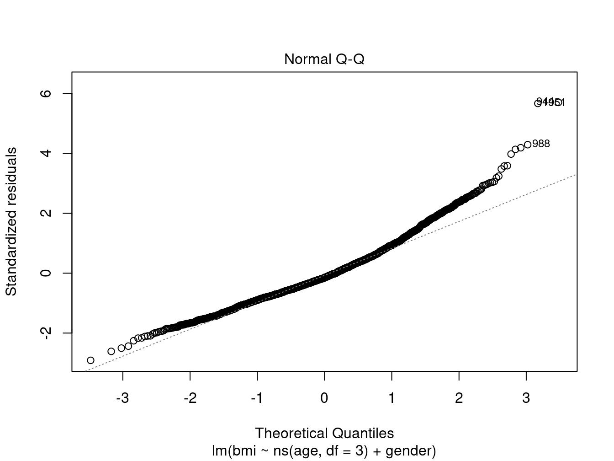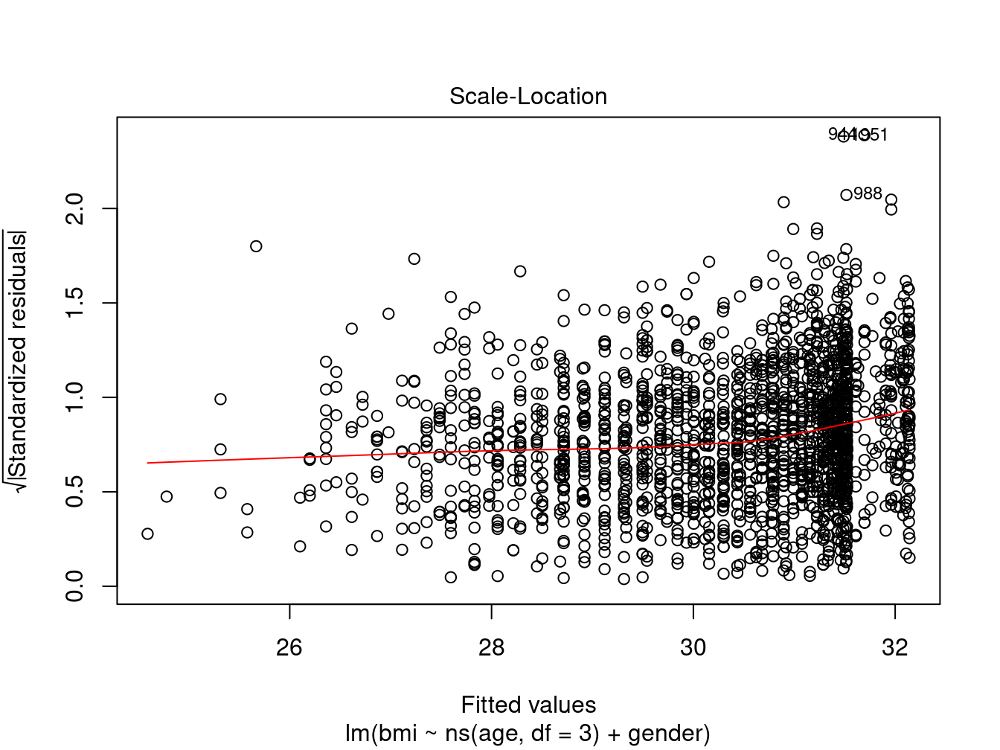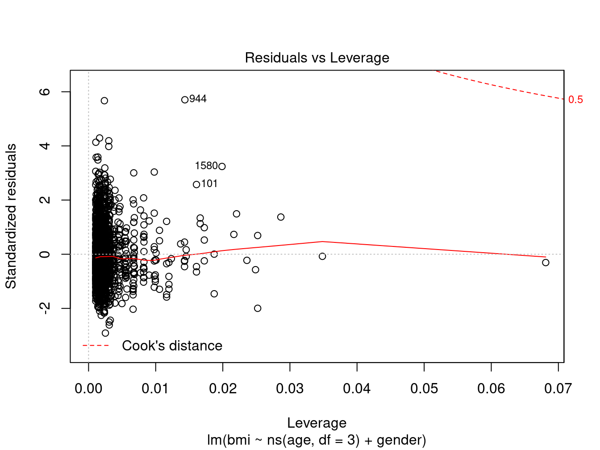

```r
> 
> # summarize residuals
> summary(resid(fit))
    Min.  1st Qu.   Median     Mean  3rd Qu.     Max. 
-17.2845  -4.0336  -0.8697   0.0000   3.1778  33.6684 
```

The following code plots the relationship between age and BMI separately for males and females with a smoother through the points, providing further insight into the data. 


```r
> ggplot(d1, aes(x = age, y = bmi)) + geom_point(alpha = 0.1) + geom_smooth(span = 1) + 
+     facet_wrap(~gender)
`geom_smooth()` using method = 'gam' and formula 'y ~ s(x, bs = "cs")'
Warning: Removed 13 rows containing non-finite values (stat_smooth).
Warning: Removed 13 rows containing missing values (geom_point).
```

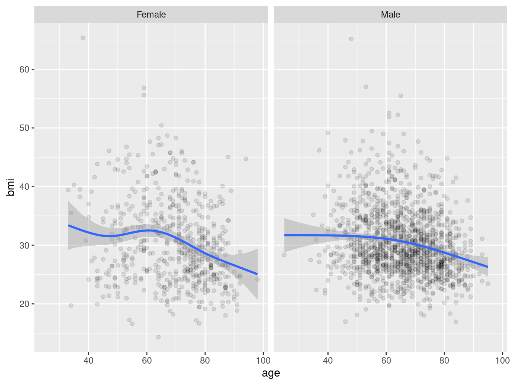

### Logistic regression models

Assess which risk factors predict the discharge status: `dischargestatus`.


```r
> d1$dischargestatus01 <- as.numeric(d1$dischargestatus) - 1
> with(d1, table(dischargestatus01, dischargestatus))
                 dischargestatus
dischargestatus01 Alive Deceased
                0  1976        0
                1     0       24
> 
> # Look at a simple model: the association between gender and in-hospital death
> fit3 <- glm(dischargestatus01 ~ gender, data = d1, family = "binomial")
> summary(fit3)

Call:
glm(formula = dischargestatus01 ~ gender, family = "binomial", 
    data = d1)

Deviance Residuals: 
    Min       1Q   Median       3Q      Max  
-0.1689  -0.1689  -0.1689  -0.1168   3.1593  

Coefficients:
            Estimate Std. Error z value Pr(>|z|)    
(Intercept)  -4.9836     0.5016  -9.935   <2e-16 ***
genderMale    0.7408     0.5499   1.347    0.178    
---
Signif. codes:  0 '***' 0.001 '**' 0.01 '*' 0.05 '.' 0.1 ' ' 1

(Dispersion parameter for binomial family taken to be 1)

    Null deviance: 260.01  on 1999  degrees of freedom
Residual deviance: 257.89  on 1998  degrees of freedom
AIC: 261.89

Number of Fisher Scoring iterations: 7
```

The `broom` package allows users to extract information from a model and save it as a `data.frame`.  The two main functions in `broom` are `tidy()`, which returns a tidy version of the model coefficients, and `glance()` which returns a one-row glance at the model's statistics. There is also the function `augment()` which augments the original data with information such as the fitted values and residuals.


```r
> # Look at a tidy model summary (data frame)
> library(broom)
> # 'exponentiate=TRUE' exponentiates the estimates, including the intercept
> tmp <- tidy(fit3, exponentiate = TRUE, conf.int = TRUE)
> print(tmp, digits = 3)
# A tibble: 2 x 7
  term        estimate std.error statistic  p.value conf.low conf.high
  <chr>          <dbl>     <dbl>     <dbl>    <dbl>    <dbl>     <dbl>
1 (Intercept)  0.00685     0.502     -9.93 2.94e-23  0.00212    0.0160
2 genderMale   2.10        0.550      1.35 1.78e- 1  0.790      7.24  
> # Remove the intercept line
> print(tmp[-1, ], digits = 3)
# A tibble: 1 x 7
  term       estimate std.error statistic p.value conf.low conf.high
  <chr>         <dbl>     <dbl>     <dbl>   <dbl>    <dbl>     <dbl>
1 genderMale     2.10     0.550      1.35   0.178    0.790      7.24
> glance(fit3)
# A tibble: 1 x 7
  null.deviance df.null logLik   AIC   BIC deviance df.residual
          <dbl>   <int>  <dbl> <dbl> <dbl>    <dbl>       <int>
1          260.    1999  -129.  262.  273.     258.        1998
```

This is fine for a small number of models, but if you want to summarize results for multiple models, perhaps adjusting for a certain set of covariates, then it is time to use a different tool.  The `modelsum()` in `arsenal` creates such summaries.  For logistic regression models (`family='binomial'`), the results are automatically shown with odd's ratios and confidence intervals, plus the concordance (AUC) value and the number of missing values for that variable.


```r
> # Use formulize in arsenal to create a formula to pass to modelsum
> myform <- formulize(y = "dischargestatus01", x = covar)
> tmp <- modelsum(myform, family = "binomial", data = d1)
> summary(tmp, show.intercept = F, title = "Hospital Discharge: Univariate analysis")
```


Table: Hospital Discharge: Univariate analysis

|                               |OR     |CI.lower.OR |CI.upper.OR |p.value |concordance |Nmiss |
|:------------------------------|:------|:-----------|:-----------|:-------|:-----------|:-----|
|**Age, yrs**                   |1.020  |0.986       |1.057       |0.259   |0.555       |0     |
|**Gender Male**                |2.098  |0.790       |7.236       |0.178   |0.564       |0     |
|**recentmi .L**                |5.914  |2.554       |16.883      |< 0.001 |0.742       |28    |
|**recentmi .Q**                |1.260  |0.452       |3.903       |0.662   |            |      |
|**recentmi .C**                |0.760  |0.201       |2.227       |0.637   |            |      |
|**cardioshock Yes**            |91.915 |36.761      |262.524     |< 0.001 |0.855       |4     |
|**diabetes Yes**               |0.978  |0.347       |2.418       |0.963   |0.502       |16    |
|**hypertension Yes**           |0.415  |0.157       |1.213       |0.086   |0.584       |72    |
|**Body Mass Index (kg/sq.m)**  |0.934  |0.860       |1.007       |0.094   |0.588       |13    |
|**currsmoker Yes**             |1.982  |0.697       |4.978       |0.164   |0.561       |68    |
|**msrenaldis Yes**             |1.038  |0.058       |5.067       |0.971   |0.501       |20    |
|**Number of diseased vessels** |1.407  |0.880       |2.270       |0.154   |0.577       |18    |
|**intrapostmi Yes**            |2.370  |0.375       |8.251       |0.249   |0.523       |0     |

```r
> 
> # Note - because recentmi is an ordered factor, R tries to model it with
> # Linear/Quadradic/Cubic. Try creating covar2 - see the difference
> covar2 <- c("age", "gender", "as.numeric(recentmi)", "cardioshock", "diabetes", "hypertension", 
+     "bmi", "currsmoker", "msrenaldis", "numdisvessels", "intrapostmi")
> myform2 <- formulize(y = "dischargestatus01", x = covar2)
> tmp2 <- modelsum(myform2, family = "binomial", data = d1)
> summary(tmp2, show.intercept = F, title = "Hospital Discharge: Univariate analysis")
```


Table: Hospital Discharge: Univariate analysis

|                               |OR     |CI.lower.OR |CI.upper.OR |p.value |concordance |Nmiss |
|:------------------------------|:------|:-----------|:-----------|:-------|:-----------|:-----|
|**Age, yrs**                   |1.020  |0.986       |1.057       |0.259   |0.555       |0     |
|**Gender Male**                |2.098  |0.790       |7.236       |0.178   |0.564       |0     |
|**as.numeric(recentmi)**       |2.236  |1.547       |3.426       |< 0.001 |0.742       |28    |
|**cardioshock Yes**            |91.915 |36.761      |262.524     |< 0.001 |0.855       |4     |
|**diabetes Yes**               |0.978  |0.347       |2.418       |0.963   |0.502       |16    |
|**hypertension Yes**           |0.415  |0.157       |1.213       |0.086   |0.584       |72    |
|**Body Mass Index (kg/sq.m)**  |0.934  |0.860       |1.007       |0.094   |0.588       |13    |
|**currsmoker Yes**             |1.982  |0.697       |4.978       |0.164   |0.561       |68    |
|**msrenaldis Yes**             |1.038  |0.058       |5.067       |0.971   |0.501       |20    |
|**Number of diseased vessels** |1.407  |0.880       |2.270       |0.154   |0.577       |18    |
|**intrapostmi Yes**            |2.370  |0.375       |8.251       |0.249   |0.523       |0     |


```r
> # save results as a data frame and output results to a csv file
> foroutput <- as.data.frame(tmp)
> head(foroutput)
             y.term           y.label strata.term adjustment model        term
1 dischargestatus01 dischargestatus01             unadjusted     1 (Intercept)
2 dischargestatus01 dischargestatus01             unadjusted     1         age
3 dischargestatus01 dischargestatus01             unadjusted     2 (Intercept)
4 dischargestatus01 dischargestatus01             unadjusted     2  genderMale
5 dischargestatus01 dischargestatus01             unadjusted     3 (Intercept)
6 dischargestatus01 dischargestatus01             unadjusted     3  recentmi.L
        label term.type          OR  CI.lower.OR CI.upper.OR      p.value
1 (Intercept) Intercept 0.003153183 0.0002420665  0.03147134 3.184984e-06
2    Age, yrs      Term 1.020021318 0.9861477653  1.05679269 2.592280e-01
3 (Intercept) Intercept 0.006849315 0.0021209595  0.01598169 2.943694e-23
4 Gender Male      Term 2.097701072 0.7897245602  7.23552308 1.778864e-01
5 (Intercept) Intercept 0.009989839 0.0055506795  0.01593187 3.116393e-68
6 recentmi .L      Term 5.914143128 2.5537218993 16.88340502 1.463148e-04
  concordance Nmiss
1   0.5550038     0
2   0.5550038     0
3   0.5644399     0
4   0.5644399     0
5   0.7420966    28
6   0.7420966    28
> write.csv(foroutput, file = "~/ibm/testoutput.csv")
```

You can also use `modelsum` to look at results after adjusting for variables such as age and gender.


```r
> tmp2 <- modelsum(dischargestatus01 ~ as.numeric(recentmi) + cardioshock, adjust = ~age + 
+     gender, data = d1, family = "binomial")
> summary(tmp2, show.intercept = F, show.adjust = F, title = "Hospital Discharge: Results of key variables after adjusting for age and gender")
```


Table: Hospital Discharge: Results of key variables after adjusting for age and gender

|                         |OR      |CI.lower.OR |CI.upper.OR |p.value |concordance |Nmiss |
|:------------------------|:-------|:-----------|:-----------|:-------|:-----------|:-----|
|**as.numeric(recentmi)** |2.333   |1.600       |3.609       |< 0.001 |0.784       |28    |
|**cardioshock Yes**      |103.312 |40.588      |300.457     |< 0.001 |0.863       |4     |

Alternative code for looping through variables is shown at the [end of this document](#alt-loop).

You might also want to look at the functional form of age as it relates to the endpoint. The `termplot()` function is a quick way to see if there are indications that the relationship may be non-linear. Here we used the spline function `ns()` with 3 degrees of freedom to look for non-linearity. 


```r
> fit4 <- glm(dischargestatus01 ~ ns(age, df = 3), data = d1, family = "binomial")
> termplot(fit4, se = TRUE, rug = TRUE)
```

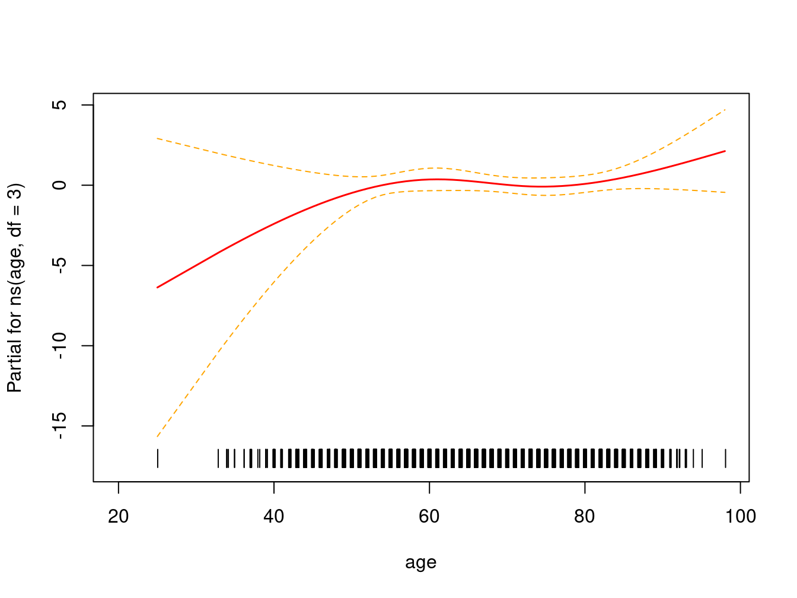

```r
> summary(fit4)

Call:
glm(formula = dischargestatus01 ~ ns(age, df = 3), family = "binomial", 
    data = d1)

Deviance Residuals: 
    Min       1Q   Median       3Q      Max  
-0.4171  -0.1704  -0.1521  -0.1415   3.2127  

Coefficients:
                 Estimate Std. Error z value Pr(>|z|)  
(Intercept)       -10.895      4.758  -2.290   0.0220 *
ns(age, df = 3)1    2.789      2.489   1.120   0.2626  
ns(age, df = 3)2   14.263      9.827   1.451   0.1467  
ns(age, df = 3)3    4.356      2.441   1.784   0.0744 .
---
Signif. codes:  0 '***' 0.001 '**' 0.01 '*' 0.05 '.' 0.1 ' ' 1

(Dispersion parameter for binomial family taken to be 1)

    Null deviance: 260.01  on 1999  degrees of freedom
Residual deviance: 256.00  on 1996  degrees of freedom
AIC: 264

Number of Fisher Scoring iterations: 8
> anova(fit4, test = "Chi")
Analysis of Deviance Table

Model: binomial, link: logit

Response: dischargestatus01

Terms added sequentially (first to last)

                Df Deviance Resid. Df Resid. Dev Pr(>Chi)
NULL                             1999     260.01         
ns(age, df = 3)  3   4.0076      1996     256.00   0.2606
> 
> # Test whether non-linearity is significant by comparing to linear model
> fit5 <- glm(dischargestatus01 ~ age, data = d1, family = "binomial")
> anova(fit5, fit4, test = "Chi")
Analysis of Deviance Table

Model 1: dischargestatus01 ~ age
Model 2: dischargestatus01 ~ ns(age, df = 3)
  Resid. Df Resid. Dev Df Deviance Pr(>Chi)
1      1998      258.7                     
2      1996      256.0  2   2.7026   0.2589
```

### Cox regression models

Assess which risk factors predict the endpoint `tm2death`.


```r
> # First, a simple model for gender only
> fit6 <- coxph(Surv(tm2death, s.death) ~ gender, data = d1)
> summary(fit6)
Call:
coxph(formula = Surv(tm2death, s.death) ~ gender, data = d1)

  n= 2000, number of events= 608 

              coef exp(coef) se(coef)      z Pr(>|z|)  
genderMale -0.2029    0.8163   0.0856 -2.371   0.0177 *
---
Signif. codes:  0 '***' 0.001 '**' 0.01 '*' 0.05 '.' 0.1 ' ' 1

           exp(coef) exp(-coef) lower .95 upper .95
genderMale    0.8163      1.225    0.6902    0.9654

Concordance= 0.517  (se = 0.01 )
Likelihood ratio test= 5.49  on 1 df,   p=0.02
Wald test            = 5.62  on 1 df,   p=0.02
Score (logrank) test = 5.64  on 1 df,   p=0.02
```

The `broom` package can be used with survival objects as well.


```r
> # Look at a tidy model summary (data frame)
> tmp <- tidy(fit6, exponentiate = TRUE, conf.int = TRUE)
> print(tmp, digits = 3)
# A tibble: 1 x 7
  term       estimate std.error statistic p.value conf.low conf.high
  <chr>         <dbl>     <dbl>     <dbl>   <dbl>    <dbl>     <dbl>
1 genderMale    0.816    0.0856     -2.37  0.0177    0.690     0.965
> glance(fit6)
# A tibble: 1 x 15
      n nevent statistic.log p.value.log statistic.sc p.value.sc statistic.wald
  <int>  <dbl>         <dbl>       <dbl>        <dbl>      <dbl>          <dbl>
1  2000    608          5.49      0.0191         5.64     0.0176           5.62
# … with 8 more variables: p.value.wald <dbl>, r.squared <dbl>,
#   r.squared.max <dbl>, concordance <dbl>, std.error.concordance <dbl>,
#   logLik <dbl>, AIC <dbl>, BIC <dbl>
```

Here is how you would use  `modelsum()` for Cox models.


```r
> myform <- formulize(y = "Surv(tm2death, s.death)", x = covar2)
> tmp <- modelsum(myform, family = "survival", data = d1)
> summary(tmp, show.intercept = F, title = "Overall survival: Univariate analysis")
```


Table: Overall survival: Univariate analysis

|                               |HR    |CI.lower.HR |CI.upper.HR |p.value |concordance |Nmiss |
|:------------------------------|:-----|:-----------|:-----------|:-------|:-----------|:-----|
|**Age, yrs**                   |1.062 |1.054       |1.070       |< 0.001 |0.663       |0     |
|**Gender Male**                |0.816 |0.690       |0.965       |0.018   |0.517       |0     |
|**as.numeric(recentmi)**       |1.093 |1.024       |1.167       |0.008   |0.550       |28    |
|**cardioshock Yes**            |2.290 |1.649       |3.181       |< 0.001 |0.526       |4     |
|**diabetes Yes**               |2.207 |1.876       |2.597       |< 0.001 |0.586       |16    |
|**hypertension Yes**           |2.140 |1.653       |2.770       |< 0.001 |0.546       |72    |
|**Body Mass Index (kg/sq.m)**  |0.984 |0.970       |0.998       |0.022   |0.535       |13    |
|**currsmoker Yes**             |0.659 |0.514       |0.845       |0.001   |0.525       |68    |
|**msrenaldis Yes**             |4.026 |3.116       |5.202       |< 0.001 |0.543       |20    |
|**Number of diseased vessels** |1.572 |1.434       |1.724       |< 0.001 |0.607       |18    |
|**intrapostmi Yes**            |1.028 |0.672       |1.573       |0.899   |0.503       |0     |

You might also want to look at the functional form of age as it relates to the endpoint. The `termplot()` function is a quick way to see if there are indications that the relationship may be non-linear. Here we used the penalized spline `pspline()` with 4 degrees of freedom to look for non-linearity. 


```r
> fit7 <- coxph(Surv(tm2death, s.death) ~ pspline(age, df = 4), data = d1)
> termplot(fit7, se = TRUE, rug = TRUE)
```

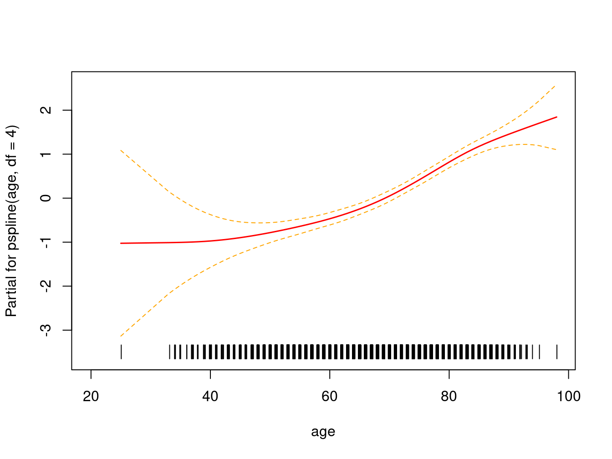

```r
> fit7  # test linear and nonlinear portions of the fit for significance
Call:
coxph(formula = Surv(tm2death, s.death) ~ pspline(age, df = 4), 
    data = d1)

                              coef se(coef)      se2    Chisq   DF      p
pspline(age, df = 4), lin 5.93e-02 3.69e-03 3.69e-03 2.58e+02 1.00 <2e-16
pspline(age, df = 4), non                            9.61e+00 3.07  0.024

Iterations: 5 outer, 15 Newton-Raphson
     Theta= 0.88 
Degrees of freedom for terms= 4.1 
Likelihood ratio test=269  on 4.07 df, p=<2e-16
n= 2000, number of events= 608 
> anova(fit7)  # overall test
Analysis of Deviance Table
 Cox model: response is Surv(tm2death, s.death)
Terms added sequentially (first to last)

                      loglik  Chisq     Df Pr(>|Chi|)    
NULL                 -4324.7                             
pspline(age, df = 4) -4190.1 269.33 4.0686  < 2.2e-16 ***
---
Signif. codes:  0 '***' 0.001 '**' 0.01 '*' 0.05 '.' 0.1 ' ' 1
```

Finally, it is good to do some basic model checks on your results. The coefficient in a Cox model is an average of the estimated beta over all the event times. The proportional hazards model assumes that this coefficient is constant over time, however that is not always true. The `cox.zph` function creates time-dependent coefficients for more detailed examination. The printout of `cox.zph` summarizes the correlation of Beta(time) vs time for each variable. The plot of `cox.zph` visualizes the relationship. It is important to look at the plot to understand the summary.

In the `coxph` function, as with some (but not all) of the other model functions in R, there are several options for handling missing values. The default `na.omit` option and the `na.exclude` option both remove any missing values from the fit. They differ in that the former returns residuals only for the non-missing values and the latter returns residuals with the same number of rows as the input data. If you want to compare residuals to the original data then it is more convenient to use `na.exclude` (not the default); if you are going to calculate summaries such as quantiles then the former is more convenient because missing values will have been removed.


```r
> # Change option because we will want to look at residuals later on
> options(na.action = na.exclude)
> fit8 <- coxph(Surv(tm2death, s.death) ~ age + gender + cardioshock, data = d1)
> zfit8 <- cox.zph(fit8)
> 
> zfit8
            chisq df       p
age          40.0  1 2.5e-10
gender        1.5  1    0.22
cardioshock  27.6  1 1.5e-07
GLOBAL       65.3  3 4.3e-14
> plot(zfit8[3])  # look at 3rd variable, hard to view
```

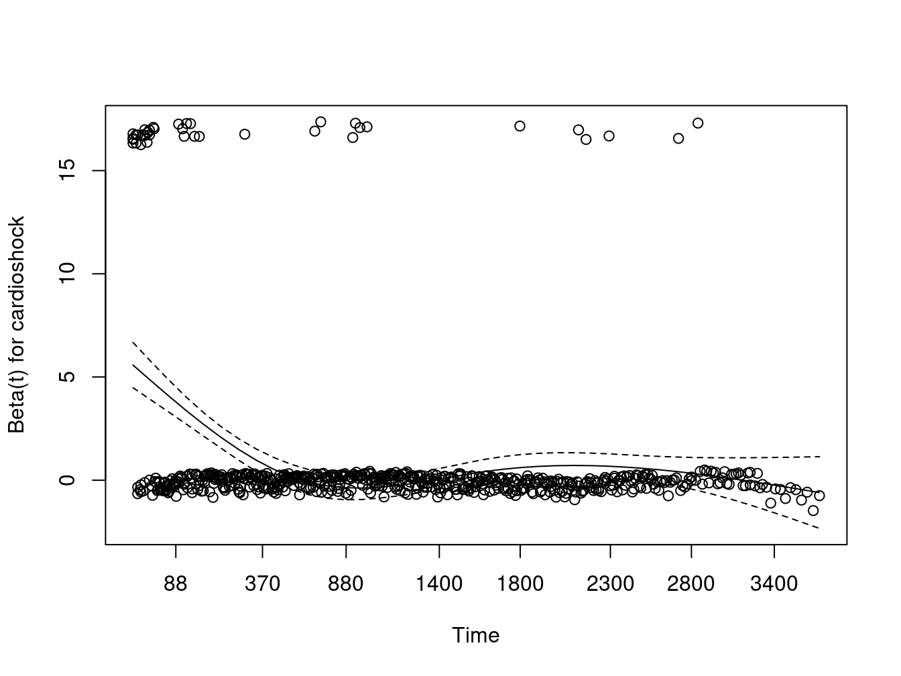

```r
> plot(zfit8[3], resid = FALSE)  # plot without residuals
> abline(h = coef(fit8)[3], col = 2)  # coef estimate
> abline(h = 0, col = 3)
```


Based on this, it appears that we might need to treat early deaths (likely those in the hospital) different from those that appear after discharge.  Perhaps we might want to start follow-up after discharge if that information is available.

Leverage points are also sometimes an issue. Dfbeta residuals offer one way to check for influential points. It allows you to see how much the estimate of Beta would change if one point was deleted.


```r
> rr <- resid(fit8, type = "dfbeta")
> dim(rr)
[1] 2000    3
> 
> # color by status - residuals are all in the 4th decimal so nothing too large
> plot(d1$age, rr[, 1], col = d1$s.death + 1)
```


### Missingness revisited: Imputation

There are multiple packages that do multiple imputation in R (see [article](https://www.analyticsvidhya.com/blog/2016/03/tutorial-powerful-packages-imputing-missing-values/) for review). In the code below we've chosen to use the `mice` package (Multivariate Imputation via Chained Equations).

Recommendations:
* need to include the endpoint in the imputation
* if using multiple models/endpoints, just impute everything once including all the variables
* imputing continuous variables is much easier than categorical
     - The default "mice" method is predictive mean matching (pmm) for numeric variables, logistic
        regression (logreg) for two level factors, polytomous regression (polyreg) for unordered
        categorical variables, and proportional odds regression (polyr) for ordered factors.
        You can also specify different methods for different variables within the same call.
     - The mice package does not like dates
     - Other methods for imputation are also available besides these defaults 


```r
> library(mice)

Attaching package: 'mice'
The following objects are masked from 'package:base':

    cbind, rbind
> library(dplyr)
> 
> # Create data frame 'sub' which excludes date variables, status variables and id
> sub <- d1 %>% select(-starts_with("dt"), -starts_with("s."), -id)
> # Create 5 imputed datasets
> imputed_d1 <- mice(sub, m = 5, printFlag = FALSE, set.seed = 123)  # create 5 datasets, don't print log
Warning: Number of logged events: 3
> 
> # fit multiple models with imputed data, then combine the results
> fits <- with(imputed_d1, glm(dischargestatus01 ~ diabetes, family = "binomial"))
> 
> # Pool function combines the results of the 5 imputed datasets
> pool.fits <- pool(fits)
> summary(pool.fits)
         term   estimate std.error   statistic        df   p.value
1 (Intercept) -4.3768615 0.2422715 -18.0659339 1662.3695 0.0000000
2 diabetesYes -0.1254765 0.4814559  -0.2606188  612.7132 0.7944741
> # fmi = fraction of information about the coefficients missing due to nonresponse
> 
> # original value
> tidy(glm(dischargestatus01 ~ diabetes, data = d1, family = "binomial"))
# A tibble: 2 x 5
  term        estimate std.error statistic  p.value
  <chr>          <dbl>     <dbl>     <dbl>    <dbl>
1 (Intercept)  -4.53       0.260  -17.5    3.13e-68
2 diabetesYes  -0.0227     0.486   -0.0468 9.63e- 1
```

This is fine for 1 variable, but what if you want to look at multiple models using the imputed data?


```r
> # create a list with 5 elements, each housing one of the new datasets
> imp.list <- list()
> for (i in 1:5) {
+     tmp <- complete(imputed_d1, action = i)
+     imp.list[[i]] <- tmp
+ }
> 
> # run modelsum on each element of the list, store as a dataframe (again an
> # element of a list)
> myform <- formulize(y = "dischargestatus01", x = covar)
> 
> # Write function to return modelsum results as a data frame
> myfun <- function(x) {
+     fit <- modelsum(myform, family = "binomial", data = x, show.intercept = FALSE, 
+         binomial.stats = c("estimate", "std.error", "p.value", "concordance", "Nmiss"))
+     return(as.data.frame(fit))
+ }
> 
> # For each element in the list (each imputed dataset), run myfun()
> tmp <- lapply(imp.list, myfun)
> head(tmp[[1]])
             y.term           y.label strata.term adjustment model
1 dischargestatus01 dischargestatus01             unadjusted     1
2 dischargestatus01 dischargestatus01             unadjusted     2
3 dischargestatus01 dischargestatus01             unadjusted     3
4 dischargestatus01 dischargestatus01             unadjusted     3
5 dischargestatus01 dischargestatus01             unadjusted     3
6 dischargestatus01 dischargestatus01             unadjusted     4
            term           label term.type    estimate  std.error      p.value
1            age        Age, yrs      Term  0.01982353 0.01757066 2.592280e-01
2     genderMale     Gender Male      Term  0.74084202 0.54987517 1.778864e-01
3     recentmi.L     recentmi .L      Term  1.77999512 0.46803433 1.428797e-04
4     recentmi.Q     recentmi .Q      Term  0.23067795 0.52772788 6.620277e-01
5     recentmi.C     recentmi .C      Term -0.27538557 0.58132374 6.356985e-01
6 cardioshockYes cardioshock Yes      Term  4.57959159 0.48957295 8.418875e-21
  concordance
1   0.5550038
2   0.5644399
3   0.7424089
4   0.7424089
5   0.7424089
6   0.8600709
> 
> # look at coefficients from all the datasets
> 
> # Create a list with the estimates from each model
> model.coef <- lapply(tmp, function(x) x$estimate)
> 
> # use the cbind() function to bind the results together
> model.coef2 <- do.call(cbind, model.coef)
> 
> # make this a dataframe
> model.coef3 <- data.frame(matrix(model.coef2, nrow = nrow(model.coef2), ncol = ncol(model.coef2)))
> 
> # add in rownames for the variables
> rownames(model.coef3) <- tmp[[1]]$term
> 
> # label each column as imp1--imp5
> colnames(model.coef3) <- paste0("imp", 1:5)
> 
> # add in the mean of the 5 columns
> model.coef3$mean.est <- rowMeans(model.coef3)
> 
> knitr::kable(model.coef3, digits = 3)
```


|                |   imp1|   imp2|   imp3|   imp4|   imp5| mean.est|
|:---------------|------:|------:|------:|------:|------:|--------:|
|age             |  0.020|  0.020|  0.020|  0.020|  0.020|    0.020|
|genderMale      |  0.741|  0.741|  0.741|  0.741|  0.741|    0.741|
|recentmi.L      |  1.780|  1.779|  1.774|  1.773|  1.771|    1.776|
|recentmi.Q      |  0.231|  0.227|  0.231|  0.225|  0.229|    0.229|
|recentmi.C      | -0.275| -0.286| -0.265| -0.274| -0.274|   -0.275|
|cardioshockYes  |  4.580|  4.368|  4.580|  4.368|  4.580|    4.495|
|diabetesYes     | -0.210|  0.001| -0.004| -0.206| -0.208|   -0.125|
|hypertensionYes | -1.118| -1.122| -1.298| -1.301| -1.609|   -1.289|
|bmi             | -0.070| -0.067| -0.065| -0.071| -0.074|   -0.070|
|currsmokerYes   |  0.448|  0.645|  0.645|  0.649|  0.642|    0.606|
|msrenaldisYes   | -0.127| -0.127| -0.116| -0.127| -0.116|   -0.123|
|numdisvessels   |  0.343|  0.396|  0.344|  0.233|  0.397|    0.343|
|intrapostmiYes  |  0.863|  0.863|  0.863|  0.863|  0.863|    0.863|


## Resources

### Technical details

Report created: September 22 2020  


```r
> # Grab session info
> sessionInfo()
R version 3.6.2 (2019-12-12)
Platform: x86_64-pc-linux-gnu (64-bit)
Running under: CentOS Linux 7 (Core)

Matrix products: default
BLAS:   /usr/lib64/libblas.so.3.4.2
LAPACK: /usr/lib64/liblapack.so.3.4.2

locale:
 [1] LC_CTYPE=en_US.UTF-8       LC_NUMERIC=C              
 [3] LC_TIME=en_US.UTF-8        LC_COLLATE=C              
 [5] LC_MONETARY=en_US.UTF-8    LC_MESSAGES=en_US.UTF-8   
 [7] LC_PAPER=en_US.UTF-8       LC_NAME=C                 
 [9] LC_ADDRESS=C               LC_TELEPHONE=C            
[11] LC_MEASUREMENT=en_US.UTF-8 LC_IDENTIFICATION=C       

attached base packages:
[1] splines   stats     graphics  grDevices utils     datasets  methods  
[8] base     

other attached packages:
 [1] mice_3.10.0        broom_0.5.6        survminer_0.4.6    ggpubr_0.2.5      
 [5] magrittr_1.5       survival_3.2-5     rpart.plot_3.0.8   rpart_4.1-15      
 [9] naniar_0.5.0       summarytools_0.9.6 arsenal_3.4.0.9000 haven_2.2.0       
[13] forcats_0.5.0      stringr_1.4.0      dplyr_1.0.0        purrr_0.3.4       
[17] readr_1.3.1        tidyr_1.1.0        tibble_3.0.1       ggplot2_3.3.2     
[21] tidyverse_1.3.0   

loaded via a namespace (and not attached):
 [1] nlme_3.1-145       matrixStats_0.56.0 fs_1.3.2           lubridate_1.7.4   
 [5] httr_1.4.1         tools_3.6.2        backports_1.1.6    utf8_1.1.4        
 [9] R6_2.4.1           mgcv_1.8-31        DBI_1.1.0          colorspace_1.4-1  
[13] nnet_7.3-13        withr_2.1.2        tidyselect_1.1.0   gridExtra_2.3     
[17] compiler_3.6.2     cli_2.0.2          rvest_0.3.5        formatR_1.7       
[21] xml2_1.3.2         labeling_0.3       bookdown_0.18      scales_1.1.0      
[25] checkmate_2.0.0    survMisc_0.5.5     digest_0.6.25      rmarkdown_2.1     
[29] base64enc_0.1-3    pkgconfig_2.0.3    htmltools_0.5.0    highr_0.8         
[33] dbplyr_1.4.2       rlang_0.4.7        readxl_1.3.1       rstudioapi_0.11   
[37] pryr_0.1.4         farver_2.0.3       generics_0.0.2     zoo_1.8-7         
[41] jsonlite_1.7.0     rapportools_1.0    Matrix_1.2-18      Rcpp_1.0.4        
[45] munsell_0.5.0      fansi_0.4.1        lifecycle_0.2.0    visdat_0.5.3      
[49] pROC_1.16.1        stringi_1.4.6      yaml_2.2.1         MASS_7.3-51.5     
[53] plyr_1.8.6         grid_3.6.2         crayon_1.3.4       lattice_0.20-40   
[57] pander_0.6.4       hms_0.5.3          magick_2.4.0       knitr_1.29        
[61] pillar_1.4.4       tcltk_3.6.2        ggsignif_0.6.0     codetools_0.2-16  
[65] reprex_0.3.0       glue_1.4.1         evaluate_0.14      data.table_1.12.8 
[69] modelr_0.1.6       vctrs_0.3.2        cellranger_1.1.0   gtable_0.3.0      
[73] km.ci_0.5-2        assertthat_0.2.1   xfun_0.15          xtable_1.8-4      
[77] KMsurv_0.1-5       ellipsis_0.3.1    
```

### Packages used

* [haven](http://haven.tidyverse.org/)
* [tidyverse](http://www.tidyverse.org/)
* [summarytools](https://cran.r-project.org/web/packages/summarytools/vignettes/Introduction.html)
     + [summarytools with rmarkdown](https://cran.r-project.org/web/packages/summarytools/vignettes/Recommendations-rmarkdown.html)
* [arsenal](https://cran.r-project.org/web/packages/arsenal/index.html)
* [broom](https://cran.r-project.org/web/packages/broom/vignettes/broom.html)
* [survival](https//cran.r-project.org/web/packages/survival/index.html)
* [naniar](https://cran.r-project.org/web/packages/naniar/vignettes/getting-started-w-naniar.html)
* [mice](https://www.rdocumentation.org/packages/mice/versions/current/topics/mice)

## Optional ways to code 

### Fit multiple models and store results {#alt-loop}

Sometimes the model you are fitting can't be handled by `modelsum`.  Here is some alternative code for looping through a set of variables and storing the results.


```r
> ## how many are there?
> nvar <- length(covar)
> 
> ## create matrix for storing results, label rows and columns
> fit.results <- matrix(NA, nrow = nvar, ncol = 4, dimnames = list(covar, c("N", "coef", 
+     "std", "p.value")))
> 
> ## loop through the variables
> for (i in 1:nvar) {
+     
+     ## if the variable is in my dataset, proceed
+     if (!is.na(match(covar[i], names(d1)))) {
+         
+         ## paste together the formula that I want to use
+         text <- paste("coxph(Surv(tm2death,s.death) ~  ", covar[i], " , data=d1)", 
+             sep = "")
+         fit <- eval(parse(text = text))
+         
+         ## pull off the summary, print
+         prob <- summary(fit)
+         
+         ## pull off the coefficient and std.error (last row of fit)
+         fit.results[i, 2:4] <- prob$coef[nrow(prob$coef), c(1, 3, 5)]
+         fit.results[i, 1] <- prob$n
+     }
+ }
```

### Fit models "by" some variable

In SAS you can run a model "by" some variable, such as gender.  In R you can do the same thing using the following code.  The `group_by()` function tells R to run the analysis by that variable (or variables) and the `do()` function tells R what to do. 


```r
> ans <- d1 %>% group_by(gender) %>% do(tidy(coxph(Surv(tm2death, s.death) ~ age + 
+     cardioshock, data = .data), exponentiate = T, confint = T))
> ans
# A tibble: 4 x 8
# Groups:   gender [2]
  gender term           estimate std.error statistic  p.value conf.low conf.high
  <chr>  <chr>             <dbl>     <dbl>     <dbl>    <dbl>    <dbl>     <dbl>
1 Female age                1.03   0.00636      5.41 6.27e- 8    1.02       1.05
2 Female cardioshockYes     1.73   0.298        1.83 6.65e- 2    0.963      3.10
3 Male   age                1.08   0.00503     15.1  1.15e-51    1.07       1.09
4 Male   cardioshockYes     3.26   0.203        5.83 5.65e- 9    2.19       4.86
```
